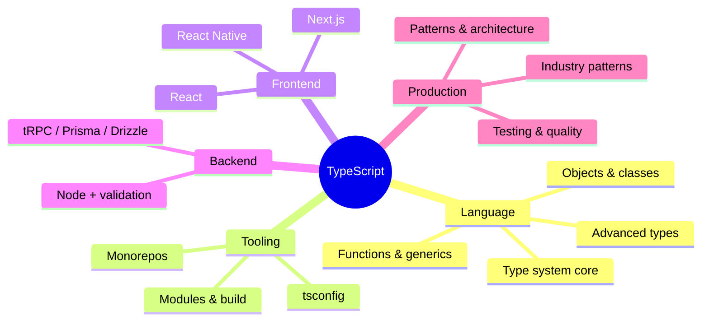
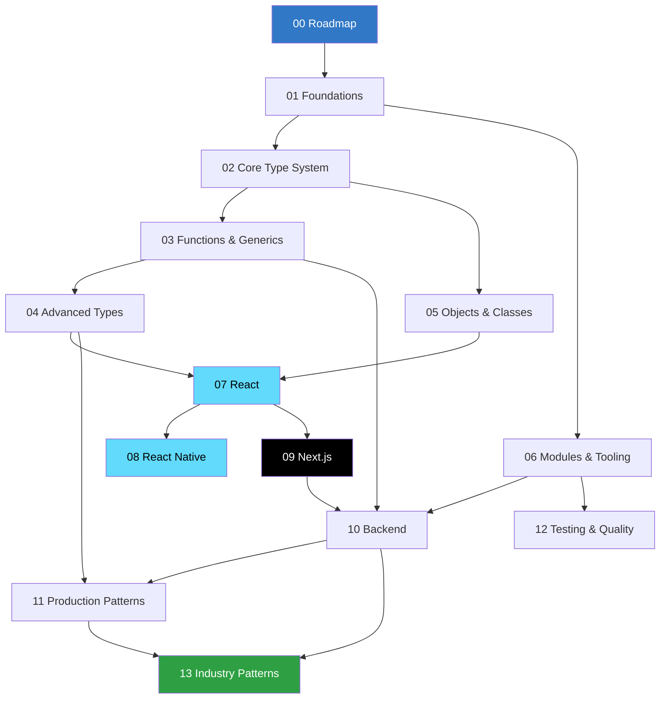
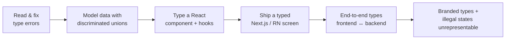

# TypeScript Learning Plan

> Re-learn TypeScript from scratch (assuming beginner–intermediate JavaScript) and reach the level where you can **confidently build React, React Native, and Next.js applications** plus production-grade frontend and backend workflows.

This plan is split into focused guides under [`./typescript/`](./typescript/). Each guide is self-contained, teaches concept → idiomatic code → diagram → production gotchas → exercises, and cross-links to the others. Work them in order, or jump to a topic you need.

---

## Why TypeScript

TypeScript is JavaScript with a **static type system that erases at runtime**. You write types to catch a whole class of bugs *before* the code runs, to make refactors safe at scale, and to get editor autocomplete that actually understands your data. Every framework you care about — React, React Native, Next.js — is now TypeScript-first. Learning TS well is the highest-leverage investment for building reliable apps in this stack.



---

## The guides

| # | Guide | What it covers |
|---|-------|----------------|
| 00 | [Roadmap & Mental Model](./typescript/00-roadmap.md) | Why TS, JS→TS diff, how the compiler works, the full skill tree, learning order, milestones |
| 01 | [Foundations](./typescript/01-foundations.md) | tsconfig, primitives, inference, `any`/`unknown`/`never`, strict mode |
| 02 | [Core Type System](./typescript/02-type-system-core.md) | Unions, narrowing, literals, type guards, discriminated unions, enums |
| 03 | [Functions & Generics](./typescript/03-functions-generics.md) | Function types, overloads, generics, constraints, variance |
| 04 | [Advanced Types](./typescript/04-advanced-types.md) | Mapped, conditional, `infer`, template literals, utility types, `satisfies` |
| 05 | [Objects, Interfaces & Classes](./typescript/05-objects-classes.md) | `interface` vs `type`, classes, access modifiers, decorators |
| 06 | [Modules, Tooling & Build](./typescript/06-modules-tooling.md) | ESM, path aliases, `.d.ts`, bundlers, monorepos, project references |
| 07 | [TypeScript with React](./typescript/07-react.md) | Props, hooks, context, events, generic components, refs |
| 08 | [TypeScript with React Native](./typescript/08-react-native.md) | RN components, styles, typed navigation, native modules, platform types |
| 09 | [TypeScript with Next.js](./typescript/09-nextjs.md) | App Router, RSC, server actions, route handlers, typed env |
| 10 | [Backend TypeScript](./typescript/10-backend.md) | Node, Zod validation, Fastify/Express, tRPC, Prisma/Drizzle |
| 11 | [Production Patterns & Architecture](./typescript/11-production-patterns.md) | Illegal-states-unrepresentable, branded types, Result types, DDD-lite |
| 12 | [Testing & Code Quality](./typescript/12-testing-quality.md) | Vitest/Jest, type-level tests, typed ESLint, CI gates |
| 13 | [Industry Patterns](./typescript/13-industry-patterns.md) | Fintech, healthcare, social/internet — real production type patterns |

---

## Suggested learning order



**Fast path to the React/RN/Next.js goal:** 00 → 01 → 02 → 03 → 04 → 07 → (08 / 09) → 10 → 11. Pick up 05, 06, 12, 13 as you hit the need.

---

## Milestones



1. **Literacy** — read any TS file, understand and fix the errors (guides 01–02).
2. **Modeling** — represent app state so invalid states won't compile (02, 11).
3. **React fluency** — props, hooks, context, generic components fully typed (07).
4. **Ship a screen** — a typed Next.js route or RN screen with data fetching (08/09).
5. **Full-stack types** — schema/validation shared frontend↔backend, no `any` at boundaries (10).
6. **Production craft** — branded types, Result types, tested and CI-gated (11–13).

---

## Setup (do this first)

```bash
# scratch playground — run a .ts file instantly, no build step
npm i -g tsx
echo 'const greet = (name: string) => `hi ${name}`; console.log(greet("ts"))' > scratch.ts
tsx scratch.ts

# or use the browser playground: https://www.typescriptlang.org/play
```

A strict baseline `tsconfig.json` (explained in [01 Foundations](./typescript/01-foundations.md)):

```jsonc
{
  "compilerOptions": {
    "strict": true,
    "noUncheckedIndexedAccess": true,
    "target": "ES2022",
    "module": "ESNext",
    "moduleResolution": "Bundler",
    "verbatimModuleSyntax": true,
    "skipLibCheck": true,
    "esModuleInterop": true,
    "noEmit": true
  }
}
```

---

## How to use these guides

- **Type along.** Don't just read — paste the snippets into a playground and break them.
- **Hover everything.** Your editor's hover tooltip is the fastest TS teacher.
- **Do the exercises** at the end of each guide before moving on.
- **Come back.** Guides 11–13 reward a second read after you've shipped something real.

Start here → [00 Roadmap & Mental Model](./typescript/00-roadmap.md)
