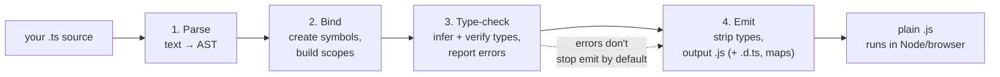
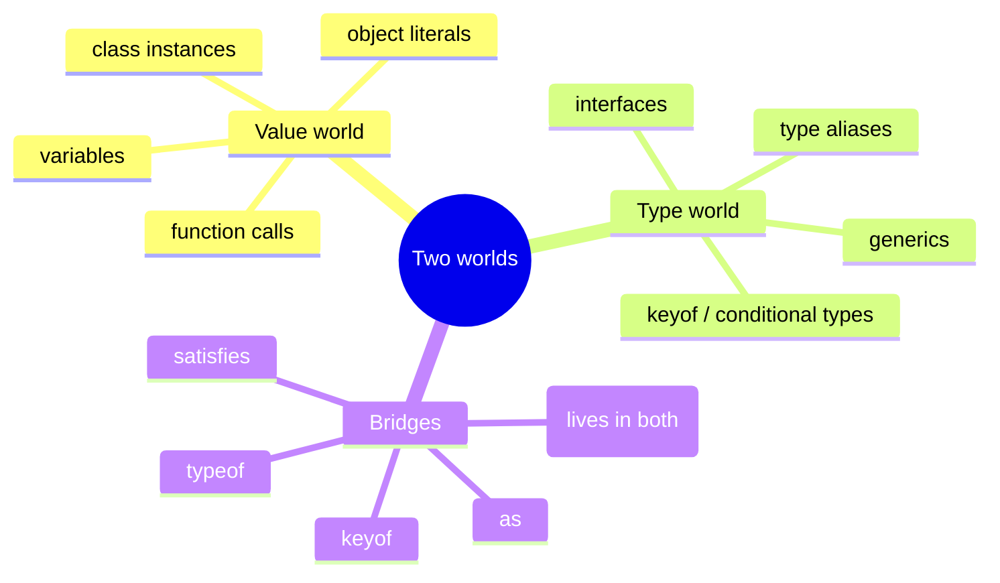
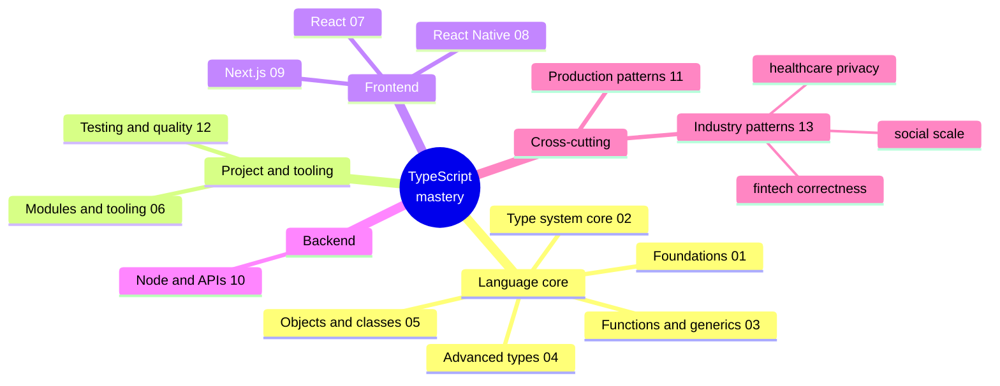
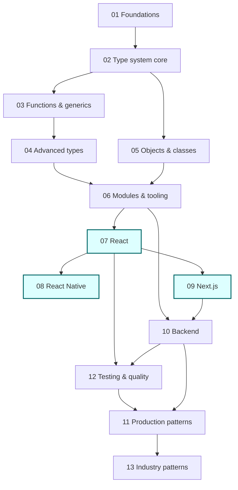

# TypeScript Roadmap & Mental Model

> **Goal:** Re-learn TypeScript from your existing JavaScript foundation and end up able to confidently ship React, React Native, and Next.js apps backed by production-grade frontend and backend workflows.

## What you'll learn

- **Why** TypeScript exists and what problem it actually solves (it is not "Java for the browser").
- The concrete **JS → TS deltas** you need internalized as someone who already knows JavaScript.
- **How the compiler works** — the `tsc` pipeline, and the single most important fact: *types are erased at runtime*.
- **Structural ("duck") typing** and why it surprises people coming from nominal languages.
- The **two worlds**: type-level vs value-level, and how to keep them straight.
- A **full skill tree** for the whole series, a **dependency graph** for learning order, and the **milestones** that get you to the React/RN/Next goal.
- How to set up a **scratch playground** in under a minute so you can experiment while you read.

## Prerequisites

- Comfortable with modern JavaScript: `let`/`const`, arrow functions, destructuring, spread/rest, `async`/`await`, modules (`import`/`export`), array methods (`map`/`filter`/`reduce`).
- Node.js 20+ installed (`node --version`).
- A terminal and an editor with TS support (VS Code is the path of least resistance — the editor *is* the TypeScript compiler running in the background).

You do **not** need any prior TypeScript. If you've only ever seen a `: string` annotation and bounced off, you're in exactly the right place.

---

## Mental model

Hold three ideas in your head and most of TypeScript falls out of them:

1. **TypeScript is JavaScript plus a type layer that disappears.** Every valid `.js` file is (almost) a valid `.ts` file. At build time the type annotations are *erased* and you're left with plain JavaScript that runs in Node or the browser. The types never exist at runtime. This is the fact people forget and then get burned by.

2. **The type checker is a separate program from the thing that runs.** `tsc` does two jobs that are conceptually independent: it *checks* your types (and can yell at you) and it *emits* JavaScript (stripping the types). You can have type errors and still get runnable output. The checker is a very fast, very pedantic code reviewer that reads your whole project before you run anything.

3. **There are two parallel universes — values and types — and they almost never touch.** Code that runs lives in the *value* world. Types live in the *type* world, evaluated only by the compiler. A few keywords bridge them (`typeof`, `keyof`, `as`, `satisfies`), but mixing them up is the root of most early confusion.

Everything else in this series is detail layered on those three ideas.

---

## Why TypeScript

You already know JavaScript works. So why add a compiler step, a config file, and red squiggles?

### The cost of bugs scales with the codebase

A `cannot read property 'name' of undefined` is a 30-second fix in a 200-line script. In a 200,000-line codebase touched by 40 engineers, the same class of bug is a production incident, a rollback, and a postmortem. TypeScript moves an entire category of errors — typos, wrong argument shapes, `undefined` access, renamed-but-not-everywhere — from *runtime in production* to *compile time on your laptop*. The earlier a bug is caught, the cheaper it is, and TS catches them at the earliest possible moment.

### Refactor confidence

This is the feature seasoned engineers actually fall in love with. Rename a field, change a function signature, delete a property — the compiler immediately shows you *every* place that breaks. You can do surgery on a large codebase and trust that "no type errors" means "I didn't forget a caller." Untyped JS refactors rely on grep, tests, and hope.

### Developer experience (DX)

Types are documentation that can't go stale, plus autocomplete that actually knows what's on an object, plus inline errors as you type. Hover any value and see its shape. Jump to definition across packages. The editor becomes an active collaborator instead of a fancy text box. For a team, the types *are* the API contract.

```ts
// Plain JS: this fails silently at runtime, maybe in prod, maybe Friday at 5pm
function greet(user) {
  return `Hello, ${user.naem}`; // typo: naem
}

// TypeScript: this fails on your machine, in your editor, right now
interface User {
  name: string;
}
function greetTyped(user: User): string {
  return `Hello, ${user.naem}`;
  //                    ~~~~ Property 'naem' does not exist on type 'User'.
}
```

> The point isn't that you *couldn't* find that bug. It's that you found it without running anything, without writing a test, and the editor pointed at the exact character.

---

## JS → TS for someone who already knows JS

You're not learning a new language. You're learning an annotation layer plus a checker. Here are the deltas that matter.

| You know (JS) | You now also have (TS) |
|---|---|
| Variables hold values | Variables also have *static types*, inferred or annotated |
| Functions accept anything | Function parameters and returns can be typed and *checked* |
| Objects are bags of properties | Objects have *shapes* the compiler tracks (`interface` / `type`) |
| `undefined`/`null` lurk everywhere | `strictNullChecks` makes them explicit and impossible to ignore |
| Duck typing at runtime | Structural typing *at compile time* |
| Build step optional | A compile/erase step (`tsc`, or a bundler that strips types) |

The single biggest behavioral change: with `strict` mode on (and you should always have it on), the compiler will not let you access something that might be `undefined`. This feels annoying for a day and then becomes the thing that prevents most of your null-pointer bugs forever.

```ts
function findUser(id: string): User | undefined {
  return users.find((u) => u.id === id);
}

const u = findUser("abc");
console.log(u.name);
//          ~ 'u' is possibly 'undefined'.

// You must handle the absent case — the compiler forces the conversation:
if (u) {
  console.log(u.name); // narrowed to User here
}
```

---

## How the TypeScript compiler works

Understanding the pipeline removes most of the "why is it doing that?" confusion. `tsc` runs four phases:



1. **Parse** — The source text is turned into an Abstract Syntax Tree (AST), the same as any JS parser. Annotations like `: string` become nodes in the tree.
2. **Bind** — The compiler walks the AST and builds *symbols* (named declarations) and *scopes*, so it knows what `user` refers to in any given place.
3. **Type-check** — The heart of it. The checker *infers* types where you didn't annotate, *verifies* the ones you did, applies narrowing, resolves generics, and emits diagnostics (the red squiggles). This phase produces no output files — it only judges.
4. **Emit** — The annotations are *erased* and JavaScript is written out, optionally with `.d.ts` declaration files and source maps.

### The fact that changes how you write code: types are erased

Nothing about your types survives to runtime. There is no reflection on a TS `interface`, no way to ask "what type is this?" using the type system, no runtime type checks generated for you.

```ts
interface Config {
  retries: number;
}

// ❌ Does NOT exist at runtime — `interface` is compiled away to nothing.
// console.log(typeof Config); // 'Config' only refers to a type

// ✅ If you need a runtime check, YOU write it (or a library like Zod does):
function isConfig(x: unknown): x is Config {
  return typeof x === "object" && x !== null && "retries" in x
    && typeof (x as Record<string, unknown>).retries === "number";
}
```

> **This is why you validate external data at runtime.** API responses, `JSON.parse`, form input, env vars — the compiler trusts your annotation, but the network does not read your types. Guide 10 (backend) and the `satisfies`/Zod patterns later lean hard on this.

---

## Structural ("duck") typing vs nominal typing

In nominal languages (Java, C#), a value is a `User` only if it was declared as a `User`. TypeScript is **structural**: a value is a `User` if it *has the shape of* a `User`, regardless of where it came from or what it was called. If it walks like a duck and quacks like a duck, the compiler calls it a duck.

```ts
interface Point {
  x: number;
  y: number;
}

function dist(p: Point): number {
  return Math.hypot(p.x, p.y);
}

// No `: Point` annotation anywhere, but the shape matches — accepted:
const anywhere = { x: 3, y: 4 };
dist(anywhere); // ✅ 5

// Extra properties are fine when passed via a variable...
const labeled = { x: 1, y: 2, label: "origin-ish" };
dist(labeled); // ✅ has x and y, so it's structurally a Point

// ...but object *literals* get "excess property checks" to catch typos:
dist({ x: 1, y: 2, lable: "oops" });
//                  ~~~~~ Object literal may only specify known properties
```

The practical upshot: you rarely need to "convert" between types that already match. Two independently-declared interfaces with the same fields are interchangeable. This is liberating once it clicks, and occasionally surprising when two unrelated things match by accident (the rare case where you reach for *branded types*, covered in guide 04).

---

## The two worlds: type-level vs value-level

This is the concept that, once internalized, makes advanced TypeScript readable.

- **Value world**: things that exist when the program runs — variables, function calls, objects, numbers.
- **Type world**: things that exist only during compilation — `interface`, `type`, generic parameters, `keyof`, conditional types.

Some names live in only one world; some clever ones live in both.

```ts
// Pure value world:
const port = 3000;

// Pure type world (erased at emit):
type Port = number;

// `class` is special — it creates BOTH a value (the constructor) and a type:
class Server {
  constructor(public port: number) {}
}
const s = new Server(port); // `Server` used as a value here
let other: Server;          // `Server` used as a type here

// Bridges between the worlds:
type PortType = typeof port;       // value -> type ("what type is `port`?") => number
type Keys = keyof Server;          // type -> type ("port")
const asserted = port as Port;     // value-world escape hatch (assertion)
```



> A huge fraction of "TS is so confusing" moments are really "I tried to use a type as a value or a value as a type." When stuck, ask: *which world is this name in?*

---

## The full skill tree

Here is the entire series as a mindmap. This is your map of the territory — every node is a guide or a major theme inside one.



---

## Suggested learning order

Don't read linearly out of obligation — read along the dependency edges. The language-core guides feed everything; the framework guides depend on core plus tooling.



The highlighted nodes (07, 08, 09) are your stated end goal. Notice they all sit *downstream* of the core language work — there's no skipping straight to React types without the generics and advanced-types foundation, because React's own types (`useState<T>`, `Props`, `ReactNode`) are built from exactly those features.

---

## Milestones to the React / RN / Next.js goal

Concrete checkpoints. You "have" a milestone when you can do the thing without looking it up.

1. **Read any annotation.** Given `(items: readonly User[], opts?: { limit?: number }) => Promise<Result<User>>`, you can describe what it takes and returns. *(after 01–03)*
2. **Write your own generics.** You can type a reusable `groupBy`, a typed event emitter, or a `Result<T, E>` helper. *(after 03–04)*
3. **Model real data.** You can turn an API JSON shape into types, narrow unions discriminated by a `kind` field, and validate untrusted input at the boundary. *(after 02, 04, 10)*
4. **Type a React component end to end.** Props, children, hooks, generic components, and event handlers — all typed, no `any`. *(after 07)*
5. **Ship a typed Next.js + RN feature.** Server components / API routes typed against the same models the client uses; a React Native screen sharing those types. *(after 08–09)*
6. **Own the toolchain.** You can configure `tsconfig` for strict mode, set up path aliases, wire up linting and CI type-checks, and read a `.d.ts`. *(after 06, 11–12)*

---

## Set up a scratch playground

You should be running code within five minutes. Three options, lightest first.

### Option A — the online TS Playground (zero install)

Open the official **TS Playground** in a browser. You get the editor, instant type errors, the emitted JS side-by-side, and shareable URLs. Best for trying a snippet from this guide or sharing a type puzzle with a teammate.

### Option B — `tsx` for local scratch files (recommended)

`tsx` runs a `.ts` file directly, no build step, fast. This is the modern default for scratch work and scripts.

```bash
# one-off, no install needed:
npx tsx scratch.ts

# or add it once to a project:
npm install -D tsx
```

```ts
// scratch.ts — edit and re-run with `npx tsx scratch.ts`
const nums: number[] = [1, 2, 3, 4];
const doubled = nums.map((n) => n * 2);
console.log(doubled); // [2, 4, 6, 8]
```

### Option C — `ts-node` (older but common)

You'll see `ts-node` in many existing repos. It's the predecessor to `tsx`; functionally similar for running TS directly. Prefer `tsx` for new work, but recognize `ts-node` when you meet it.

### Make a real strict project

When you're past scratch files, scaffold a properly strict project so you learn with the guardrails on:

```bash
mkdir ts-lab && cd ts-lab
npm init -y
npm install -D typescript tsx
npx tsc --init
```

Then ensure these are in `tsconfig.json` — `strict` is non-negotiable; learning without it teaches you bad habits:

```ts
// tsconfig.json (excerpt) — yes, JSON, but it's how you'll always configure TS
{
  "compilerOptions": {
    "strict": true,                 // turns on the whole strict family
    "noUncheckedIndexedAccess": true, // arr[i] is T | undefined — catches OOB bugs
    "target": "ES2022",
    "module": "NodeNext",
    "moduleResolution": "NodeNext",
    "verbatimModuleSyntax": true,
    "skipLibCheck": true
  }
}
```

> **`strict: true` from day one.** Adding it later to an existing codebase is a painful migration; starting with it is free. Every code sample in this series assumes strict mode.

---

## Production gotchas

> **Types are erased — never trust the network.** A function typed to return `User` will happily return whatever the API actually sent. Validate at every trust boundary (HTTP responses, `JSON.parse`, env vars, form data). The compiler guards your code; it cannot guard your inputs.

> **`any` is a hole in the type system, and it's contagious.** One `any` propagates through every value derived from it, silently disabling checking downstream. Reach for `unknown` instead — it forces you to narrow before use. Treat `any` in a PR as a smell that needs a comment justifying it.

> **`as` is a promise to the compiler, not a conversion.** `value as User` tells the checker "trust me," it does *not* validate or transform anything at runtime. A wrong assertion is a runtime crash the compiler can no longer warn you about. Prefer narrowing and `satisfies` over `as`.

> **A green type check is not a green test suite.** Types prove shape, not behavior. `strict` won't catch an off-by-one or wrong business logic. You still need tests (guide 12).

> **Declaration drift in monorepos.** When two packages share types, a stale build of one can make the other's errors lie. Set up project references / proper build ordering early (guide 06) before this bites a whole team.

---

## Patterns in production

How mature engineering organizations actually use TypeScript — and where the stakes change by industry.

- **Types as the cross-team contract.** At scale, the type definitions *are* the API documentation between frontend, backend, and mobile teams. A shared types package (or generated types from an OpenAPI/GraphQL schema) means a backend change that breaks the client fails *the client's build*, not a customer's session.

- **Fintech — correctness, money, and audit.** Money is never a floating-point `number` (`0.1 + 0.2 !== 0.3`). Mature fintech codebases model money as integer minor units with a *branded type* so a raw `number` can't accidentally be passed where cents are expected, and currency is part of the type. Discriminated unions model transaction states (`pending | settled | reversed`) so the compiler forces every state to be handled — an unhandled `reversed` becomes a build error, not a reconciliation nightmare. Audit trails benefit from `readonly` immutable records.

- **Healthcare — PII/PHI and privacy.** Protected health information demands that you can't accidentally log or serialize the wrong field. Teams use branded types (`type SSN = string & { __brand: "SSN" }`) and dedicated "redacted" wrapper types so a PHI value can't flow into a logger or analytics call without an explicit, reviewable unwrap. The type system encodes the privacy policy.

- **Social / internet scale — performance, feeds, real-time.** High-traffic feed and messaging systems lean on precise types for serialized payloads (you control byte sizes when you know exact shapes), discriminated unions for the dozens of event types over a websocket, and exhaustive `switch` checks so a new event type can't silently fall through. Generated types from the wire schema keep the client and a fast backend in lockstep across millions of messages a second.

The throughline: in every one of these, the type system is used to make *the dangerous thing impossible to express*, so the compiler enforces the policy that would otherwise rely on every engineer remembering it. Guide 13 goes deep on each.

---

## Exercises

Do these in your `tsx` scratch file with `strict` on.

1. **Erasure proof.** Write an `interface Animal { species: string }`, then try `console.log(typeof Animal)`. Read the error. Now write a runtime type guard `isAnimal(x: unknown): x is Animal` that actually works at runtime, and test it on a `JSON.parse(...)` result. *(Cements: types are erased.)*

2. **Structural surprise.** Declare two unrelated interfaces with identical fields (`type A = { id: string }`, `type B = { id: string }`). Write a function taking `A` and pass it a `B`. Observe it's accepted. Then pass an object literal with an extra field and watch excess-property checking fire. *(Cements: structural typing.)*

3. **Force the null conversation.** Write `findById(id: string): Item | undefined`, call it, and try to read a property off the result. Make the compiler error, then fix it three different ways (`if` narrowing, optional chaining `?.`, and a default with `??`). *(Cements: `strictNullChecks`.)*

4. **Two worlds.** Given `const config = { host: "localhost", port: 3000 }`, derive a type `type Config = typeof config` and a type `type ConfigKeys = keyof typeof config`. Then write a function `get<K extends ConfigKeys>(key: K)` that returns the right value type. *(Cements: type-level vs value-level + the `typeof`/`keyof` bridges.)*

5. **Set up the lab.** Scaffold the strict project from the setup section, add `noUncheckedIndexedAccess`, and observe how `const x = arr[10]` is now `T | undefined`. Fix the resulting error. *(Cements: toolchain + why strict matters.)*

6. **Map the goal.** Without re-reading, sketch the dependency graph from memory: which guides must come before guide 07 (React)? Check yourself against the flowchart above. *(Cements: your learning path.)*

---

## Next

Start at the top of the language core and follow the dependency graph:

- **[01 — Foundations](./01-foundations.md)** — your next stop: types, inference, primitives, and the strict-mode mindset in practice.
- [02 — Type System Core](./02-type-system-core.md) — unions, literals, narrowing, `interface` vs `type`.
- [03 — Functions & Generics](./03-functions-generics.md)
- [04 — Advanced Types](./04-advanced-types.md)
- [05 — Objects & Classes](./05-objects-classes.md)
- [06 — Modules & Tooling](./06-modules-tooling.md)
- [07 — React](./07-react.md) · [08 — React Native](./08-react-native.md) · [09 — Next.js](./09-nextjs.md)
- [10 — Backend](./10-backend.md)
- [11 — Production Patterns](./11-production-patterns.md) · [12 — Testing & Quality](./12-testing-quality.md) · [13 — Industry Patterns](./13-industry-patterns.md)

Series index: [TypeScript Learning Plan](../TypeScript_Learning_Plan.md)
