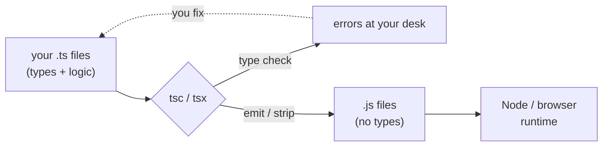
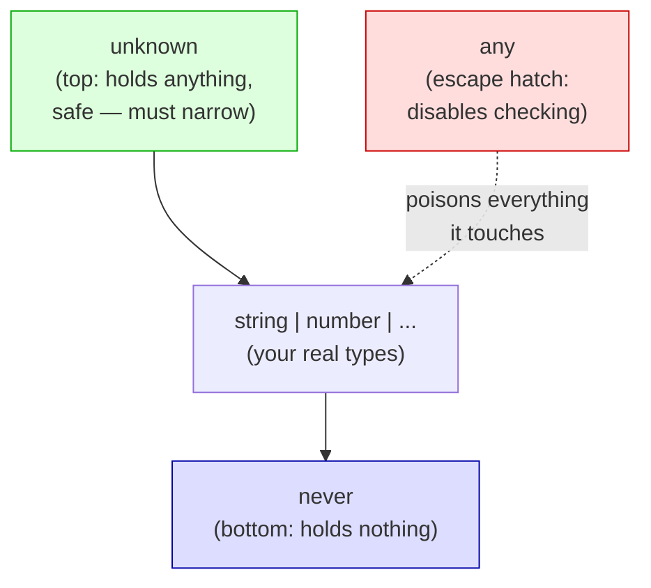
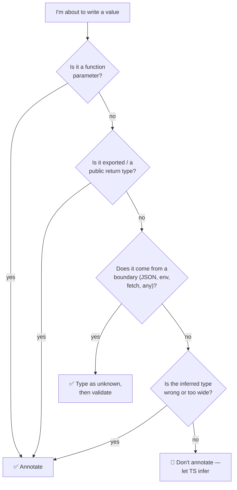
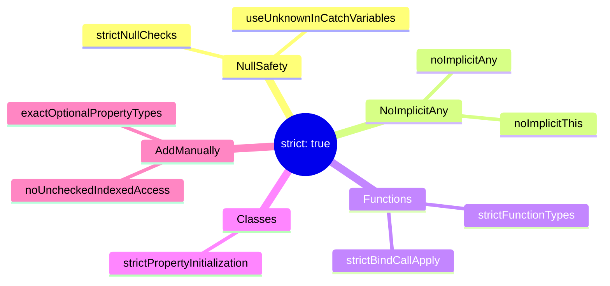

# Foundations: tsconfig, primitives, inference, strictness

> **Goal:** Set up a strict TypeScript toolchain and understand the core type primitives, the inference engine, and the compiler flags that turn TypeScript from "JavaScript with hints" into a real safety net.

## What you'll learn

- How to install and run TypeScript two ways: `tsc` (the compiler) and `tsx` (run-`.ts`-directly).
- Every primitive type, plus arrays, tuples, and object types.
- The `any` / `unknown` / `never` triangle — and why `any` is banned on serious teams.
- When to write type annotations and when to let the compiler infer (the "annotate boundaries, infer internals" rule).
- How `const` vs `let` changes the *type* of a value (literal widening).
- Type assertions (`as`) and why they're usually a code smell.
- A line-by-line tour of `tsconfig.json` and a recommended strict baseline you can copy.

## Prerequisites

You should be comfortable with beginner-to-intermediate JavaScript: variables, functions, arrays/objects, `import`/`export`, and `async`/`await`. If you want the bird's-eye view of where this guide sits in the series, read the [roadmap](./00-roadmap.md) first.

---

## Mental model

Here is the single most useful idea to carry through the whole series: **TypeScript is a layer that runs only at your desk, never on your users' machines.** It reads your code, builds a model of what types flow where, complains when the model is inconsistent, and then *erases itself*. The thing that ships is plain JavaScript — the types are gone.

That has two consequences worth internalizing now:

1. **Types cannot enforce anything at runtime.** A value that arrives over the network does not "become" a type because you annotated it. Annotations are promises *you* make to the compiler; at the trust boundary (HTTP, `localStorage`, `JSON.parse`) you have to actually check.
2. **The compiler is a collaborator, not a linter.** It propagates information forward. If you tell it the truth at the edges, it figures out the middle for free. Most beginner TypeScript is over-annotated because people don't trust the inference engine yet. By the end of this guide you will.



The types live on the left. The right side — what your users run — has never heard of them.

---

## Installing and running TypeScript

You don't install TypeScript globally on a real project; you pin it per-project so every teammate and CI run uses the same compiler version.

```bash
# inside a project folder
npm init -y
npm install --save-dev typescript tsx
npx tsc --init        # generates a tsconfig.json
```

Two tools, two jobs:

- **`tsc`** is the compiler. It type-checks and (optionally) emits `.js`. In CI you'll run `tsc --noEmit` purely as a type-check gate.
- **`tsx`** runs a `.ts` file directly — it strips types and executes in one step, no build directory. It's the fastest inner loop for scripts and learning.

```bash
npx tsc --noEmit          # check the whole project, emit nothing
npx tsx src/scratch.ts    # run a file right now
```

> **Production gotcha**
> `tsx` (and esbuild, swc, Babel) **transpile** — they strip types without checking them. They will happily run code that `tsc` rejects. Always keep `tsc --noEmit` as a separate CI step. Fast-runners are for the inner loop; `tsc` is the gate.

---

## The primitive types

TypeScript's primitives mirror JavaScript's runtime primitives one-to-one. You rarely annotate these explicitly — the value tells the compiler — but you must recognize them.

```ts
const name: string = "Ada";
const age: number = 36;          // one number type: ints and floats both
const active: boolean = true;
const nothing: null = null;
const missing: undefined = undefined;
const id: symbol = Symbol("id"); // unique, used as non-colliding keys
const big: bigint = 9_007_199_254_740_993n; // beyond Number.MAX_SAFE_INTEGER
```

Two distinctions that bite JavaScript developers:

- **`null` vs `undefined` are different types.** `null` is an intentional "no value"; `undefined` is "not set yet / not provided". TypeScript keeps them apart, and strict mode makes you handle both (more below).
- **`number` cannot safely hold large integers.** Above `2^53` you lose precision. `bigint` exists for that — relevant the moment you touch money in minor units, database `BIGINT` ids, or nanosecond timestamps.

> **Production gotcha**
> Never store currency as a `number`. Floating-point `0.1 + 0.2 !== 0.3`. Use integer minor units (cents) typed as `number`, or `bigint` for very large balances, or a decimal library. This is non-negotiable in **fintech**.

---

## Arrays, tuples, and object types

```ts
// Array: homogeneous, any length
const scores: number[] = [98, 71, 84];
const names: Array<string> = ["a", "b"]; // identical, generic syntax

// Tuple: fixed length, position-typed
const point: [number, number] = [0, 0];
const entry: [key: string, value: number] = ["age", 36]; // named for readability

// Object type: shape, structurally checked
type User = {
  id: string;
  email: string;
  age?: number;        // optional
  readonly createdAt: Date; // can't reassign after construction
};

const u: User = { id: "1", email: "a@b.com", createdAt: new Date() };
```

TypeScript is **structurally typed**: a value is a `User` if it *has the right shape*, regardless of whether anyone named it `User`. This is different from Java/C# nominal typing and it's why TypeScript feels fluid — you pass object literals around and they just fit.

> **Production gotcha**
> Object literals get **excess property checks** — `{ id, email, createdAt, typo: 1 }` errors on `typo`. But that check only fires for *fresh* literals. Assign through a variable first and the extra property slips past. Don't rely on excess-property checks as validation; they're a typo-catcher, not a boundary guard.

---

## The `any` / `unknown` / `never` triangle

These three sit at the extremes of the type system and you must know them cold.

```ts
// any — turns the type checker OFF for this value. Contagious.
let a: any = JSON.parse("{}");
a.foo.bar.baz();   // compiles. explodes at runtime. no help from TS.

// unknown — the safe top type. You MUST narrow before using it.
let u: unknown = JSON.parse("{}");
// u.foo;          // ❌ Object is of type 'unknown'
if (typeof u === "object" && u !== null && "foo" in u) {
  // now usable, narrowed
}

// never — the bottom type. A value that can never exist.
function fail(msg: string): never {
  throw new Error(msg);      // never returns normally
}
```

The relationship: `any` and `unknown` both accept *anything*, but they differ on the way out. `unknown` lets nothing out until you prove what it is; `any` lets *everything* out, unchecked. `never` is the empty set — nothing is assignable *to* it, and it's assignable *to* everything.



**Why ban `any`:** one `any` doesn't stay put. It flows into every variable it touches, silently disabling checks far from where it was written. A function returning `any` poisons all its callers. The whole value of TypeScript is the guarantee that checked code is checked — `any` breaks that guarantee invisibly. Mature teams turn on `@typescript-eslint/no-explicit-any` and the `noImplicitAny` compiler flag so `any` can only appear when someone deliberately, visibly opts out.

> **Production gotcha**
> `JSON.parse`, `response.json()`, `fetch`, `localStorage.getItem`, and most `process.env` access hand you `any` or `string | null`. These are exactly your trust boundaries. Type the result as `unknown` and validate with a schema library (Zod, Valibot) — never assert your way past them with `as`.

`never` shows up in two useful places you'll meet later: functions that always throw, and **exhaustiveness checks** in `switch` statements (if you handle every case, the `default` branch sees `never`, and adding a new case breaks the build until you handle it). We cover that in [advanced types](./04-advanced-types.md).

---

## Annotations vs inference

TypeScript infers the type of nearly everything. The skill is knowing when to *override* that with an explicit annotation. The rule:

> **Annotate boundaries. Infer internals.**

A "boundary" is where your code meets something else: function parameters, public return types, exported constants, API payloads, config. There, an annotation is a contract — it pins behavior and produces clean error messages. "Internals" are local variables and intermediate values inside a function; there, an annotation is just noise that can drift out of sync with reality.

```ts
// ✅ Annotate the boundary: parameters and (for exports) the return type.
export function priceWithTax(cents: number, rate: number): number {
  // ✅ Infer internals — TS already knows these are numbers.
  const tax = Math.round(cents * rate);
  const total = cents + tax;
  return total;
}

// ❌ Over-annotated internals: redundant, and a refactor magnet.
const tax: number = Math.round(cents * rate);

// ❌ Under-annotated boundary: `data` is implicitly any (errors under strict).
function handle(data) { /* ... */ }
```

Annotating a function's return type at module boundaries is worth the keystrokes: it catches the bug *inside* the function instead of at every call site, and it stops you from accidentally widening the return shape later.



---

## `const` vs `let` and literal widening

This trips up everyone once. The *keyword you declare with changes the type you get.*

```ts
let mutableGreeting = "hello";   // type: string   (widened)
const fixedGreeting = "hello";   // type: "hello"  (literal, not widened)

let count = 0;                   // type: number
const max = 100;                 // type: 100
```

`let` declarations get **widened** to the general type because you might reassign them. `const` can never be reassigned, so TypeScript keeps the narrow **literal type**. This matters most with unions and discriminants:

```ts
// ❌ widening bites you
let direction = "left";          // type: string
move(direction);                 // error if move expects "left" | "right"

// ✅ const keeps the literal
const direction = "left";        // type: "left"
move(direction);                 // fine
```

For objects, `const` only freezes the *binding*, not the contents — properties still widen. Use `as const` to lock the whole thing into a deeply-readonly literal:

```ts
const config = { env: "prod", retries: 3 } as const;
// type: { readonly env: "prod"; readonly retries: 3 }
```

`as const` is the idiomatic way to build enum-like objects and pin tuple types — you'll lean on it constantly in React props and route tables.

---

## Type assertions (`as`) — usually a smell

`as` tells the compiler "trust me, this is that type." It performs **no runtime check** and no conversion. It just silences the type checker.

```ts
const el = document.getElementById("app") as HTMLDivElement; // unchecked claim
const data = JSON.parse(raw) as User;  // 🚩 lying about untrusted input
```

That second line is the classic mistake. `raw` could be anything; `as User` doesn't verify it, it just stops TypeScript from helping. When it's wrong, you get an undefined-property crash three modules away with no clue where the lie was told.

When `as` is acceptable:

- Narrowing a DOM element you genuinely know the type of (no runtime way to express it otherwise).
- `as const` (a different, safe feature — it narrows, it doesn't lie).
- Inside a validated boundary, after a real check has proven the shape.

> **Production gotcha**
> Treat every `as SomeType` (that isn't `as const` or `as unknown as`-bridging in tests) as a TODO. Reach for a **type guard** (`x is User`) or a **schema validator** instead — they check at runtime, so the type claim is actually true. Replace assertions with validation at trust boundaries; never as a way to "make the error go away."

---

## The `tsconfig.json` deep-dive

`tsconfig.json` is where you configure the compiler. Most fields fall into two buckets: *how to emit* and *how strict to be*. Here are the ones that earn their place.

### Strictness — the flags that do the real work

`"strict": true` is a master switch that turns on a family of sub-flags. Turn it on for every new project, no exceptions. What it enables:

| Sub-flag | What it does |
| --- | --- |
| `strictNullChecks` | `null` and `undefined` are no longer assignable to every type. You must handle "no value" explicitly. **The single most valuable flag in the language.** |
| `noImplicitAny` | A value the compiler can't infer (e.g. an un-annotated parameter) is an error, not silent `any`. |
| `strictFunctionTypes` | Function parameters are checked **contravariantly** — you can't pass a handler that expects a narrower argument where a wider one is required. Catches unsound callbacks. |
| `strictBindCallApply` | `.bind`/`.call`/`.apply` are type-checked against the function signature. |
| `strictPropertyInitialization` | Class fields must be assigned in the constructor (or marked optional / `!`). |
| `useUnknownInCatchVariables` | `catch (e)` gives you `unknown`, not `any` — so you have to narrow before assuming `e.message`. |
| `alwaysStrict` | Emits `"use strict"` and parses in strict mode. |

Beyond the `strict` family, two flags are *not* on by default but belong in any serious config:

- **`noUncheckedIndexedAccess`** — makes `arr[i]` and `record[key]` return `T | undefined` instead of `T`. Because an index access *can* miss. This catches a huge class of "cannot read property of undefined" bugs at compile time. It's slightly annoying and completely worth it.
- **`exactOptionalPropertyTypes`** — distinguishes "property absent" from "property set to `undefined`". Stricter, occasionally noisy; turn it on once the team is comfortable.



> **Production gotcha**
> Turning on `strict` in an existing loose codebase produces hundreds of errors at once. Don't do it in one heroic PR. Enable sub-flags one at a time (`strictNullChecks` first — it finds the most real bugs), fix the fallout, commit, repeat. A migration that lands cleanly beats a perfect config stuck in review forever.

### Emit and resolution — the flags that decide what JavaScript comes out

| Flag | What it controls |
| --- | --- |
| `target` | Which JS version to emit. `ES2022` is a safe modern default for Node 18+ and current browsers. Lower it only for ancient runtimes. |
| `module` | The module format of the output: `ESNext`/`NodeNext` for ESM, `CommonJS` for old-Node/Jest setups. |
| `moduleResolution` | How `import` specifiers are resolved to files. Use `Bundler` for Vite/Next/webpack apps, `NodeNext` for libraries that ship to Node. |
| `lib` | Which built-in type definitions are available (e.g. `["ES2022", "DOM"]`). Add `DOM` for browser code; omit it for pure Node. |
| `esModuleInterop` | Lets you `import express from "express"` against CommonJS packages without `* as` gymnastics. Keep it `true`. |
| `skipLibCheck` | Skips type-checking inside `.d.ts` files in `node_modules`. Speeds up builds and dodges third-party type conflicts. Keep it `true`. |
| `verbatimModuleSyntax` | Forces you to write `import type` for type-only imports and never elides them. Removes ESM/CJS ambiguity and prevents accidental runtime imports of type-only code. Recommended for new projects. |

> **Production gotcha**
> `moduleResolution: "Bundler"` assumes a bundler will handle resolution — it will let imports compile that break when run directly in Node. Match this flag to how the code actually *runs*: `Bundler` for app code that goes through Vite/Next, `NodeNext` for anything Node executes raw. A mismatch produces green builds that crash on `node dist/index.js`.

### A recommended strict baseline

Copy this into a new project and you start from a defensible position:

```jsonc
{
  "compilerOptions": {
    // Emit
    "target": "ES2022",
    "module": "ESNext",
    "moduleResolution": "Bundler",
    "lib": ["ES2022", "DOM", "DOM.Iterable"],
    "esModuleInterop": true,
    "verbatimModuleSyntax": true,

    // Strictness
    "strict": true,
    "noUncheckedIndexedAccess": true,
    "noImplicitOverride": true,
    "noFallthroughCasesInSwitch": true,

    // Hygiene
    "skipLibCheck": true,
    "forceConsistentCasingInFileNames": true,

    // We only type-check here; a bundler/tsx does the running.
    "noEmit": true
  },
  "include": ["src"]
}
```

Drop `DOM` from `lib` for pure-backend projects; we revisit per-environment configs in [modules & tooling](./06-modules-tooling.md).

---

## Patterns in production

A few things mature startups do consistently — worth adopting from day one rather than retrofitting:

- **`strict: true` from the first commit.** Every team that skips it pays compound interest later: a strict-migration is one of the most-deferred, least-loved tickets in any codebase. The companies that move fastest are strict from line one, not the ones who "stay flexible."
- **`any` is a CI failure, not a style preference.** Serious teams set `@typescript-eslint/no-explicit-any` to `error` and require `unknown` + validation at boundaries. In **fintech** and **healthcare** this is effectively mandatory: an `any` on a balance, a dosage, or a patient identifier is a silent runtime bug in exactly the domain where silent bugs are catastrophic.
- **Schema validation at every trust boundary.** **Fintech** validates transaction payloads, **healthcare** validates FHIR/HL7 records against PHI-shaped schemas, **social** validates the firehose of user-generated content. The pattern is identical everywhere: parse `unknown` into a known type with a runtime validator (Zod et al.), never assert. Types describe; validators enforce. We build this out in [industry patterns](./13-industry-patterns.md).
- **`noUncheckedIndexedAccess` on.** Index-out-of-bounds and missing-map-key bugs are the kind of thing that pages someone at 3am. This flag turns them into red squiggles. Most large TS codebases turn it on once and never look back.
- **One pinned compiler version, checked in CI with `tsc --noEmit`.** Fast runners (`tsx`, esbuild) ship the code; `tsc` is the gate that proves it's sound. Both, always.

---

## Exercises

1. **Bootstrap.** Create a fresh folder, install `typescript` + `tsx`, run `npx tsc --init`, then replace the generated config with the strict baseline above. Run `npx tsc --noEmit` and confirm it passes on an empty `src/index.ts`.
2. **Widening.** Declare the same literal (`"GET"`) with `let` and with `const`, hover each, and explain in a comment why the types differ. Then make an object `as const` and observe the `readonly` types.
3. **Tame `unknown`.** Write `function parseUser(raw: unknown): User`. Do *not* use `as`. Narrow `raw` with `typeof`, `in`, and `null` checks until it type-checks, throwing on anything malformed. Notice how much work `as User` was hiding.
4. **Feel `noUncheckedIndexedAccess`.** With the flag on, write `const first = myArray[0]` and try to call a method on `first`. Fix the resulting error two ways: a guard, and a default. Decide which you prefer and why.
5. **Boundaries vs internals.** Take an over-annotated function (annotation on every local) and strip every annotation that isn't a parameter or the public return type. Confirm it still type-checks — and reads cleaner.
6. **Stretch — strict migration.** Take any loose JS file, rename it `.ts`, and enable `strictNullChecks` only. Fix every error. Tally how many were real latent bugs vs. ceremony.

---

## Next

- Continue to [02 — Type System Core](./02-type-system-core.md): unions, intersections, narrowing, literal types, and type aliases vs interfaces.
- Back to the [series roadmap](./00-roadmap.md).
- Zoom out to the full [TypeScript Learning Plan](../TypeScript_Learning_Plan.md).
