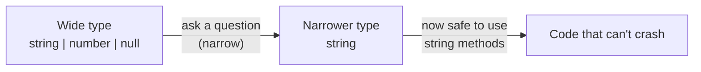
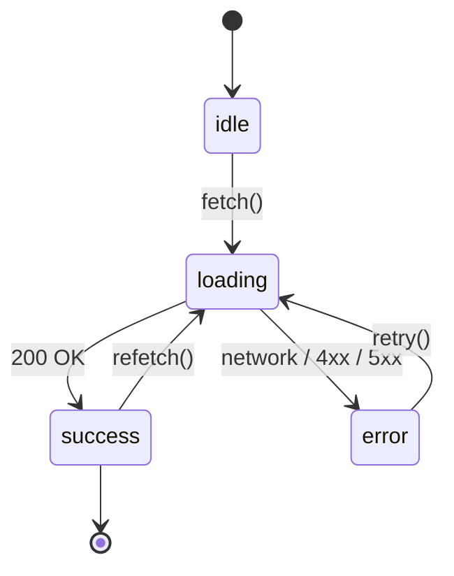
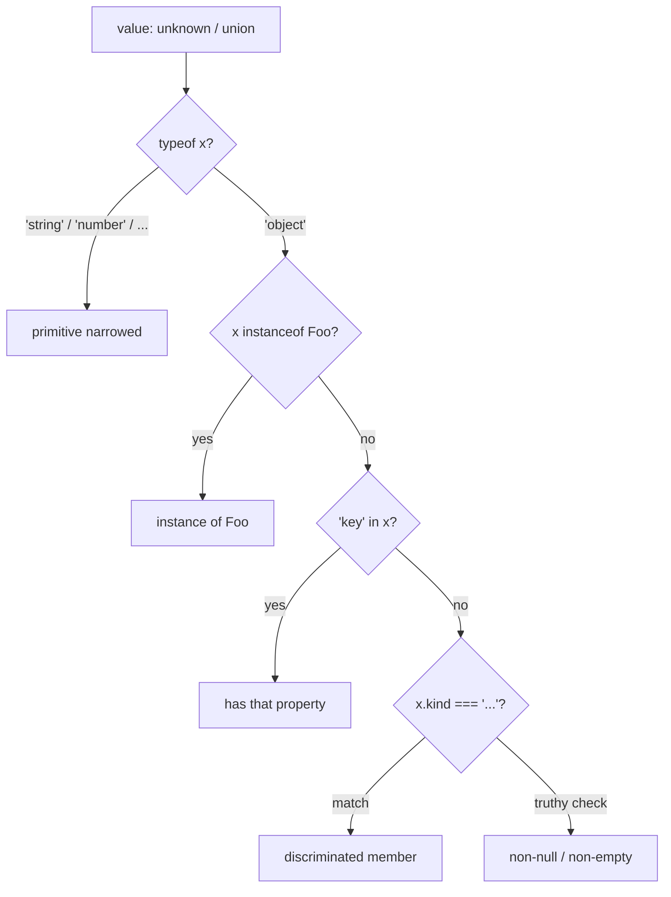
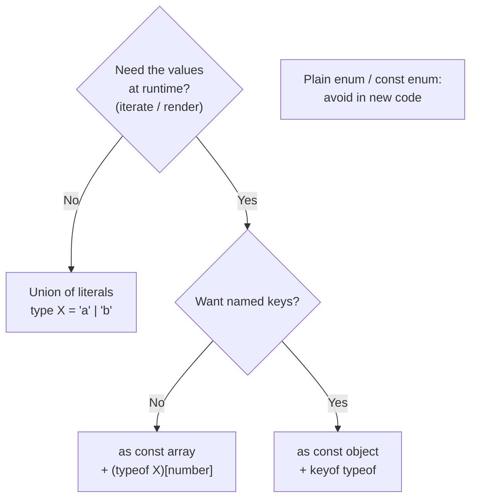

# 02 · Core Type System: Unions, Narrowing, Literals, Enums

**Goal:** Learn to model "this value is one of a fixed set of shapes" — the
single most useful skill in everyday TypeScript — and to let the compiler prove
you have handled every case. By the end you can model a loading/success/error
API response and have TypeScript yell at you the day someone adds a fourth state.

**What you'll learn**

- Union (`A | B`) and intersection (`A & B`) types, and when each shows up
- Literal types and literal unions as lightweight enums
- Discriminated (tagged) unions — the workhorse pattern for modeling state
- Narrowing: `typeof`, `instanceof`, `in`, truthiness, equality, discriminants
- User-defined type guards (`x is Foo`) and assertion functions (`asserts x is Foo`)
- Exhaustiveness checking with `never`
- `enum` vs `const enum` vs union literals vs `as const` objects — and what
  mature codebases actually reach for

**Prerequisites:** [01 · Foundations](./01-foundations.md) — you should be
comfortable with basic type annotations, `interface`/`type`, and reading a
compiler error. All code here assumes `"strict": true` and TypeScript 5.x.

---

## Mental model

Most JavaScript bugs are "the value wasn't the shape I assumed." TypeScript's
type system is, at its core, a tool for writing down *the full set of shapes a
value can be* — and then forcing you to check which one you actually have before
you touch it.

A **union** is "OR": the value is one of these. **Narrowing** is the act of
asking a question (`typeof x === "string"`?) that shaves the union down to a
smaller set inside that branch. A **discriminated union** is a union where every
member carries a literal tag, so one cheap question narrows perfectly. Get those
three ideas and the rest is syntax.



---

## Unions and intersections

A **union** says a value is *one of* several types. You can only use members
common to all branches until you narrow.

```ts
type Id = string | number;

function format(id: Id): string {
  // id.toUpperCase() // ❌ Error: number has no toUpperCase
  return id.toString(); // ✅ toString exists on both
}
```

An **intersection** combines types — the value must satisfy *all* of them at
once. It is how you compose object shapes.

```ts
type Timestamps = { createdAt: Date; updatedAt: Date };
type User = { id: string; email: string };

type StoredUser = User & Timestamps;
// must have id, email, createdAt, updatedAt
```

Rule of thumb: **union = OR (one of), intersection = AND (all of).** Unions are
everywhere; intersections mostly show up when merging object shapes or mixing in
extra fields.

> **Production gotcha:** intersecting two object types with the *same key but
> incompatible value types* yields `never` for that key, which is almost
> impossible to satisfy. `{ x: string } & { x: number }` makes `x: never`. If a
> field "can't be assigned," check whether two intersected shapes disagree on it.

---

## Literal types and literal unions

A literal type is a single exact value used as a type: `"active"`, `42`, `true`.
On their own they are rarely useful — but a *union of literals* is a lightweight,
zero-runtime enum.

```ts
type Currency = "USD" | "EUR" | "GBP";
type HttpMethod = "GET" | "POST" | "PUT" | "DELETE";

function setCurrency(c: Currency): void {
  // only the three strings are accepted; typos are compile errors
}

setCurrency("USD"); // ✅
// setCurrency("usd"); // ❌ not assignable
```

This is the idiom most mature codebases prefer over `enum` (more on that below).
It is just strings at runtime, so it serializes to JSON for free, plays nicely
with API payloads, and adds zero bundle weight.

> **Production gotcha:** a bare object literal widens. `const m = "GET"` infers
> `"GET"`, but `let m = "GET"` infers `string`, and `const o = { method: "GET" }`
> infers `{ method: string }`. To keep the narrow literal, use `as const`:
> `const o = { method: "GET" } as const` gives `{ readonly method: "GET" }`.

---

## Discriminated (tagged) unions — the important one

A discriminated union is a union where every member has a shared **discriminant**:
a literal-typed field (commonly `type`, `kind`, `status`) that uniquely identifies
which member you have. This is how you model state without lying to the compiler.

The canonical example is an async request. Naively people write one object with
optional fields — `{ loading?: boolean; data?: T; error?: Error }` — and then
every access is a guess. Model it as states instead:

```ts
type RequestState<T> =
  | { status: "idle" }
  | { status: "loading" }
  | { status: "success"; data: T }
  | { status: "error"; error: Error };
```

Now `data` only exists when `status` is `"success"`, and the compiler enforces
it. You literally cannot read `state.data` without first proving you are in the
success branch:

```ts
function render(state: RequestState<string[]>): string {
  switch (state.status) {
    case "idle":
      return "Nothing yet";
    case "loading":
      return "Loading…";
    case "success":
      return state.data.join(", "); // ✅ data is in scope here
    case "error":
      return `Failed: ${state.error.message}`; // ✅ error is in scope here
  }
}
```

The discriminant turns one machine into a literal state machine:



### A realistic API-response union

Real APIs rarely return one clean shape. A payments endpoint might return a
settled charge, a pending one awaiting 3-D Secure, or a declined one with a
reason. Model the response, not your hopes:

```ts
type ChargeResponse =
  | { outcome: "succeeded"; chargeId: string; amount: number }
  | { outcome: "requires_action"; chargeId: string; redirectUrl: string }
  | { outcome: "declined"; declineCode: "insufficient_funds" | "fraud" | "expired_card" };

function handleCharge(res: ChargeResponse): string {
  switch (res.outcome) {
    case "succeeded":
      return `Charged $${(res.amount / 100).toFixed(2)} (${res.chargeId})`;
    case "requires_action":
      return `Redirect to ${res.redirectUrl}`;
    case "declined":
      return `Declined: ${res.declineCode}`;
  }
}
```

Note `declineCode` is itself a literal union — narrowing nests cleanly.

---

## Narrowing: the full toolbox

Narrowing is how you move from a wide union to a single type the compiler trusts.
Each technique answers a runtime question; TypeScript watches the answer and
narrows the type accordingly.



**`typeof`** — for primitives (`"string"`, `"number"`, `"boolean"`, `"bigint"`,
`"symbol"`, `"undefined"`, `"function"`, `"object"`):

```ts
function len(x: string | string[]): number {
  return typeof x === "string" ? x.length : x.length; // both have .length, but each branch is narrowed
}
```

**`instanceof`** — for class instances:

```ts
function describe(e: Error | string): string {
  return e instanceof Error ? e.message : e;
}
```

**`in`** — checks for a property, narrows to members that have it:

```ts
type Cat = { meow: () => void };
type Dog = { bark: () => void };

function speak(pet: Cat | Dog): void {
  if ("meow" in pet) pet.meow();
  else pet.bark();
}
```

**Truthiness** — narrows out `null`, `undefined`, `0`, `""`, `false`:

```ts
function greet(name: string | null): string {
  if (!name) return "Hello, stranger";
  return `Hello, ${name}`; // name: string here
}
```

**Equality** — comparing with `===`/`!==` narrows both sides:

```ts
function f(a: string | number, b: string | boolean): void {
  if (a === b) {
    // a and b must both be string (the only common type)
    a.toUpperCase();
    b.toUpperCase();
  }
}
```

**Discriminant** — the `switch`/`if` on a tag field shown above. Prefer this for
unions you control; it is the most precise.

> **Production gotcha:** `typeof null === "object"`. A `typeof x === "object"`
> check does *not* exclude `null` under strict mode — you still need an explicit
> `x !== null`. This is the most common narrowing bug in real code.

> **Production gotcha:** narrowing is forgotten across function boundaries and
> after `await`. If you narrow a `let` variable and then `await` something or
> call a closure, TypeScript may widen it back, because the value could have
> changed. Pull the narrowed value into a `const` first.

---

## User-defined type guards (`x is Foo`)

When a check is too complex for the built-ins, write a function whose return type
is a **type predicate** `arg is Type`. If it returns `true`, the compiler narrows
the argument at the call site.

```ts
type ApiUser = { id: string; email: string };

function isApiUser(value: unknown): value is ApiUser {
  return (
    typeof value === "object" &&
    value !== null &&
    "id" in value &&
    "email" in value &&
    typeof (value as Record<string, unknown>).id === "string"
  );
}

function useUser(raw: unknown): void {
  if (isApiUser(raw)) {
    raw.email.toLowerCase(); // ✅ raw is ApiUser
  }
}
```

Type guards are the right boundary tool for data you do not control — JSON from
`fetch`, `localStorage`, message events. (At scale you'd reach for a runtime
validator like Zod, covered in [04 · Advanced Types](./04-advanced-types.md); a
guard is the hand-rolled version of the same idea.)

> **Production gotcha:** a type guard is an *unchecked promise* to the compiler.
> If your boolean logic is wrong, TypeScript believes you anyway and you get a
> runtime crash with no type error. Treat the body of a guard like security
> code: test it, and validate every field you claim exists.

## Assertion functions (`asserts x is Foo`)

An assertion function throws instead of returning a boolean. After it returns
(without throwing), the compiler narrows for the rest of the scope — no `if`
block needed.

```ts
function assertIsUser(value: unknown): asserts value is ApiUser {
  if (!isApiUser(value)) {
    throw new Error("Expected an ApiUser");
  }
}

function process(raw: unknown): string {
  assertIsUser(raw);
  return raw.email; // ✅ narrowed for the rest of the function
}
```

There is also the bare `asserts x` form (no type), used for "this is truthy"
invariants:

```ts
function assert(cond: unknown, msg: string): asserts cond {
  if (!cond) throw new Error(msg);
}
```

Reach for assertions when failing fast is correct (config loading, startup
invariants); reach for guards when you want a branch.

---

## Exhaustiveness checking with `never`

`never` is the type with no values. Crucially, *anything* is assignable **to**
`never` only if it is itself `never`. That gives a trick: in the default branch
of a discriminated-union switch, assign the value to `never`. If every case is
handled the value is already `never` and it compiles; the day someone adds a new
union member, the value is no longer `never` and you get a compile error pointing
right at the unhandled case.

```ts
function assertNever(x: never): never {
  throw new Error(`Unhandled case: ${JSON.stringify(x)}`);
}

function label(state: RequestState<unknown>): string {
  switch (state.status) {
    case "idle":
      return "Idle";
    case "loading":
      return "Loading";
    case "success":
      return "Success";
    case "error":
      return "Error";
    default:
      return assertNever(state); // ❌ compile error if a new status is added
  }
}
```

This is the payoff of discriminated unions: adding a state to the type
mechanically surfaces every place that must change. No grepping, no hoping.

> **Production gotcha:** the exhaustiveness check only works if the compiler can
> *see* the union is fully covered. If your switch is on a `string` (not a
> literal union), or you `return` a default value instead of calling
> `assertNever`, the safety net silently disappears. Always route the default
> through an `assertNever`-style call.

---

## `enum` vs `const enum` vs union literals vs `as const`

Four ways to express "a fixed set of named values." They are not equivalent.

**`enum`** generates a runtime object and reverse-mapping. It exists at runtime,
adds bundle weight, and string/number enums have surprising assignability rules.

```ts
enum Role { Admin, Editor, Viewer } // 0, 1, 2 at runtime
```

**`const enum`** is inlined at compile time (no runtime object), but it breaks
under isolated-module bundlers (Babel, esbuild, SWC) and Vite's default
transpile — so most modern toolchains discourage or forbid it.

**Union of literals** — no runtime footprint, serializes to JSON natively,
trivially narrowed:

```ts
type Role = "admin" | "editor" | "viewer";
```

**`as const` object** — when you also want the values available at runtime (to
iterate, validate, render a dropdown) *and* the literal type:

```ts
const ROLES = ["admin", "editor", "viewer"] as const;
type Role = (typeof ROLES)[number]; // "admin" | "editor" | "viewer"

// or the object form when you want named keys:
const STATUS = { Active: "active", Banned: "banned" } as const;
type Status = (typeof STATUS)[keyof typeof STATUS]; // "active" | "banned"
```



**What mature codebases prefer:** union literals by default; `as const`
array/object when you need to enumerate the values at runtime. Plain `enum` is
tolerated in legacy code; `const enum` is generally avoided. The reason is
simple — union literals are *just strings*, so they cross the JSON boundary, the
React-props boundary, and the bundler boundary without special handling.

---

## Patterns in production

**Fintech — model every outcome, never an optional soup.** Payment, transfer,
and KYC flows have many terminal states. A discriminated union with an
`assertNever` default means a regulator-mandated new state (say, `"under_review"`)
cannot ship until every handler acknowledges it. Optional-field objects let that
slip through and become a silent `undefined` in a money path.

**Healthcare — type guards at every ingestion boundary.** HL7/FHIR payloads
arrive as untrusted JSON. A user-defined type guard (or assertion function) at
the parse boundary turns "we hope this is a Patient resource" into a checked
gate, and the narrowed type carries through the rest of the pipeline. Pair the
guard with a real validator for field-level rules.

**Social — literal unions for content and moderation state.** A post's
visibility (`"public" | "followers" | "private"`) and moderation status
(`"ok" | "flagged" | "removed"`) as literal unions serialize straight into API
responses and feed-ranking inputs, and the exhaustiveness check forces the
ranking and rendering code to handle a new moderation state when Trust & Safety
adds one.

---

## Exercises

1. **State machine.** Define a `DownloadState` discriminated union with members
   `queued`, `downloading` (carrying `progress: number`), `done` (carrying
   `url: string`), and `failed` (carrying `error: string`). Write a `summary`
   function with an exhaustive switch and an `assertNever` default.

2. **Break the safety net.** Add a `paused` member to your `DownloadState`. Do
   *not* update `summary`. Confirm you get a compile error, and note which line
   it points at. Then fix it.

3. **Type guard.** Given `unknown` input, write `isCoordinate(x): x is { lat: number; lng: number }`
   that validates both fields are finite numbers (reject `NaN`). Write a small
   `assert`-based self-check that feeds it good and bad inputs.

4. **Narrowing null trap.** Write a function taking `unknown` that returns the
   number of keys if the value is a non-null object, else `0`. Prove your
   `typeof x === "object"` branch handles `null` correctly.

5. **Enum migration.** Take this `enum Priority { Low, Medium, High }` and
   rewrite it as (a) a union of literals and (b) an `as const` array that also
   lets you render the options in a dropdown. Note what each costs at runtime.

6. **API response.** Model a `SearchResponse<T>` union with `"ok"` (carrying
   `results: T[]` and `total: number`), `"empty"`, and `"rate_limited"`
   (carrying `retryAfterMs: number`). Write the render switch.

---

## Next

- [03 · Functions & Generics](./03-functions-generics.md) — reuse these unions
  across types with generics, overloads, and inference.
- [04 · Advanced Types](./04-advanced-types.md) — conditional types, mapped
  types, and runtime validation (Zod) that builds on guards.
- Back to [00 · Roadmap](./00-roadmap.md) · series root:
  [TypeScript Learning Plan](../TypeScript_Learning_Plan.md)
