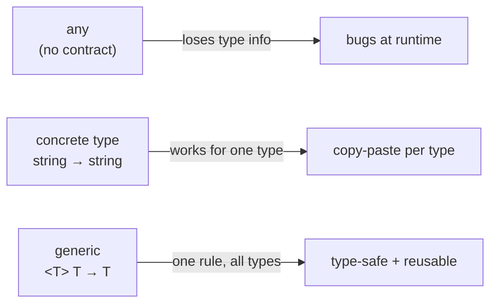
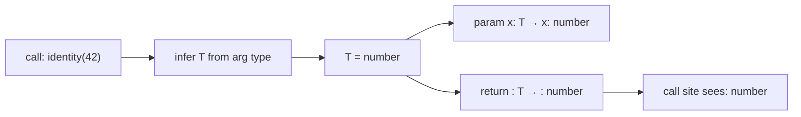

# 03 — Functions & Generics

**Goal:** Type functions precisely and reach for generics only when they pay for themselves — so that by the time you write React hooks, RN navigation params, and Next.js data loaders, you can read and write the generic machinery those APIs hand you instead of fighting it.

**What you'll learn**

- Typing parameters, return types, optional/default/rest params
- Function type expressions vs. call signatures
- Overloads — and why a union parameter usually beats them
- Typing `this`
- Generics from first principles: why they beat `any`
- Constraints (`extends`), defaults, multiple type params, inference
- Reusable generic utilities (`pick`, `groupBy`)
- Variance intuition: covariance, contravariance, method bivariance, `strictFunctionTypes`
- When a generic is overkill
- Higher-order functions and currying types
- A real payoff: a typed `fetch` wrapper / generic API client

**Prerequisites:** [02 — Type System Core](./02-type-system-core.md). You should be comfortable with unions, `interface` vs `type`, literal types, and `unknown` vs `any` before continuing.

> All code here is valid TypeScript 5.x under `"strict": true`.

---

## Mental model

A function type is a contract with two halves: **what you must hand in** (parameters) and **what you get back** (return). TypeScript checks both halves at every call site.

A **generic** adds a third idea: *some part of that contract is a blank the caller fills in.* You don't write the type — you write a *rule* relating input types to output types, and TypeScript solves for the blank at each call. That's the whole game. `any` throws the contract away; a generic keeps it and parameterizes it.



Keep that picture: generics are *relationships between types*, not "a type that means anything."

---

## Typing parameters and return types

Annotate parameters; let TypeScript infer the return type unless you want it pinned as documentation or a guardrail.

```ts
// Return type inferred as number — fine.
function add(a: number, b: number) {
  return a + b;
}

// Return type pinned. Now an accidental `return undefined` is a compile error,
// not a surprise three call sites away.
function half(n: number): number {
  return n / 2;
}
```

Pin the return type on anything that crosses a module boundary or returns a discriminated union — it stops an internal refactor from silently widening the public shape.

### Optional, default, and rest params

```ts
// Optional: type is `string | undefined`.
function greet(name?: string) {
  return `Hi ${name ?? "there"}`;
}

// Default: type is `string`, and the param is optional at the call site.
function greetD(name: string = "there") {
  return `Hi ${name}`;
}

// Rest: a tuple/array of the trailing args.
function sum(...nums: number[]): number {
  return nums.reduce((a, b) => a + b, 0);
}
```

> **Optional vs default.** `name?: string` includes `undefined` in the type. `name = "there"` does not — the default fills it in. Prefer defaults when you have a sensible fallback; you get a non-nullable type for free.

---

## Function type expressions and call signatures

A **function type expression** is the inline arrow form. A **call signature** is the object-literal form — and the only one that can also carry properties.

```ts
// Function type expression.
type BinaryOp = (a: number, b: number) => number;

const multiply: BinaryOp = (a, b) => a * b; // params inferred from BinaryOp

// Call signature — a callable object that ALSO has properties.
type Memoized = {
  (key: string): number; // call signature
  cache: Map<string, number>; // extra property
};
```

You'll meet call signatures in the wild on things like `React.FC` (callable, but also has `.displayName`) and many library "function-with-config" objects.

---

## Overloads — and why unions usually win

Overloads let one implementation advertise several precise signatures.

```ts
function len(x: string): number;
function len(x: unknown[]): number;
function len(x: string | unknown[]): number {
  return x.length;
}
```

The cost: the implementation signature is invisible to callers, the overloads must be kept in sync by hand, and editor hints get noisy. Most of the time a **union parameter** says the same thing with less ceremony:

```ts
function len2(x: string | unknown[]): number {
  return x.length;
}
```

> **Reach for overloads only when the return type genuinely depends on the argument type** — `createElement("div")` returns a different element than `createElement("a")`. If every overload returns the same type, you wanted a union.

---

## Typing `this`

In a regular function, `this` is whatever called it. Give it a fake first parameter named `this` to type it; TypeScript erases it at compile time.

```ts
interface Counter {
  count: number;
  increment(this: Counter): void;
}

const c: Counter = {
  count: 0,
  increment() {
    this.count++; // `this` is Counter, checked
  },
};
```

> **Gotcha — detached methods lose `this`.** `const f = c.increment; f();` calls with the wrong `this`. The `this: Counter` annotation makes that a compile error. Arrow functions sidestep the whole issue by capturing the surrounding `this` — which is exactly why React class components and event handlers lean on them.

---

## Generics from first principles

Start with the problem. This "identity" helper works, but throws away the type:

```ts
function identityBad(x: any): any {
  return x;
}
const n = identityBad(42); // n: any  — TypeScript now knows nothing
```

A type parameter `<T>` captures the input type and threads it to the output:

```ts
function identity<T>(x: T): T {
  return x;
}
const m = identity(42); // m: number — T inferred as number
const s = identity("hi"); // s: string
```

You almost never pass `T` explicitly. TypeScript **infers** it from the argument. That inference is the engine behind every typed API you'll use later.



### Constraints with `extends`

An unconstrained `T` can be *anything*, so you can't touch its properties. Constrain it to the shape you need:

```ts
// T must have a .length; otherwise we couldn't read it.
function longest<T extends { length: number }>(a: T, b: T): T {
  return a.length >= b.length ? a : b;
}

longest("abc", "de"); // ok → string
longest([1, 2], [3]); // ok → number[]
// longest(1, 2);      // error: number has no .length
```

### Multiple type params, defaults, and explicit inference

```ts
// Two params; defaults; K constrained to the keys of T.
function getProp<T, K extends keyof T = keyof T>(obj: T, key: K): T[K] {
  return obj[key];
}

const user = { id: 1, name: "Ada" };
const name = getProp(user, "name"); // string
// getProp(user, "email");           // error: "email" not a key of user
```

`keyof T` plus a constrained `K` is the single most important generic pattern you'll reuse — it's how form libraries, ORMs, and state setters stay type-safe across arbitrary object shapes.

---

## Reusable generic utilities

Two you'll write or import constantly.

```ts
// pick: a typed subset of an object.
function pick<T extends object, K extends keyof T>(obj: T, keys: K[]): Pick<T, K> {
  const out = {} as Pick<T, K>;
  for (const k of keys) out[k] = obj[k];
  return out;
}

const slim = pick(user, ["id"]); // { id: number }
```

```ts
// groupBy: array → record keyed by a derived string.
function groupBy<T, K extends string>(items: T[], keyOf: (item: T) => K): Record<K, T[]> {
  const out = {} as Record<K, T[]>;
  for (const item of items) {
    const k = keyOf(item);
    (out[k] ??= []).push(item);
  }
  return out;
}

const txns = [
  { id: "a", kind: "debit" as const, cents: 500 },
  { id: "b", kind: "credit" as const, cents: 900 },
];
const byKind = groupBy(txns, (t) => t.kind);
// byKind: Record<"debit" | "credit", {...}[]>
```

> Note `keyOf: (item: T) => K` — the *output* type `K` is inferred from the callback's return, so `byKind` knows the literal keys, not just `string`.

---

## Variance — the part everyone skips and then gets bitten by

Variance is "if `Dog` is assignable to `Animal`, when is `X<Dog>` assignable to `X<Animal>`?" For functions it has a sharp, practical edge.

**Return types are covariant.** A function returning `Dog` is a valid stand-in for one returning `Animal` — you asked for an Animal, you got a Dog, fine.

**Parameter types are contravariant.** A handler that accepts *any* `Animal` can stand in where an `Animal`-handler is expected, but one that demands a specific `Dog` cannot — it'd choke on a `Cat`.

```ts
type Animal = { name: string };
type Dog = { name: string; bark(): void };

type Handler<A> = (a: A) => void;

let handleAnimal: Handler<Animal> = (a) => console.log(a.name);
let handleDog: Handler<Dog> = (d) => d.bark();

handleDog = handleAnimal; // OK: accepts more → safe (contravariant)
// handleAnimal = handleDog; // ERROR under strictFunctionTypes: needs bark()
```


> **`strictFunctionTypes` and the method-bivariance hole.** That contravariant check only runs on *function-typed properties* (`fn: (a: A) => void`). Methods written in **method shorthand** (`fn(a: A): void`) are checked **bivariantly** — both directions allowed — for historical reasons, mainly so arrays and the DOM stay usable. Practical takeaway: if you want the strict, safe check, write callbacks as `onX: (e: E) => void`, not `onX(e: E): void`. This is exactly why React event handler types are property-style.

---

## When a generic is overkill

Generics earn their keep by **relating** types. If a type parameter appears only once, it relates nothing — delete it.

```ts
// Pointless: T is used once, so it's just `unknown` with extra steps.
function logIt<T>(x: T): void {
  console.log(x);
}
// Better:
function logIt2(x: unknown): void {
  console.log(x);
}
```

> **Rule of thumb:** a type parameter must appear in **at least two positions** (two params, or a param and the return). One appearance → not a generic, just obfuscation. Resist generalizing for hypothetical future callers; that future rarely arrives and the indirection is paid every time someone reads the signature.

---

## Higher-order functions and currying

A higher-order function takes or returns a function. Generics let the wrapped types flow through.

```ts
// compose two functions; the middle type B links them.
function compose<A, B, C>(f: (b: B) => C, g: (a: A) => B): (a: A) => C {
  return (a) => f(g(a));
}

const toLen = (s: string) => s.length;
const isEven = (n: number) => n % 2 === 0;
const isLenEven = compose(isEven, toLen); // (a: string) => boolean
```

```ts
// Curried add — each layer narrows what's left.
const adder = (a: number) => (b: number) => a + b;
const add5 = adder(5); // (b: number) => number
add5(10); // 15
```

Keep currying shallow. Past two or three levels the types are correct but unreadable, and a plain multi-arg function is kinder to whoever debugs it at 3am.

---

## Patterns in production: a typed `fetch` wrapper

Everything above converges here. This is the generic API client you'll adapt for a fintech ledger UI, a healthcare records dashboard, or a social feed — the shape is identical; only the response types differ.

```ts
type ApiResult<T> =
  | { ok: true; data: T }
  | { ok: false; status: number; error: string };

// T is the EXPECTED response shape. Caller supplies it; nothing else changes.
async function apiGet<T>(url: string): Promise<ApiResult<T>> {
  const res = await fetch(url);
  if (!res.ok) {
    return { ok: false, status: res.status, error: res.statusText };
  }
  // `unknown` at the boundary — validate before trusting it (see below).
  const data = (await res.json()) as T;
  return { ok: true, data };
}

// Fintech: the caller declares the contract once.
interface Account {
  id: string;
  balanceCents: number;
}

const result = await apiGet<Account>("/api/accounts/42");
if (result.ok) {
  result.data.balanceCents; // number — fully typed downstream
} else {
  result.status; // number — error branch is typed too
}
```

> **Production gotcha — `as T` is a promise, not a proof.** The cast tells TypeScript to *believe* the JSON matches `T`; it does **not** check. In fintech and healthcare that's a data-integrity and compliance hazard — a malformed `balanceCents` or a missing field flows straight into your UI typed as valid. At trust boundaries, parse with a runtime validator (Zod, Valibot) and infer `T` from the schema so the static type and the runtime check can never drift. We'll wire this up in [11 — Production Patterns](./11-production-patterns.md).

> **Production gotcha — don't over-parameterize the client.** A tempting "v2" adds `<T, TBody, THeaders, TQuery>`. Stop. Most call sites only care about the response type. Extra type params every caller must think about (or `// @ts-ignore` past) are negative value. Add a parameter the day a real second caller needs it — not before.

---

## Exercises

1. **Tighten a function.** Given `function first(arr) { return arr[0]; }`, type it generically so `first([1,2,3])` is `number` and `first(["a"])` is `string`. What should `first([])` return, and how do you signal that in the type?

2. **Overload vs union.** Write `parseId` that accepts `string | number` and returns a normalized `string`. Do it once with overloads and once with a union param. Which reads better here, and why?

3. **Constrain a key.** Implement `setProp<T, K extends keyof T>(obj: T, key: K, value: T[K]): T`. Then try calling it with a wrong-typed value and confirm the compiler rejects it.

4. **`groupBy`, extended.** Adapt the `groupBy` above so the key function may return a `number` (e.g. group transactions by day-of-month). What constraint do you put on `K`, and why can't it be unconstrained?

5. **Variance bug hunt.** Declare `type Listener<E> = (e: E) => void`, make a `Listener<{ x: number }>`, and try assigning it to a `Listener<{ x: number; y: number }>`. Predict the result under `strictFunctionTypes`, then rewrite `Listener` as a method-shorthand property and observe what changes.

6. **Typed client.** Extend `apiGet` into `apiPost<TReq, TRes>(url, body: TReq): Promise<ApiResult<TRes>>`. Then argue for or against adding `TReq` — does a real second caller justify it yet?

---

## Next

- Previous: [02 — Type System Core](./02-type-system-core.md)
- Next: [04 — Advanced Types](./04-advanced-types.md) — conditional types, mapped types, and the inference tricks that power utility types
- Runtime validation referenced above: [11 — Production Patterns](./11-production-patterns.md)
- Series index: [TypeScript Learning Plan](../TypeScript_Learning_Plan.md)
