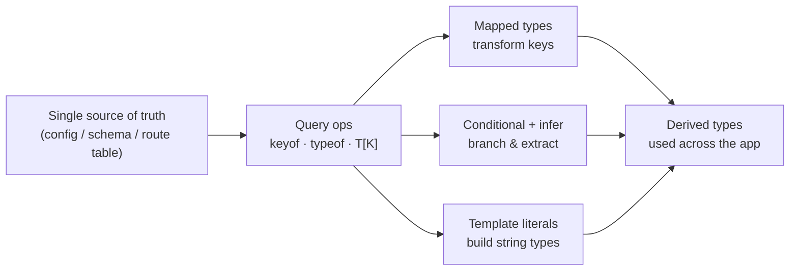
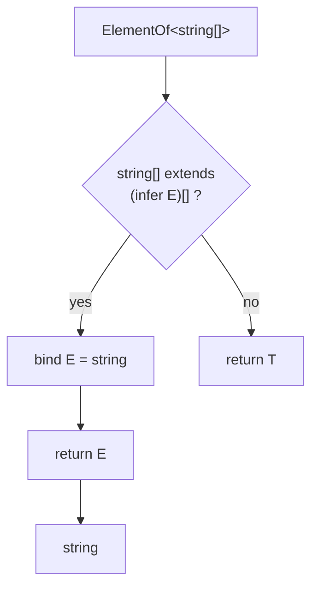
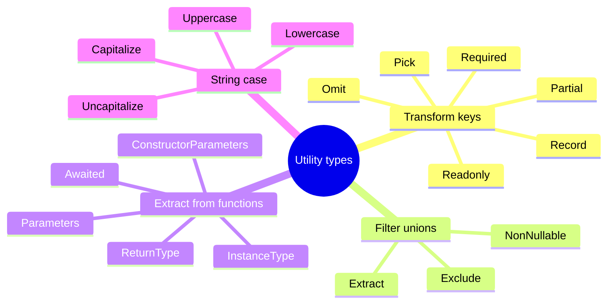

# 04 - Advanced Types: Mapped, Conditional, Template Literal, and Utility Types

**Goal:** Learn to *derive* types instead of hand-writing them, so that your React props, API clients, and config objects stay correct automatically when the underlying shape changes.

## What you'll learn

- The four query operators that read shape from existing types: `keyof`, `typeof`, indexed access (`T[K]`), and how they combine.
- **Mapped types** — transforming every key of a type at once, including key remapping with `as`, and the `+`/`-` modifiers for `readonly` and `?`.
- **Conditional types** (`T extends U ? X : Y`), the `infer` keyword, and why conditionals over unions *distribute*.
- **Template literal types** for building string types like routes and event names.
- The **built-in utility types** in depth, and when to reach for each.
- Writing your own utilities (`DeepPartial`, `DeepReadonly`) and **recursive types**.
- The `satisfies` operator and how it differs from `as` and from a plain annotation.
- When all of this is worth it — and when it's type-level showing off you'll regret at 3am.

## Prerequisites

You should be comfortable with generics and constraints from [03 - Functions and Generics](./03-functions-generics.md). Everything here builds on `<T extends ...>`. If `keyof` and `T[K]` already feel foreign, skim that guide first.

---

## Mental model

Think of advanced types as a **small pure functional language that runs at compile time**. Its values are types. Its functions take types and return types. It has:

- variables (generic parameters `T`),
- a map operation (mapped types),
- an if-expression (conditional types),
- pattern matching / destructuring (`infer`),
- string concatenation (template literals),
- and recursion.

You are not writing runtime code here. Nothing in this guide ships to the browser. The entire payoff is that **one source of truth** — a config object, an API schema, a route table — generates the dozens of derived types you'd otherwise write by hand and forget to update.

The cost is real too: this language has no debugger and famously unfriendly error messages. So the rule throughout is *derive what changes often, hand-write what's stable.*



---

## The query operators: reading shape from types

Before you can transform a type, you have to *read* it. Three operators do this.

**`keyof`** gives you the union of a type's keys as string (or number/symbol) literals.

**`typeof`** (the *type-level* one, not the JS runtime operator) lifts a runtime value into the type world.

**Indexed access** `T[K]` reads the type of a property — and because `K` can itself be a union, you can read several at once.

```ts
const config = {
  apiUrl: "https://api.example.com",
  timeoutMs: 5000,
  retries: 3,
} as const;

type Config = typeof config;
// { readonly apiUrl: "https://..."; readonly timeoutMs: 5000; readonly retries: 3 }

type ConfigKey = keyof Config;
// "apiUrl" | "timeoutMs" | "retries"

type TimeoutType = Config["timeoutMs"];
// 5000

type NumericFields = Config["timeoutMs" | "retries"];
// 5000 | 3

// Read the element type of an array with the `number` index:
const roles = ["admin", "member", "guest"] as const;
type Role = (typeof roles)[number];
// "admin" | "member" | "guest"
```

That last pattern — `(typeof arr)[number]` over an `as const` array — is the workhorse of "single source of truth." You write the list once as data, and the type follows.

---

## Mapped types: transform every key at once

A mapped type walks over the keys of a type and produces a new property for each. The syntax echoes a JS `for...in`:

```ts
type Flags = {
  darkMode: boolean;
  betaApi: boolean;
  newCheckout: boolean;
};

// Make every flag a getter function instead of a value.
type FlagGetters = {
  [K in keyof Flags]: () => Flags[K];
};
// { darkMode: () => boolean; betaApi: () => boolean; newCheckout: () => boolean }
```

### Modifiers: `readonly` and `?`, with `+` / `-`

You can add or strip the `readonly` and optional (`?`) modifiers. A bare `readonly` or `?` *adds* it; prefixing with `-` *removes* it.

```ts
type Mutable<T> = {
  -readonly [K in keyof T]: T[K];
};

type Concrete<T> = {
  [K in keyof T]-?: T[K]; // strip optionality
};

type ReadonlyState = {
  readonly id: string;
  readonly draft?: string;
};

type EditableState = Mutable<Concrete<ReadonlyState>>;
// { id: string; draft: string }
```

### Key remapping with `as`

The `as` clause lets you *rename* keys while mapping — and if you map a key to `never`, it disappears. This is how you build "getters" or filter keys.

```ts
type Getters<T> = {
  [K in keyof T as `get${Capitalize<string & K>}`]: () => T[K];
};

type User = { name: string; age: number };
type UserGetters = Getters<User>;
// { getName: () => string; getAge: () => number }

// Filter: keep only the string-valued keys.
type StringKeys<T> = {
  [K in keyof T as T[K] extends string ? K : never]: T[K];
};
type OnlyStrings = StringKeys<{ a: string; b: number; c: string }>;
// { a: string; c: string }
```

---

## Conditional types and `infer`

A conditional type is a type-level ternary: `T extends U ? X : Y`. The interesting part is `infer`, which pattern-matches *inside* the `extends` clause and binds a piece of the type to a fresh variable.

```ts
// Unwrap the element type of an array, otherwise pass through.
type ElementOf<T> = T extends readonly (infer E)[] ? E : T;

type A = ElementOf<string[]>; // string
type B = ElementOf<number>;   // number (not an array, passes through)

// Pull the resolved type out of a Promise (one level).
type Unpromise<T> = T extends Promise<infer R> ? R : T;
type C = Unpromise<Promise<User>>; // User
```

Here's how the compiler resolves a conditional. It's worth internalizing because nested conditionals are where readability dies.



### Distributive conditional types

When the checked type is a **naked generic parameter** and you pass it a union, the conditional applies to *each member separately*, then re-unions the results. This is usually what you want — but it surprises people.

```ts
type ToArray<T> = T extends unknown ? T[] : never;

type D = ToArray<string | number>;
// distributes -> ToArray<string> | ToArray<number>
// = string[] | number[]   (NOT (string | number)[])
```

To **disable** distribution, wrap both sides in a tuple so the parameter is no longer "naked":

```ts
type ToArrayNonDist<T> = [T] extends [unknown] ? T[] : never;
type E = ToArrayNonDist<string | number>;
// (string | number)[]
```

A practical use of distribution: filtering a union.

```ts
type ExcludeNull<T> = T extends null | undefined ? never : T;
type F = ExcludeNull<string | null | number | undefined>;
// string | number
```

(That's essentially how the built-in `NonNullable` works.)

---

## Template literal types

Template literal types build *string types* the same way template strings build string values. They're how you type things like API routes, CSS units, or event names — turning a category of strings into a checkable type.

```ts
type HttpMethod = "GET" | "POST" | "PUT" | "DELETE";
type Resource = "users" | "orders";

type Endpoint = `${HttpMethod} /${Resource}`;
// "GET /users" | "GET /orders" | "POST /users" | ... (8 combinations)

// Event names from a domain noun.
type DomainEvent<T extends string> = `${T}:created` | `${T}:updated` | `${T}:deleted`;
type OrderEvent = DomainEvent<"order">;
// "order:created" | "order:updated" | "order:deleted"
```

Combined with `infer`, template literals can *parse* strings at the type level — for example, extracting path params from a route:

```ts
type PathParams<T extends string> =
  T extends `${string}:${infer Param}/${infer Rest}`
    ? Param | PathParams<`/${Rest}`>
    : T extends `${string}:${infer Param}`
      ? Param
      : never;

type Params = PathParams<"/users/:userId/orders/:orderId">;
// "userId" | "orderId"
```

> [!WARNING]
> Recursive template-literal parsing like the above is *clever*. It's also the kind of thing the next engineer (or you, in six months) will not want to debug. Reach for it only when the alternative — hand-listing param names — is genuinely error-prone. Most route tables are better expressed as plain data.

---

## The built-in utility types, in depth

TypeScript ships a standard library of these. Knowing them cold means you rarely write a mapped or conditional type by hand. Here they are grouped by *what job they do*.



**Key transformers** (operate on object shapes):

```ts
interface Account {
  id: string;
  email: string;
  balanceCents: number;
}

type Draft = Partial<Account>;        // every field optional — good for PATCH bodies
type Full = Required<Draft>;           // every field required again
type Frozen = Readonly<Account>;       // every field readonly
type Public = Pick<Account, "id" | "email">;   // keep a subset
type Internal = Omit<Account, "balanceCents">; // drop a subset
type ById = Record<string, Account>;   // build an index/dictionary
```

Use **`Pick`** when the allowed fields are the small set; use **`Omit`** when the forbidden fields are. `Omit` is safer against drift: add a new field to `Account` and an `Omit`-derived type automatically includes it, whereas a `Pick` does not. Choose based on which default you want when the source grows.

**Union filters:**

```ts
type Status = "draft" | "active" | "archived" | "deleted";
type Live = Exclude<Status, "archived" | "deleted">; // "draft" | "active"
type Gone = Extract<Status, "archived" | "deleted">; // "archived" | "deleted"
type Defined = NonNullable<string | null | undefined>; // string
```

**Function/constructor extractors** — derive types from existing functions instead of restating them:

```ts
function createOrder(userId: string, total: number) {
  return { id: crypto.randomUUID(), userId, total, createdAt: Date.now() };
}

type Order = ReturnType<typeof createOrder>;      // the inferred return shape
type CreateArgs = Parameters<typeof createOrder>; // [userId: string, total: number]

async function fetchUser(id: string): Promise<Account> {
  const res = await fetch(`/api/users/${id}`);
  return res.json() as Promise<Account>;
}

type Fetched = Awaited<ReturnType<typeof fetchUser>>; // Account (unwraps the Promise)
```

`Awaited` is recursive — it unwraps nested promises and thenables — which is why you should prefer it over a hand-rolled `Unpromise`.

---

## Building your own utility types

The built-ins are shallow: `Partial<T>` only makes the *top* level optional. For nested config and state, you often want deep versions. These are the two you'll actually reuse, so put them in a shared `types.ts` rather than reinventing per file.

```ts
// Recurse into plain objects; leave functions and arrays' elements handled too.
type DeepPartial<T> = T extends (infer E)[]
  ? DeepPartial<E>[]
  : T extends object
    ? { [K in keyof T]?: DeepPartial<T[K]> }
    : T;

type DeepReadonly<T> = T extends (infer E)[]
  ? ReadonlyArray<DeepReadonly<E>>
  : T extends object
    ? { readonly [K in keyof T]: DeepReadonly<T[K]> }
    : T;

interface Settings {
  theme: { color: string; spacing: number };
  features: { beta: boolean }[];
}

type SettingsPatch = DeepPartial<Settings>;
// { theme?: { color?: string; spacing?: number }; features?: { beta?: boolean }[] }

const frozen: DeepReadonly<Settings> = {
  theme: { color: "blue", spacing: 8 },
  features: [{ beta: true }],
};
// frozen.theme.color = "red"; // Error: read-only
```

These rely on **recursive types**: a type referring to itself, terminating when it hits a non-object. That's also how you'd type a JSON value:

```ts
type Json =
  | string
  | number
  | boolean
  | null
  | Json[]
  | { [key: string]: Json };
```

> [!CAUTION]
> Deep recursive types are expensive for the compiler and can hit its instantiation depth limit on large or cyclic shapes. If your editor starts lagging or you see *"Type instantiation is excessively deep,"* stop recursing and accept a shallower type. Compile speed is a feature.

---

## `satisfies`: validate without widening

This is the most useful operator added in recent TS versions, and the most misunderstood. Three tools look similar but do different things:

- **Annotation** `const x: T = ...` — checks the value against `T` **and** changes `x`'s type *to* `T` (you lose the specific literal types).
- **`as T`** — a *cast*. It tells the compiler "trust me," does almost no checking, and can hide real bugs.
- **`satisfies T`** — checks the value against `T` **and keeps** the value's narrow, inferred type.

```ts
type RouteConfig = Record<string, { method: "GET" | "POST"; auth: boolean }>;

// Annotation: type-checked, but routes is now the wide Record type.
const a: RouteConfig = {
  home: { method: "GET", auth: false },
};
// typeof a.home.method === "GET" | "POST"  (widened — lost which one)
// a.dashboard;  // allowed by the index signature, compiles but is undefined at runtime

// satisfies: type-checked AND narrow.
const routes = {
  home: { method: "GET", auth: false },
  login: { method: "POST", auth: false },
} satisfies RouteConfig;

routes.home.method; // narrowed to "GET"
// routes.dashboard; // Error: property does not exist  (keys are known)
```

Rule of thumb: **`satisfies` is what you almost always want** for config objects, route tables, and design tokens — you get the constraint check *and* keep precise types and key autocompletion. Reserve `as` for the rare case where you genuinely know more than the compiler (e.g., parsing external data you've already validated), and reach for an annotation only when you *want* the wider type as the public surface.

> [!NOTE]
> `satisfies` does not exist at runtime and emits no JS. It is purely a compile-time check, like all of this guide's content.

---

## Production gotchas

> [!WARNING]
> **Distribution bites silently.** `T extends ... ? ...` over a union distributes when `T` is naked. If your helper produces a union you didn't expect (e.g. `string[] | number[]` instead of `(string | number)[]`), wrap the check in `[T]` to turn it off. This is the single most common conditional-type bug.

> [!CAUTION]
> **Type complexity is a real cost.** Every clever recursive/template type slows `tsc` and IDE responsiveness, and turns hover tooltips into noise. Before writing one, ask: would three lines of duplicated hand-written types be *cheaper to maintain* than this one clever generic? Often yes. Lazy here means writing less type-level code.

> [!WARNING]
> **`as` is not validation.** `data as User` does nothing at runtime — if the API returns garbage, you get a `User`-typed value that lies. Validate external data with a schema library (Zod, Valibot) at the boundary; derive the static type *from* the schema with its `infer`, so the type and the runtime check can't drift.

> [!NOTE]
> **Prefer the built-ins.** Don't ship a hand-rolled `Unpromise`, `Diff`, or `MyPartial` when `Awaited`, `Exclude`, and `Partial` exist. The standard library is more correct on edge cases and instantly familiar to the next reader.

---

## Patterns in production

**Fintech — money fields locked at the type level.** Account and ledger types are built once and exposed as `DeepReadonly` everywhere outside the service that owns them, so no UI component can accidentally mutate a balance. Mutations go through functions that take a `DeepPartial` patch, validated against the canonical type, so a PATCH endpoint can't introduce an unknown field.

```ts
type LedgerEntry = DeepReadonly<{
  id: string;
  amountCents: number;
  currency: "USD" | "EUR";
  postedAt: string;
}>;
```

**Healthcare — FHIR-style resources from one schema.** A single Zod (or similar) schema for a `Patient` resource is the source of truth; the static type is `z.infer<typeof PatientSchema>`, and `Pick`/`Omit` derive the narrow shapes for the "search result row," the "edit form," and the "audit log entry." Because they're all derived, adding a required field to the schema forces compile errors at every consumer that forgot it — exactly what you want in a regulated domain.

**Social — typed event bus from a single event map.** One `interface EventMap` lists every event name and its payload; mapped + template-literal types generate the `on`/`emit` signatures so the listener for `"post:liked"` is guaranteed to receive the right payload.

```ts
interface EventMap {
  "post:liked": { postId: string; userId: string };
  "post:reported": { postId: string; reason: string };
}

type Emitter = {
  emit<K extends keyof EventMap>(event: K, payload: EventMap[K]): void;
  on<K extends keyof EventMap>(event: K, handler: (p: EventMap[K]) => void): void;
};
```

The thread through all three: **define the data once, derive the types.** When the schema changes, the compiler — not a code reviewer — finds every place that needs updating.

---

## Exercises

1. **Indexed access drill.** Given `const permissions = { read: 1, write: 2, admin: 4 } as const`, write a type `Permission` that is the union `1 | 2 | 4` using only `typeof` and indexed access. Then write `PermissionName` = `"read" | "write" | "admin"`.

2. **Mapped + remap.** Write `Nullable<T>` that makes every property `T[K] | null`. Then write `Events<T>` that, for object `T`, produces `{ onNameChange, onAgeChange, ... }` keys (template literal + `as` remap) whose values are `(value: T[K]) => void`.

3. **Conditional + infer.** Write `FirstArg<F>` that extracts the type of the first parameter of a function type `F`, returning `never` for functions with no parameters. Verify it against `(id: string, n: number) => void`.

4. **Kill distribution.** Write `IsUnion<T>` that resolves to `true` if `T` is a union of two or more members and `false` otherwise. (Hint: compare a distributive form of `T` against a non-distributive `[T]` form.)

5. **Deep utility.** Without looking back, write `DeepRequired<T>` (the recursive opposite of `DeepPartial`). Test it on a nested optional config.

6. **`satisfies` vs `as`.** Define `type Theme = Record<"light" | "dark", { bg: string; fg: string }>`. Build a `theme` const that (a) errors if you misspell `fg`, (b) errors if you add a `sepia` key, and (c) still autocompletes `theme.light.bg`. Show why `as Theme` fails requirement (a) and an annotation fails (c)'s narrowing.

---

## Next

- Previous: [03 - Functions and Generics](./03-functions-generics.md)
- Next: [05 - Objects and Classes](./05-objects-classes.md)
- Up: [00 - Roadmap](./00-roadmap.md) · [TypeScript Learning Plan](../TypeScript_Learning_Plan.md)
