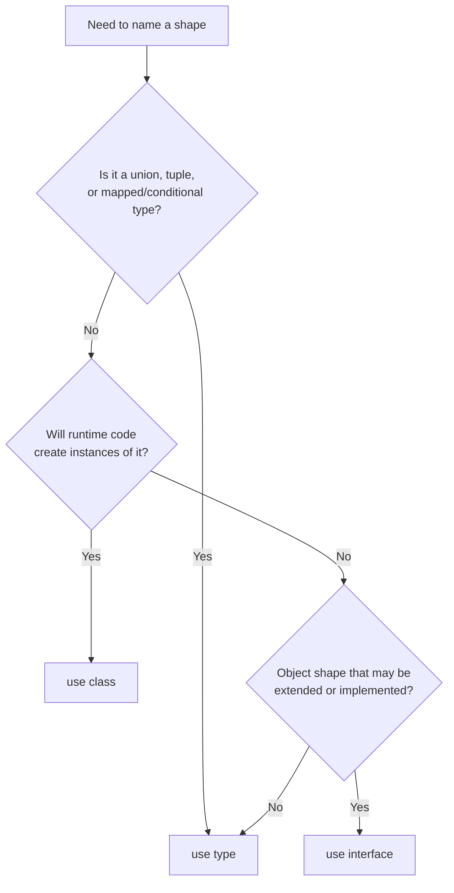
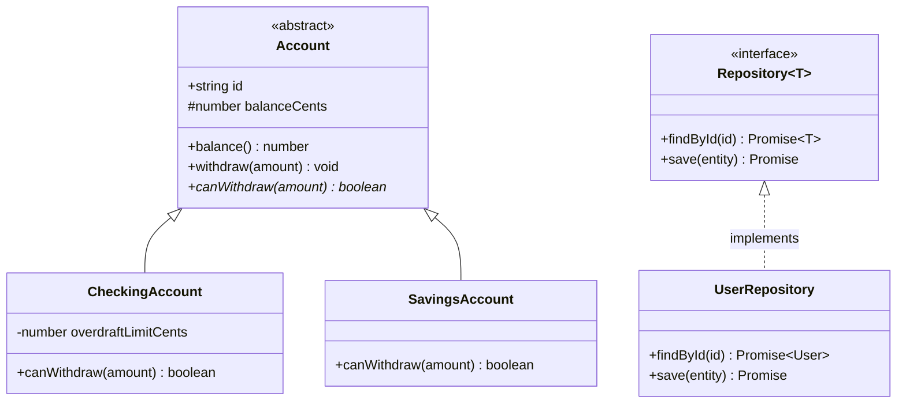

# 05 — Objects, Interfaces & Classes

**Goal:** Learn how TypeScript describes the *shape* of data (`interface`, `type`, object types) and the *behavior* of data (classes, decorators) — and, just as importantly, when **not** to reach for a class in modern React/Next.js code.

## What you'll learn

- `interface` vs `type` alias — the real differences, declaration merging, and the rule of thumb mature teams actually follow.
- Object type details: optional props, `readonly`, index signatures, and excess property checks.
- Classes in TypeScript: fields, constructors, parameter properties, access modifiers (`public`/`private`/`protected`, `#` fields), `readonly`, accessors, `static`, `abstract`, and implementing interfaces.
- Generic classes, and why **composition beats inheritance** almost every time.
- Stage 3 / TS 5 decorators — the overview you need to read NestJS, Angular, and TypeORM code.
- Where classes belong (backend domain entities, repositories) and where they don't (most React app code).

## Prerequisites

You should be comfortable with the material in [./02-type-system-core.md](./02-type-system-core.md) — primitives, unions, literal types, and basic object annotations. Generics are touched on here but covered fully in [./03-functions-generics.md](./03-functions-generics.md).

---

## Mental model

TypeScript splits cleanly into two worlds, and almost every confusion comes from mixing them up:

- **Types describe shape.** `interface` and `type` exist only at compile time. They are erased — they produce *zero* JavaScript. They answer "what does this value look like?"
- **Classes produce runtime values.** A `class` is real JavaScript that exists at runtime: it creates objects, holds methods, and shows up in stack traces. It *also* happens to introduce a type with the same name.

So a class is doing two jobs at once (a runtime constructor *and* a type), while an interface does exactly one (a type). When you only need the shape — which is most of the time in frontend code — you want the thing that does one job. Reach for a class only when you need behavior bundled with data, identity, or runtime machinery (decorators, instance checks).

> Rule of thumb to carry through this whole guide: **default to plain object types and functions; introduce a class only when a class earns its keep.**

---

## `interface` vs `type` alias

Both describe object shapes, and for the common case they are interchangeable:

```ts
interface User {
  id: string;
  name: string;
}

type UserAlias = {
  id: string;
  name: string;
};
```

The differences that actually matter:

**1. `type` can name anything; `interface` only describes object-ish shapes.** Unions, tuples, primitives, and mapped types all need `type`:

```ts
type Id = string | number;           // union — interface cannot do this
type Pair = [number, number];        // tuple
type Status = "active" | "archived"; // literal union
```

**2. `interface` supports declaration merging; `type` does not.** Two interfaces with the same name in the same scope merge into one. Two `type`s with the same name are a duplicate-identifier error.

```ts
interface Window {
  myAppVersion: string;
}
// Elsewhere — merges into the global Window:
interface Window {
  featureFlags: Record<string, boolean>;
}
```

This is occasionally useful for augmenting third-party globals, but inside your own code it is mostly a footgun — two declarations silently combining is rarely what you want.

**3. `extends` vs intersection.** Interfaces extend; types intersect. Both compose, but `extends` gives clearer errors and the compiler caches it better:

```ts
interface Animal { name: string; }
interface Dog extends Animal { breed: string; }

type AnimalT = { name: string };
type DogT = AnimalT & { breed: string };
```

**The rule mature teams follow:** *Use `interface` for object shapes that might be extended or implemented (public API surfaces, props, entities). Use `type` for everything else — unions, tuples, mapped/conditional types, and function signatures.* It is fine if you prefer `type` everywhere for consistency; what's not fine is agonizing over it per-declaration. Pick the convention, lint it, move on.



---

## Object type details

### Optional and readonly properties

```ts
interface Account {
  readonly id: string;     // can't be reassigned after creation
  email: string;
  nickname?: string;       // optional: string | undefined
}

const a: Account = { id: "acc_1", email: "x@y.com" };
// a.id = "acc_2"; // Error: Cannot assign to 'id', it is read-only.
```

`readonly` is compile-time only — it disappears at runtime and does not deep-freeze. For true immutability use `Object.freeze` or a library; `readonly` just stops *you* from writing the obvious mistake.

### Index signatures

Use these for genuinely dynamic keys — a dictionary, not a fixed record:

```ts
interface FeatureFlags {
  [flag: string]: boolean;
}

const flags: FeatureFlags = { darkMode: true, betaSearch: false };
```

If the keys are known and finite, prefer `Record<K, V>` or an explicit shape over an index signature — it gives you autocomplete and catches typos.

### Excess property checks

TypeScript flags extra properties on *object literals* assigned directly to a typed target. This catches typos:

```ts
interface Opts { timeout: number; }

// Error: 'timoeut' does not exist in type 'Opts'.
const o: Opts = { timeout: 1000, timoeut: 2000 };

// But via a variable, the check is skipped (structural typing):
const raw = { timeout: 1000, timoeut: 2000 };
const o2: Opts = raw; // OK — raw has at least what Opts needs
```

This surprises people. The check exists specifically for the literal case, because that's where typos live. If you genuinely want extra props, an index signature opts out.

---

## Classes in TypeScript

A class adds runtime behavior. Here is most of the surface area in one example:

```ts
abstract class Account {
  // Parameter properties: declare + assign fields straight from the constructor.
  constructor(
    public readonly id: string,
    protected balanceCents: number,
  ) {}

  // Accessor — looks like a property, runs code.
  get balance(): number {
    return this.balanceCents / 100;
  }

  // Subclasses must implement this.
  abstract canWithdraw(amountCents: number): boolean;

  withdraw(amountCents: number): void {
    if (!this.canWithdraw(amountCents)) {
      throw new Error("Withdrawal not allowed");
    }
    this.balanceCents -= amountCents;
  }

  // Shared across all instances.
  static fromDollars(id: string, dollars: number): never {
    throw new Error("Use a concrete subclass");
  }
}

class CheckingAccount extends Account {
  // True private — enforced at runtime, not just by the type checker.
  #overdraftLimitCents: number;

  constructor(id: string, balanceCents: number, overdraftCents: number) {
    super(id, balanceCents);
    this.#overdraftLimitCents = overdraftCents;
  }

  canWithdraw(amountCents: number): boolean {
    return this.balanceCents - amountCents >= -this.#overdraftLimitCents;
  }
}

const acc = new CheckingAccount("acc_1", 5000, 10000);
acc.withdraw(6000);
console.log(acc.balance); // -10
```

Key points:

- **Parameter properties** (`public readonly id: string` in the constructor) declare the field, set the access modifier, and assign it — three things in one line. Heavily used in NestJS for dependency injection.
- **Access modifiers** `public` (default), `protected` (this class + subclasses), `private` (this class only). These are *compile-time* — they erase, so `private` is visible at runtime via bracket access.
- **`#` private fields** are real JavaScript private fields — enforced at runtime, genuinely inaccessible from outside. Prefer `#` over `private` when you want actual encapsulation; use `private` when you only need the type-checker's help.
- **`abstract`** classes can't be instantiated and can declare members subclasses must implement.
- **`static`** members live on the class itself, not instances — handy for factories.

### Implementing interfaces

A class can promise to satisfy one or more interfaces. The interface defines the contract; the class provides behavior.

```ts
interface Repository<T> {
  findById(id: string): Promise<T | null>;
  save(entity: T): Promise<void>;
}

interface AuditLog {
  log(action: string): void;
}

class UserRepository implements Repository<User>, AuditLog {
  private store = new Map<string, User>();

  async findById(id: string): Promise<User | null> {
    return this.store.get(id) ?? null;
  }
  async save(entity: User): Promise<void> {
    this.store.set(entity.id, entity);
  }
  log(action: string): void {
    console.log(`[audit] ${action}`);
  }
}
```



### Generic classes

Classes take type parameters just like functions:

```ts
class InMemoryRepository<T extends { id: string }> implements Repository<T> {
  private store = new Map<string, T>();

  async findById(id: string): Promise<T | null> {
    return this.store.get(id) ?? null;
  }
  async save(entity: T): Promise<void> {
    this.store.set(entity.id, entity);
  }
}

const users = new InMemoryRepository<User>();
```

The `T extends { id: string }` constraint guarantees every stored entity has an `id` to key on.

---

## Inheritance vs composition (prefer composition)

Inheritance couples a subclass to its parent's internals and forces a single, rigid hierarchy. The classic trap: you start with `Animal -> Dog`, then need a `RobotDog` that barks but doesn't eat, and the tree no longer fits.

Composition assembles behavior from small independent pieces instead. In TypeScript this usually means *holding* a collaborator rather than *being* a subclass:

```ts
// Composition: behaviors are injected, not inherited.
interface Notifier {
  notify(msg: string): Promise<void>;
}

class EmailNotifier implements Notifier {
  async notify(msg: string) { /* send email */ }
}

class OrderService {
  // Holds a Notifier; doesn't extend one. Swappable in tests.
  constructor(private readonly notifier: Notifier) {}

  async placeOrder(id: string) {
    // ...persist order...
    await this.notifier.notify(`Order ${id} placed`);
  }
}

// Swap the collaborator freely:
const svc = new OrderService(new EmailNotifier());
```

> **Prefer composition.** Reach for `extends` only for genuine "is-a" relationships with a stable hierarchy (and even then, often an interface + composition reads better). Composition is what makes code testable — you inject a fake `Notifier` instead of subclassing.

---

## Decorators (Stage 3 / TS 5) — overview

Decorators are functions that wrap a class or its members to add behavior declaratively. TypeScript 5 ships **Stage 3 / standard decorators** (different from the old `experimentalDecorators` flag — frameworks are migrating). You'll mostly *read* them, in NestJS controllers, Angular components, and TypeORM entities:

```ts
// Illustrative — exact decorator API varies by framework version.
function logged<This, Args extends unknown[], Return>(
  target: (this: This, ...args: Args) => Return,
  context: ClassMethodDecoratorContext,
) {
  return function (this: This, ...args: Args): Return {
    console.log(`calling ${String(context.name)}`);
    return target.call(this, ...args);
  };
}

class PaymentService {
  @logged
  charge(cents: number) {
    return `charged ${cents}`;
  }
}
```

What to know for now:

- Decorators are **metadata + wrapping**, applied at class-definition time.
- NestJS/Angular use them for dependency injection and routing; TypeORM uses them to map fields to columns.
- They require classes — which is one reason backend frameworks are class-heavy and frontend React code isn't.
- Stage 3 decorators are *not* the same as the legacy experimental ones; check which your framework targets before copying examples.

You do **not** need to write your own decorators to be productive. Recognize them, know they wrap, move on.

---

## When NOT to use classes (most React/functional TS)

In modern React, Next.js, and React Native, **most application code is plain functions plus type definitions** — not classes. Components are functions, state lives in hooks, and data is plain objects typed by interfaces.

```ts
// Idiomatic frontend: a type + a function. No class in sight.
interface CartItem {
  id: string;
  qty: number;
  priceCents: number;
}

function cartTotalCents(items: CartItem[]): number {
  return items.reduce((sum, i) => sum + i.qty * i.priceCents, 0);
}
```

Reasons to avoid classes in app-level frontend code:

- **`this` binding** breaks in event handlers and callbacks — a recurring source of bugs that functions sidestep entirely.
- **Hooks replaced class components.** React's own guidance is function components; class components are legacy.
- **Plain objects serialize cleanly** across the network and into state stores (Redux, Zustand); class instances don't survive `JSON.stringify`/`parse` round-trips.
- **Simpler to test** — a pure function needs no instantiation or mocking of `this`.

Classes still earn their place in app code occasionally: a stateful service wrapper, a custom `Error` subclass, an SDK client. But that's the exception. **Default to functions and types on the frontend; default toward classes only when you cross into a class-based backend framework.**

---

## Production gotchas

> [!WARNING]
> **`readonly` and `private` are lies at runtime.** Both erase during compilation. `readonly` stops compile-time reassignment but the object is still mutable; `private` is reachable via `obj["secret"]`. For real privacy use `#` fields; for real immutability use `Object.freeze` or `as const`.

> [!WARNING]
> **Class instances don't survive serialization.** `JSON.parse(JSON.stringify(instance))` gives you a plain object with the same data but no methods and no prototype — `instanceof` returns `false`. Never round-trip a class through JSON and expect it back. This is a top reason frontend state should be plain data.

> [!CAUTION]
> **Declaration merging is mostly a footgun.** Two same-named interfaces silently combining is great for augmenting libraries, surprising everywhere else. If you didn't *mean* to merge, you've got a bug that type-checks. Prefer `type` in your own modules where you want a duplicate-name error.

> [!TIP]
> **Excess property checks only fire on object literals.** Assign through an intermediate variable and the typo sails through. When validating external data (API responses), the type checker won't save you — use a runtime validator like Zod at the boundary.

> [!NOTE]
> **Parameter properties are great until they hide too much.** `constructor(private a: A, private b: B, private c: C, ...)` is concise but a constructor with eight injected dependencies is a class doing too much. The lint complains for a reason — split the class.

---

## Patterns in production

**Fintech — domain entities with enforced invariants.** A `Money` or `Account` class guards rules that must *never* be bypassed: a balance can't go below an overdraft limit, an amount must be in whole cents. The `#balanceCents` field plus a `withdraw` method that throws keeps the invariant in one place — far safer than scattering the same check across every caller of a plain object.

**Healthcare — repositories behind an interface.** A `PatientRepository implements Repository<Patient>` interface lets the app code depend on the *contract*, not on Postgres. In tests you inject `InMemoryRepository`; in prod, the real one. This swap (composition, not inheritance) is what makes a HIPAA-sensitive data layer testable without touching a real database full of PHI.

**Social — plain data on the frontend, classes on the backend.** The feed, posts, and comments flow through the React app as plain typed objects (`interface Post`) so they serialize into the cache and over the wire effortlessly. The backend (NestJS, decorator-driven) uses classes for controllers, services, and TypeORM entities. Same data, two representations — and that split is exactly why **backend uses classes far more than frontend**: backends need DI, decorators, and entity mapping; frontends need serializable data and function components.

---

## Exercises

1. **interface vs type.** Write a `Shape` union (`Circle | Square`) as a `type`, then write a `Drawable` contract as an `interface` that a `CanvasRenderer` class implements. Note which one *had* to be a `type` and why.
2. **Object type details.** Define an `interface ApiConfig` with a `readonly baseUrl`, an optional `timeout`, and an index signature for arbitrary `headers`. Then trigger an excess property check, and fix it two different ways (rename the typo; widen with the index signature).
3. **Class encapsulation.** Build a `Wallet` class with a `#balanceCents` field, a `deposit`/`withdraw` pair that throws on overdraft, and a `balance` getter returning dollars. Prove from outside the class that `#balanceCents` is unreachable.
4. **Composition over inheritance.** Refactor a `class PremiumOrderService extends OrderService` into a single `OrderService` that takes a `DiscountPolicy` collaborator in its constructor. Write a fake policy and swap it in.
5. **Generic repository.** Implement `InMemoryRepository<T extends { id: string }>` satisfying `Repository<T>`, then use it with two different entity types without changing the class.
6. **Frontend vs backend judgment.** Take a `class CartManager` that holds items and computes totals, and rewrite it as a `CartItem` interface plus pure functions. Explain in two sentences why the function version is better for React state.

---

## Next

- Previous: [./04-advanced-types.md](./04-advanced-types.md)
- Next: [./06-modules-tooling.md](./06-modules-tooling.md)
- Series index: [./00-roadmap.md](./00-roadmap.md)
- Where classes show up most: [./10-backend.md](./10-backend.md) and [./13-industry-patterns.md](./13-industry-patterns.md)
- Plan root: [../TypeScript_Learning_Plan.md](../TypeScript_Learning_Plan.md)
