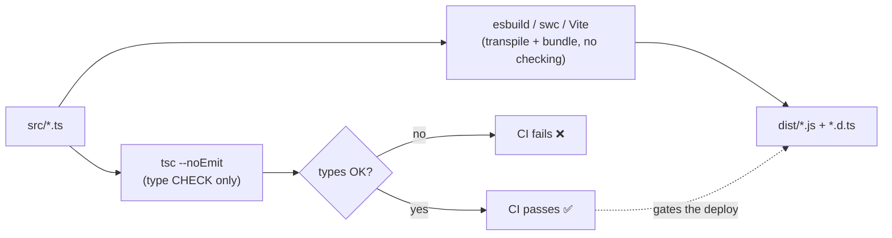
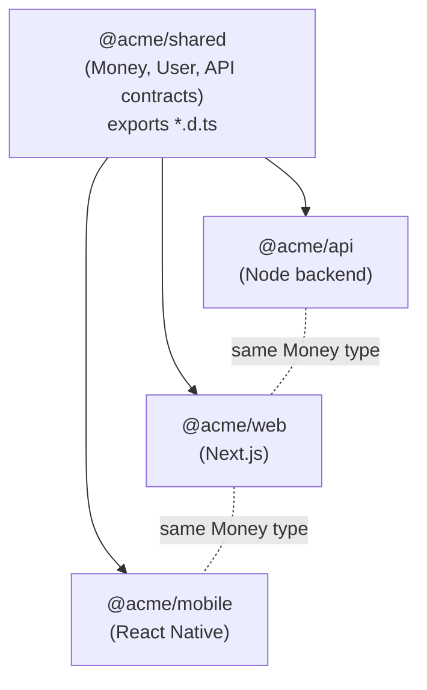

# 06 — Modules, Tooling & Build Pipeline

> **Goal:** Understand how TypeScript code becomes runnable JavaScript — how modules are written and resolved, how the build/typecheck pipeline is split, and how to share types across a real monorepo. By the end you can read any project's `tsconfig.json` + `package.json` and know how the code ships.

**What you'll learn**

- ES modules vs CommonJS, and why the distinction still bites you in 2026
- `import` / `export`, default vs named, and the type-only forms (`import type`, `verbatimModuleSyntax`)
- Module resolution: `node`, `bundler`, `nodenext` — and which one your tool wants
- Path aliases (`paths` + `baseUrl`) and how bundlers/Next actually resolve them
- Declaration files (`.d.ts`), `declare`, ambient modules, and typing untyped libraries
- The modern toolchain: `tsc` as a *type-checker*, transpilers (esbuild/swc), bundlers (Vite/tsup), runners (`tsx`)
- Why "typecheck" and "build" are two separate CI steps
- Monorepos: workspaces, project references, and a shared types package

**Prerequisites:** [01 — Foundations](./01-foundations.md). You should be comfortable with `tsconfig.json` basics and running `tsc`.

---

## The mental model

Here is the one idea that unties most TypeScript tooling confusion:

> **`tsc` is two unrelated jobs wearing one coat.** Job one: *check types*. Job two: *erase types and emit JavaScript*. Almost every modern setup keeps job one (it's the only tool that does it) and fires job two — but hands the actual JS-emitting to a faster transpiler (esbuild, swc).

TypeScript's types are a **compile-time-only fiction**. At runtime, `interface User { ... }` does not exist. So "compiling TypeScript" is mostly *deletion* — strip the annotations, downlevel a little syntax, write `.js`. That deletion is trivially parallelizable and esbuild does it ~50x faster than `tsc`. What's slow and valuable is the *checking*, and that's the part you can't skip.

So the modern split is:



Two paths run from the same source. The bundler produces the artifact fast; `tsc` produces the *verdict*. Keep them separate and your build stays fast while your types stay honest.

---

## Modules: ESM vs CommonJS

There are two module systems in the JS world and you will meet both.

**CommonJS (CJS)** — the old Node default. Synchronous, dynamic:

```ts
// CommonJS
const fs = require("node:fs");
module.exports = { readConfig };
```

**ES Modules (ESM)** — the standard, used in browsers and modern Node. Static, async-friendly:

```ts
// ESM — this is what you write in TypeScript
import { readFile } from "node:fs/promises";

export function readConfig(): Promise<string> {
  return readFile("config.json", "utf8");
}
```

Write ESM. Always. It is the standard, bundlers prefer it (tree-shaking depends on its static structure), and Node has supported it for years. The friction you'll hit is when a *dependency* ships only CJS, or when a tool disagrees about which one a file is.

> [!NOTE]
> A file's module format in Node is decided by the nearest `package.json`'s `"type"` field (`"module"` = ESM, `"commonjs"` or absent = CJS), or by extension (`.mts`/`.cts`). Set `"type": "module"` in your `package.json` and stop thinking about it.

### export / import: named vs default

```ts
// math.ts — named exports (preferred)
export function add(a: number, b: number): number {
  return a + b;
}
export const PI = 3.14159;

// app.ts
import { add, PI } from "./math.js"; // note the .js — see "Resolution" below
```

```ts
// logger.ts — a default export
export default function log(msg: string): void {
  console.log(msg);
}

// app.ts
import log from "./logger.js"; // name it whatever you want
```

Prefer **named exports**. They auto-complete, they rename safely across the codebase, and they tree-shake cleanly. Default exports get renamed inconsistently by every importer and break refactoring tools. (React components are the one common exception — many tools and Next.js *require* a default export for pages/components.)

### Type-only imports and `verbatimModuleSyntax`

This is the part beginners miss. You can import something purely for its *type*:

```ts
import type { User } from "./models.js"; // erased entirely at build time
import { saveUser } from "./db.js";      // a real runtime value

export type { User };                    // re-export a type only
```

Why bother? Because a transpiler like esbuild processes **one file at a time** and has no type information — it can't tell whether `import { User }` is a type (delete it) or a value (keep it). If it guesses wrong, you get a runtime import of something that doesn't exist, or a missing side-effect.

Turn on `verbatimModuleSyntax` and TypeScript enforces the honest answer: anything imported as a value stays, anything `import type` is erased, no guessing.

```jsonc
// tsconfig.json
{
  "compilerOptions": {
    "verbatimModuleSyntax": true // forces explicit `import type` for types
  }
}
```

> [!IMPORTANT]
> With `verbatimModuleSyntax: true`, this is an **error**: `import { User } from "./models.js"` when `User` is only a type. You must write `import type { User }`. This feels pedantic until the day esbuild silently keeps a type import and your bundle crashes at startup. Turn it on in every new project.

---

## Module resolution: how `./math.js` finds `math.ts`

When you write `import { add } from "./math.js"`, TypeScript has to map that string to a file on disk. The algorithm is controlled by `moduleResolution`. There are three you'll see:

| `moduleResolution` | Use it for | Extension in imports? |
| --- | --- | --- |
| `nodenext` | Code that runs in Node directly (backends, CLIs, libraries) | **Required** — write `.js` |
| `bundler` | Code that goes through Vite/Next/esbuild | Optional — extensionless OK |
| `node` *(legacy)* | Old projects; avoid in new code | Extensionless |

The confusing rule: under `nodenext`, you import with a **`.js` extension even though the file is `.ts`**. That's because the import path describes the *output* (what Node will load at runtime), and TypeScript resolves `./math.js` back to `./math.ts` at check time.

```jsonc
// tsconfig for a Node backend
{
  "compilerOptions": {
    "module": "nodenext",
    "moduleResolution": "nodenext"
  }
}
```

```jsonc
// tsconfig for a bundled app (Vite/Next)
{
  "compilerOptions": {
    "module": "esnext",
    "moduleResolution": "bundler" // no .js extensions needed
  }
}
```

> [!TIP]
> Rule of thumb: **does a bundler touch this code before it runs?** Yes → `bundler`. No (Node runs the `.js` directly) → `nodenext`. Pick wrong and you'll fight phantom "cannot find module" errors.

### Path aliases

Deep relative imports (`../../../shared/types`) rot. Aliases fix that:

```jsonc
// tsconfig.json
{
  "compilerOptions": {
    "baseUrl": ".",
    "paths": {
      "@/*": ["src/*"],
      "@shared/*": ["../shared/src/*"]
    }
  }
}
```

```ts
import { Button } from "@/components/Button";
import type { Money } from "@shared/money";
```

> [!WARNING]
> **`tsconfig` `paths` only teach the type-checker, not the runtime or the bundler.** `tsc` understands `@/*`, but Node, esbuild, and Vite do **not** read `tsconfig.paths` on their own. You must also configure the bundler — Vite via `resolve.alias`, Next.js *does* read `tsconfig.paths` automatically, plain Node needs `tsconfig-paths` or `imports` in `package.json`. Aliases that "work in the editor but crash at runtime" are almost always this.

---

## Declaration files (`.d.ts`) and typing untyped libraries

A `.d.ts` file contains **types and nothing else** — no runtime code. It's how a library ships types alongside its JavaScript, and how you bolt types onto a library that has none.

```ts
// money.d.ts — pure type surface, no implementation
export interface Money {
  amountCents: number;
  currency: "USD" | "EUR" | "GBP";
}
export declare function format(m: Money): string;
```

`declare` means "this exists at runtime, trust me, here's its type" — you're describing something you didn't write.

### `@types` and DefinitelyTyped

Many libraries ship their own types. Older ones don't, but the community publishes types separately on **DefinitelyTyped**, installed as `@types/*`:

```bash
npm i lodash
npm i -D @types/lodash   # types live in a separate package
```

If a package has built-in types, you don't need an `@types` package — and installing one anyway can cause version-mismatch chaos.

### Ambient modules: typing a library with no types at all

When there's no `@types` package and the library has none, declare an ambient module yourself:

```ts
// types/untyped-lib.d.ts
declare module "some-untyped-lib" {
  export function doThing(input: string): number;
  const _default: { version: string };
  export default _default;
}
```

Point TypeScript at your declaration folder via `typeRoots` or just `include` it, and the import now type-checks. Start narrow — type only the functions you actually call.

> [!NOTE]
> **Triple-slash directives** like `/// <reference types="node" />` are the legacy way to pull in ambient types. You rarely write them by hand now — `tsconfig`'s `types`/`lib` arrays handle it. Recognize them; don't reach for them.

### Typing environment variables

`process.env` is `string | undefined` by default, which is correct but annoying. Augment it once:

```ts
// env.d.ts
declare global {
  namespace NodeJS {
    interface ProcessEnv {
      DATABASE_URL: string;
      STRIPE_SECRET_KEY: string;
      NODE_ENV: "development" | "production" | "test";
    }
  }
}
export {}; // makes this file a module so `declare global` is legal
```

> [!WARNING]
> This is a **type-level lie of convenience** — it tells the compiler `DATABASE_URL` is always a string, but at runtime it can still be `undefined` if the var is missing. For real safety, validate env at startup with a schema (e.g. Zod) and export a typed, *verified* object instead of reading `process.env` everywhere.

---

## The toolchain in practice

Here's who does what, and why you don't just run `tsc`:

| Tool | Job | Checks types? |
| --- | --- | --- |
| `tsc` | Type-check; emit `.js` + `.d.ts` (slowly) | ✅ Yes |
| `esbuild` / `swc` | Transpile TS→JS, blazing fast | ❌ No |
| `vite` | Dev server + bundler (uses esbuild) | ❌ No |
| `tsup` | Bundle libraries (esbuild + `.d.ts`) | ❌ No (delegates `.d.ts` to `tsc`) |
| `tsx` / `ts-node` | *Run* a `.ts` file directly | ❌ No (`tsx`) |

The crucial takeaway: **the fast tools skip type-checking.** That's the deal you make for speed. Which is exactly why you run `tsc --noEmit` as a *separate* step.

```jsonc
// package.json scripts — note the separation
{
  "scripts": {
    "dev": "tsx watch src/index.ts",
    "build": "tsup src/index.ts --format esm --dts",
    "typecheck": "tsc --noEmit",
    "ci": "npm run typecheck && npm run build"
  }
}
```

In CI you run **both** `typecheck` and `build`. If you only ran the bundler, type errors would sail straight to production — the bundler never looked. `typecheck` is the gate; `build` is the artifact.

> [!TIP]
> Running a one-off script? `npx tsx scripts/seed.ts`. No compile step, no `dist/`, just run it. `tsx` is the modern replacement for `ts-node` — faster and zero-config.

---

## Monorepos: sharing types across packages

The payoff of all this. A monorepo holds several packages in one repo, managed by a workspace tool (pnpm workspaces, npm workspaces, or Turborepo on top).



One package defines the shared types; everything else imports them. Change `Money` in `@acme/shared` and the backend, the web app, and the mobile app **all fail to compile** until they agree. That compile-time enforcement of a contract across your whole stack is the single best reason to use TypeScript in a real product.

```jsonc
// pnpm-workspace.yaml
// packages:
//   - "packages/*"
//   - "apps/*"
```

```jsonc
// apps/web/package.json — depend on the shared package by name
{
  "dependencies": {
    "@acme/shared": "workspace:*"
  }
}
```

```ts
// packages/shared/src/money.ts
export interface Money {
  amountCents: number;
  currency: "USD" | "EUR" | "GBP";
}

// apps/web/src/checkout.ts
import type { Money } from "@acme/shared";
```

### Project references — making `tsc` monorepo-aware

For a `tsc`-driven monorepo, **project references** let TypeScript build packages in dependency order and cache results incrementally:

```jsonc
// tsconfig.json (root)
{
  "references": [
    { "path": "./packages/shared" },
    { "path": "./apps/web" }
  ]
}
```

```jsonc
// packages/shared/tsconfig.json
{
  "compilerOptions": {
    "composite": true,    // required for a referenced project
    "declaration": true,  // emit .d.ts so consumers get types
    "outDir": "dist"
  }
}
```

Then `tsc --build` walks the graph, rebuilds only what changed, and consumers read the emitted `.d.ts`. With Turborepo, you wrap this so `turbo typecheck` runs all packages' `tsc --noEmit` in parallel with caching.

> [!WARNING]
> **`peerDependencies`, not `dependencies`, for shared singletons.** A shared UI package should list `react` as a `peerDependency`, so the consuming app provides *one* React. Bundle React as a regular dependency and you get two copies, broken hooks, and "Invalid hook call" at 3am.

---

## Production gotchas

> [!WARNING]
> **The bundler doesn't type-check.** Your `vite build` passing means *nothing* about type safety. A green deploy can be riddled with type errors. Always gate deploys on a separate `tsc --noEmit`.

> [!WARNING]
> **`paths` aliases work in the editor but crash at runtime** if the bundler/runtime isn't configured to match. The type-checker and the module loader are different programs that must be told the same thing twice.

> [!IMPORTANT]
> **CJS/ESM interop is the most common dependency error.** `require() of ES Module not supported` or a default-import that's actually `{ default: { default: fn } }`. When it bites: set `"esModuleInterop": true`, prefer ESM everywhere, and check the dependency's `package.json` `exports` field.

> [!CAUTION]
> **Don't `declare` your way around missing types in a money or auth path.** An ambient `declare module` makes the error disappear but asserts a shape you never verified. For anything load-bearing, find or write *accurate* types, and validate at the boundary.

> [!NOTE]
> **Forgetting `.js` extensions under `nodenext`** is the top "works in dev, breaks in prod" Node bug. `tsx` is lenient; real Node is not. Write the `.js`.

---

## Patterns in production

**Fintech — one `Money` type, end to end.** A payments company keeps `Money`, `LedgerEntry`, and the REST/RPC request/response contracts in `@acme/contracts`. The Node ledger service, the React dashboard, and the partner SDK all import them. When an engineer adds a `currency` field, every consumer that doesn't handle it fails `tsc --noEmit` in CI — the type system *is* the integration test for the API contract. No more "the frontend sent dollars, the backend expected cents."

**Healthcare — ambient types for a legacy device SDK.** A hospital integration team consumes a vendor's untyped JS SDK for medical devices. They write a deliberately *narrow* `device-sdk.d.ts` covering only the calls they make, mark it with a comment that it's hand-maintained, and validate every value crossing the boundary at runtime (because a wrong type here is a patient-safety issue, not a stack trace). The ambient types make the codebase navigable; the runtime validation makes it safe.

**Social — Turborepo with shared design system + types.** A social app ships web (Next.js), mobile (React Native), and an admin panel. `@acme/ui` (components) lists `react`/`react-native` as peer deps; `@acme/types` holds feed/post/user models. `turbo typecheck` runs every package's `tsc --noEmit` in parallel with remote caching, so a 12-package repo type-checks in seconds on CI, and a change to the `Post` type instantly surfaces every screen that renders it.

---

## Exercises

1. **Split the pipeline.** Take any `.ts` project and add three scripts: `typecheck` (`tsc --noEmit`), `build` (`tsup` or `esbuild`), and `dev` (`tsx watch`). Introduce a deliberate type error and confirm `build` *succeeds* while `typecheck` *fails*. Sit with why.

2. **Type-only discipline.** Enable `verbatimModuleSyntax: true` in a project and fix every resulting error by converting type imports to `import type`. Note which imports were ambiguous.

3. **Resolution flip.** Take a working `bundler`-resolution project and switch it to `nodenext`. Fix the resulting errors (mostly: add `.js` extensions to relative imports). Explain in one sentence why the extensions are needed.

4. **Tame an untyped lib.** Find a small npm package with no types and no `@types`. Write an ambient `declare module` covering just the functions you use, and get a real call site to type-check.

5. **Two-package monorepo.** Create a pnpm workspace with `packages/shared` (exports a `Money` type) and `apps/api` (imports it via `workspace:*`). Change the type in `shared` and watch `apps/api` fail to compile.

6. *(Stretch)* **Typed env.** Add an `env.d.ts` that augments `ProcessEnv`, then replace it with a Zod-validated, typed config object exported from one module. Compare the safety of the two approaches.

---

## Next

- **Previous:** [05 — Objects & Classes](./05-objects-classes.md)
- **Next:** [07 — React with TypeScript](./07-react.md)
- **Series root:** [TypeScript Learning Plan](../TypeScript_Learning_Plan.md) · [00 — Roadmap](./00-roadmap.md)
