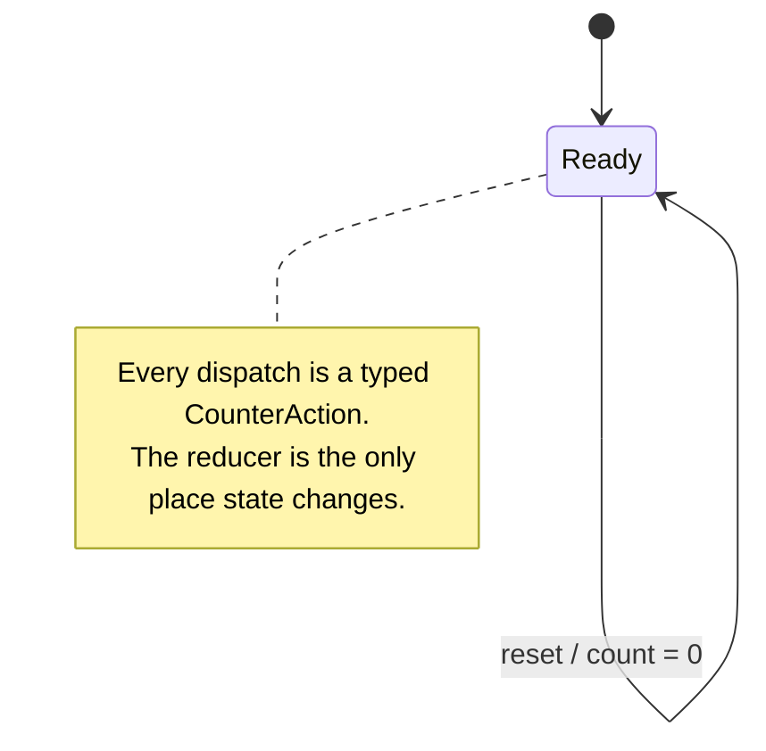
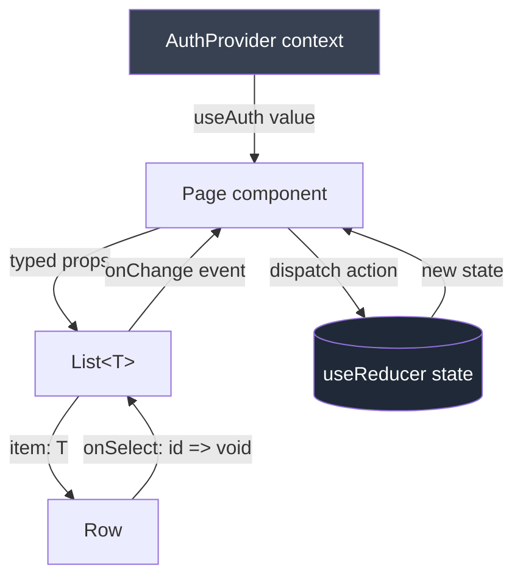

# 07 — TypeScript with React

**Goal:** Go from "I can write React in JavaScript" to confidently building real React apps in TypeScript — typing every component, prop, hook, and event so the compiler catches your mistakes before your users do.

## What you'll learn

- How to type function components and their props (and why you should skip `React.FC`)
- Typing children with `React.ReactNode`
- Typing **every** hook: `useState`, `useReducer`, `useEffect`, `useRef`, `useContext`, `useMemo`, `useCallback`
- The discriminated-union reducer pattern — the single most valuable React + TS technique
- Typing DOM events (`onChange`, `onClick`, form submits)
- Generic components, polymorphic `as` props, and custom hooks that return tuples
- `forwardRef` typing and discriminated-union props for component variants
- Typing data fetching (fetch + React Query)

## Prerequisites

This guide assumes you're comfortable with the earlier entries in the series. In particular:

- [./03-functions-generics.md](./03-functions-generics.md) — generics are everywhere in React's types (`useState<T>`, generic components, `forwardRef`).
- [./04-advanced-types.md](./04-advanced-types.md) — discriminated unions, `as const`, and conditional types underpin the reducer and props patterns below.

If `type Action = { type: "inc" } | { type: "set"; value: number }` and `as const` don't feel familiar, go read those two first. Everything here builds on them.

---

## Mental model

React in TypeScript is mostly the same React you already know, plus one habit: **describe the shape of your data and props once, and let inference do the rest.**

Three ideas carry most of the weight:

1. **A component is a function from props to UI.** Type the input (props), and the output (`JSX.Element` / `ReactNode`) types itself.
2. **Hooks are generic functions.** `useState`, `useRef`, and friends take a type parameter — sometimes you supply it, often it's inferred from the initial value.
3. **State that changes shape needs a discriminated union.** Loading vs. error vs. success isn't three booleans; it's one union with a `status` tag. This is where TS earns its keep.

You almost never annotate the return type of a component. You almost always annotate its props. Inference fills the middle.

---

## Typing function components and props

A component is just a function. Type its props with an `interface` or a `type` and you're done — no special React wrapper needed.

```tsx
interface ButtonProps {
  label: string;
  onClick: () => void;
  disabled?: boolean;        // optional
  variant?: "primary" | "secondary";
}

function Button({ label, onClick, disabled = false, variant = "primary" }: ButtonProps) {
  return (
    <button className={`btn btn-${variant}`} onClick={onClick} disabled={disabled}>
      {label}
    </button>
  );
}
```

**`interface` vs `type` for props?** Use whichever your team standardizes on. `interface` gives nicer error messages and supports declaration merging; `type` supports unions and intersections directly. For props specifically, reach for `type` the moment you need a union (e.g. variant props below). Otherwise it genuinely doesn't matter — pick one and move on.

**Default props** are just default parameter values in the destructure (`disabled = false`). The old `defaultProps` static is deprecated for function components; don't use it.

### Skip `React.FC`

You'll see old code write `const Button: React.FC<ButtonProps> = (...)`. The modern recommendation: **don't.** Just type the props parameter as shown above. Reasons:

- Typing the parameter directly is simpler and infers generics correctly (`React.FC` historically broke generic components).
- It keeps you in control of `children` instead of having it implicitly added.

The only thing `React.FC` gave you for free was a typed `children`. Add that explicitly when you want it.

### Children

`children` is just another prop. Type it as `React.ReactNode` — that's the union of everything React can render (elements, strings, numbers, arrays, `null`, etc.).

```tsx
interface CardProps {
  title: string;
  children: React.ReactNode;
}

function Card({ title, children }: CardProps) {
  return (
    <section className="card">
      <h2>{title}</h2>
      <div className="card-body">{children}</div>
    </section>
  );
}
```

Use `React.ReactNode` for "anything renderable." Reach for the narrower `React.ReactElement` only when you specifically require a single element (e.g. you're going to `cloneElement` it).

---

## Typing the hooks

### `useState`

Most of the time, inference handles it from the initial value:

```tsx
const [count, setCount] = useState(0);          // number
const [name, setName] = useState("");           // string
```

You supply the type parameter when the initial value doesn't tell the whole story — a value that's `null` at first, or a union:

```tsx
// null until loaded — supply the generic so it's User | null, not just null
const [user, setUser] = useState<User | null>(null);

// a union of literal states
const [status, setStatus] = useState<"idle" | "loading" | "done">("idle");

// empty array whose element type can't be inferred
const [items, setItems] = useState<CartItem[]>([]);
```

> [!WARNING]
> `useState(null)` infers the type `null` — you'll get a compile error the moment you call `setUser(someUser)`. Always write `useState<User | null>(null)` for nullable state.

### `useReducer` — the discriminated-union pattern

This is the key pattern of the whole guide. When state transitions through distinct shapes, model **actions as a discriminated union** keyed by `type`. The compiler then narrows the payload inside each `case` and forces you to handle every action.

```tsx
interface CounterState {
  count: number;
  step: number;
}

type CounterAction =
  | { type: "increment" }
  | { type: "decrement" }
  | { type: "setStep"; step: number }   // payload only on this action
  | { type: "reset" };

function counterReducer(state: CounterState, action: CounterAction): CounterState {
  switch (action.type) {
    case "increment":
      return { ...state, count: state.count + state.step };
    case "decrement":
      return { ...state, count: state.count - state.step };
    case "setStep":
      return { ...state, step: action.step }; // action.step is known here, nowhere else
    case "reset":
      return { ...state, count: 0 };
    default: {
      // exhaustiveness check: if you add an action and forget a case, this won't compile
      const _exhaustive: never = action;
      return state;
    }
  }
}

function Counter() {
  const [state, dispatch] = useReducer(counterReducer, { count: 0, step: 1 });
  return (
    <>
      <span>{state.count}</span>
      <button onClick={() => dispatch({ type: "increment" })}>+{state.step}</button>
      <button onClick={() => dispatch({ type: "setStep", step: 5 })}>step 5</button>
    </>
  );
}
```

Two things make this powerful:

- Inside `case "setStep"`, TS knows `action` has a `step` field. In the other cases, accessing `action.step` is a compile error. The payload travels with the tag.
- The `never` assignment in `default` is an **exhaustiveness check**: add a new action variant, forget its `case`, and the build breaks. Free correctness.

Here's that reducer as a state machine:



For async data the same pattern shines — model the whole lifecycle as one union so impossible states (loading **and** error at once) are unrepresentable:

```tsx
type FetchState<T> =
  | { status: "idle" }
  | { status: "loading" }
  | { status: "success"; data: T }
  | { status: "error"; error: string };
```

### `useEffect`

`useEffect` itself needs no annotation — but type what you return (a cleanup function or nothing) and be deliberate about the deps array.

```tsx
useEffect(() => {
  const id = setInterval(() => setCount((c) => c + 1), 1000);
  return () => clearInterval(id); // cleanup; TS checks the return is () => void | undefined
}, []); // empty deps = run once on mount
```

> [!CAUTION]
> Don't make an effect's callback `async` directly — `useEffect` expects its return to be a cleanup function or `undefined`, but an `async` function returns a `Promise`. Define an inner async function and call it: `useEffect(() => { void load(); }, [])`.

### `useRef` — two distinct uses

`useRef` has two jobs, and the type you give it changes the behavior.

```tsx
// 1. DOM ref — initialize with null, type the element. .current is read-only-ish.
const inputRef = useRef<HTMLInputElement>(null);

function focus() {
  inputRef.current?.focus(); // current is HTMLInputElement | null — guard it
}

// 2. Mutable instance value (survives renders, doesn't trigger re-render)
const renderCount = useRef(0); // MutableRefObject<number>, .current is writable
renderCount.current += 1;
```

The difference is the initial value: `useRef<T>(null)` for a DOM node you'll attach via `ref={...}` gives you a read-only-style `RefObject`; `useRef<T>(initial)` with a real initial value gives you a freely-mutable `MutableRefObject`.

### `useContext` — the type-safe pattern

Don't make context nullable everywhere and check it at every call site. Create the context, wrap it in a provider, and expose a **custom hook that throws if used outside the provider**. Consumers then get a non-null value with zero ceremony.

```tsx
import { createContext, useContext, useState, type ReactNode } from "react";

interface AuthContextValue {
  user: User | null;
  login: (email: string, password: string) => Promise<void>;
  logout: () => void;
}

// undefined sentinel lets the hook detect "no provider"
const AuthContext = createContext<AuthContextValue | undefined>(undefined);

export function AuthProvider({ children }: { children: ReactNode }) {
  const [user, setUser] = useState<User | null>(null);

  const login = async (email: string, password: string) => {
    const u = await api.login(email, password);
    setUser(u);
  };
  const logout = () => setUser(null);

  return (
    <AuthContext.Provider value={{ user, login, logout }}>
      {children}
    </AuthContext.Provider>
  );
}

// custom hook — narrows away undefined so consumers never null-check
export function useAuth(): AuthContextValue {
  const ctx = useContext(AuthContext);
  if (ctx === undefined) {
    throw new Error("useAuth must be used within an <AuthProvider>");
  }
  return ctx;
}
```

Now `const { user, logout } = useAuth();` is fully typed and the `undefined` case is impossible at the type level. This is the idiomatic context pattern — memorize it.

### `useMemo` and `useCallback`

`useMemo` infers its type from the factory's return. `useCallback` infers the function type from the callback — but you must type the callback's **parameters**, since they can't be inferred.

```tsx
const total = useMemo<number>(
  () => items.reduce((sum, i) => sum + i.price, 0),
  [items],
); // <number> is optional here — inferred from the reducer

// event handler via useCallback — annotate the event param
const handleChange = useCallback(
  (e: React.ChangeEvent<HTMLInputElement>) => {
    setQuery(e.target.value);
  },
  [],
);
```

---

## Typing events

Event handlers receive React's synthetic events, which are generic over the element. Get the element type right and `e.target` / `e.currentTarget` are fully typed.

```tsx
function SearchForm() {
  const [query, setQuery] = useState("");

  // input change
  const onChange = (e: React.ChangeEvent<HTMLInputElement>) => {
    setQuery(e.target.value);
  };

  // button / div click
  const onClick = (e: React.MouseEvent<HTMLButtonElement>) => {
    e.preventDefault();
  };

  // form submit
  const onSubmit = (e: React.FormEvent<HTMLFormElement>) => {
    e.preventDefault();
    console.log(query);
  };

  return (
    <form onSubmit={onSubmit}>
      <input value={query} onChange={onChange} />
      <button type="submit" onClick={onClick}>Search</button>
    </form>
  );
}
```

Cheat sheet for the events you'll use 90% of the time:

| Event | Type |
| --- | --- |
| `onChange` on input/select/textarea | `React.ChangeEvent<HTMLInputElement>` (swap the element) |
| `onClick` | `React.MouseEvent<HTMLButtonElement>` |
| `onSubmit` | `React.FormEvent<HTMLFormElement>` |
| `onKeyDown` | `React.KeyboardEvent<HTMLInputElement>` |
| `onFocus` / `onBlur` | `React.FocusEvent<HTMLInputElement>` |

> [!TIP]
> If you write the handler **inline** in JSX (`onChange={(e) => ...}`), the event param is inferred automatically — you only annotate when the handler is defined separately.

---

## Component data flow

How props, state, context, and events move through a typed component tree:



Data flows **down** as typed props; events flow **up** as typed callbacks; shared state lives in context or a reducer. The types make every arrow in that diagram checkable.

---

## Generic components

When a component works over "a list of anything," make it generic. The type parameter flows from the `items` prop into the `renderItem` callback so callers get full inference.

```tsx
interface ListProps<T> {
  items: T[];
  renderItem: (item: T, index: number) => React.ReactNode;
  keyOf: (item: T) => string | number;
}

function List<T>({ items, renderItem, keyOf }: ListProps<T>) {
  return (
    <ul>
      {items.map((item, i) => (
        <li key={keyOf(item)}>{renderItem(item, i)}</li>
      ))}
    </ul>
  );
}

// Usage — T is inferred as Account; `acc` is typed in renderItem
<List
  items={accounts}
  keyOf={(acc) => acc.id}
  renderItem={(acc) => <span>{acc.name}: ${acc.balance}</span>}
/>;
```

This is one place `React.FC` actively breaks — another reason to skip it.

### Polymorphic / `as` prop (brief)

A polymorphic component renders as different elements via an `as` prop while keeping the right props for that element. The full pattern uses `ElementType` and `ComponentPropsWithoutRef`; here's the shape:

```tsx
import { type ElementType, type ComponentPropsWithoutRef } from "react";

type TextProps<E extends ElementType> = {
  as?: E;
  children: React.ReactNode;
} & Omit<ComponentPropsWithoutRef<E>, "as" | "children">;

function Text<E extends ElementType = "span">({ as, children, ...rest }: TextProps<E>) {
  const Tag = as ?? "span";
  return <Tag {...rest}>{children}</Tag>;
}

<Text as="a" href="/home">Home</Text>; // href is valid because as="a"
```

You won't write these often. Recognize the pattern when you see it in a design system, and lean on libraries (Radix, MUI) that have already solved it rather than rolling your own.

---

## Typing custom hooks

A custom hook is a function — type its return. If it returns a fixed-length tuple (like `useState` does), append `as const` so callers can destructure with distinct types instead of a widened union array.

```tsx
function useToggle(initial = false) {
  const [on, setOn] = useState(initial);
  const toggle = useCallback(() => setOn((v) => !v), []);
  return [on, toggle] as const; // tuple: [boolean, () => void], NOT (boolean | (() => void))[]
}

const [isOpen, toggleOpen] = useToggle(); // isOpen: boolean, toggleOpen: () => void
```

For hooks returning an object, an explicit return type doubles as documentation and prevents accidental shape drift:

```tsx
interface UseCounter {
  count: number;
  increment: () => void;
  reset: () => void;
}

function useCounter(start = 0): UseCounter {
  const [count, setCount] = useState(start);
  return {
    count,
    increment: () => setCount((c) => c + 1),
    reset: () => setCount(start),
  };
}
```

---

## `forwardRef` typing

When a parent needs a ref to your component's DOM node, use `forwardRef`. The generics are `<RefElementType, PropsType>` — note the order is element first.

```tsx
import { forwardRef } from "react";

interface TextInputProps {
  label: string;
  value: string;
  onChange: (e: React.ChangeEvent<HTMLInputElement>) => void;
}

const TextInput = forwardRef<HTMLInputElement, TextInputProps>(
  function TextInput({ label, value, onChange }, ref) {
    return (
      <label>
        {label}
        <input ref={ref} value={value} onChange={onChange} />
      </label>
    );
  },
);
```

> [!NOTE]
> In **React 19**, `ref` is becoming a regular prop, so you can type `ref: React.Ref<HTMLInputElement>` directly in your props and skip `forwardRef`. On React 18 you still need `forwardRef`. Match your project's React version.

---

## Discriminated-union props for variants

The same union trick that powers reducers makes component APIs safe. When a component has mutually exclusive modes, model the props as a union so the compiler enforces "if `variant` is X, then Y is required and Z is forbidden."

```tsx
type AlertProps =
  | { variant: "info"; message: string }
  | { variant: "error"; message: string; retry: () => void }; // retry only for errors

function Alert(props: AlertProps) {
  if (props.variant === "error") {
    return (
      <div role="alert" className="alert-error">
        {props.message}
        <button onClick={props.retry}>Retry</button>
      </div>
    );
  }
  return <div className="alert-info">{props.message}</div>;
}

<Alert variant="info" message="Saved" />;                         // ok
<Alert variant="error" message="Failed" retry={() => refetch()} />; // ok
// <Alert variant="info" message="x" retry={fn} />;               // error: retry not allowed
```

This is how serious design systems prevent invalid prop combinations at compile time instead of in a runtime `console.warn`.

---

## Data fetching types

### Raw fetch

`fetch` returns `any` after `.json()` — that's a lie. Validate or at least annotate the boundary, then drive UI off a discriminated state union (the one from earlier).

```tsx
async function getAccount(id: string): Promise<Account> {
  const res = await fetch(`/api/accounts/${id}`);
  if (!res.ok) throw new Error(`HTTP ${res.status}`);
  return (await res.json()) as Account; // boundary cast — see gotcha below
}
```

### React Query (TanStack Query)

In real apps, prefer React Query — it types `data`, `error`, and `status` for you off the query function's return type. No manual state union needed.

```tsx
import { useQuery } from "@tanstack/react-query";

function AccountView({ id }: { id: string }) {
  const { data, isPending, isError, error } = useQuery({
    queryKey: ["account", id],
    queryFn: () => getAccount(id), // return type drives `data`: Account | undefined
  });

  if (isPending) return <Spinner />;
  if (isError) return <Alert variant="error" message={error.message} retry={() => {}} />;
  return <span>{data.name}: ${data.balance}</span>; // data is Account here — narrowed
}
```

---

## Production gotchas

> [!WARNING]
> **`as` on `.json()` is an unchecked promise.** `(await res.json()) as Account` tells the compiler to trust the wire — but the server can lie, and a renamed field becomes a silent `undefined` at runtime. In money/health paths, validate with **Zod** (`AccountSchema.parse(json)`) at the fetch boundary so bad data fails loudly there, not three components deep.

> [!CAUTION]
> **`useState(null)` and union-less state.** Initializing nullable or array state without a generic (`useState(null)`, `useState([])`) infers a uselessly narrow type. Always supply `useState<User | null>(null)`, `useState<Item[]>([])`.

> [!WARNING]
> **Missing the reducer exhaustiveness check.** Without the `const _x: never = action` in `default`, adding an action variant and forgetting its case compiles fine and silently drops the dispatch. Always include it.

> [!CAUTION]
> **`event.target` vs `event.currentTarget`.** `currentTarget` is the element the handler is attached to (always typed correctly); `target` is wherever the event originated and may be a child. For form fields, read `currentTarget` when you need guaranteed types.

> [!NOTE]
> **Don't over-annotate.** You rarely need a return type on a component or inline handler — inference is excellent. Annotate props, hook generics where inference fails, and exported custom-hook returns. Annotating everything is noise that drifts out of date.

---

## Patterns in production

**Design-system component props (everywhere).** Component libraries lean on discriminated-union props (the `Alert` pattern) and polymorphic `as` props so a single `<Button>` covers `primary | secondary | danger` with per-variant required props, all checked at compile time. Extend native element props with `ComponentPropsWithoutRef<"button">` so your `<Button>` accepts `aria-*`, `type`, `disabled`, etc. for free.

**Form state in fintech.** A wire-transfer form is the canonical discriminated-state machine: `idle → validating → submitting → success | error`. Modeling it as a `useReducer` union (not five `useState` booleans) makes "submitting and showing the success screen at once" literally unrepresentable — exactly the kind of bug that moves money twice. Pair the reducer with Zod-validated input at submit.

**Healthcare forms and PHI.** Patient-intake forms are large, conditional, and regulated. Discriminated-union props gate sections ("if `insuranceType === 'medicare'`, these fields are required"), and a typed context (`usePatientForm`) shares state across steps without prop-drilling PHI through ten layers. The custom-hook-that-throws pattern guarantees no component reads patient state outside the provider boundary.

**Social feeds.** Generic `<List<T>>` plus discriminated `FeedItem` unions (`post | ad | suggestion`) render heterogeneous feeds where each item type renders differently and the compiler forces you to handle each variant.

---

## Exercises

1. **Typed input.** Write a `<NumberInput>` with props `{ value: number; onChange: (n: number) => void; min?: number; max?: number }`. Type the `onChange` DOM event internally and convert the string to a number before calling the prop callback.

2. **Reducer state machine.** Model a checkout flow with `useReducer`: state `{ status: "cart" | "shipping" | "payment" | "done" }` and a discriminated `CheckoutAction` union. Add the `never` exhaustiveness check and confirm the build breaks when you add an action without a case.

3. **Type-safe context.** Build a `ThemeProvider` + `useTheme()` hook following the throw-if-missing pattern. Make `useTheme` return `{ theme: "light" | "dark"; toggle: () => void }`. Verify calling `useTheme` outside the provider throws.

4. **Generic component.** Implement `<Table<T>>` with `columns: { header: string; render: (row: T) => React.ReactNode }[]` and `rows: T[]`. Confirm `row` is typed inside each column's `render`.

5. **Custom hook tuple.** Write `useLocalStorage<T>(key, initial)` that returns `[value, setValue] as const`. Confirm callers get a typed tuple, not a widened array.

6. **Variant props.** Build a `<Badge>` whose props are a discriminated union: `{ kind: "count"; value: number } | { kind: "dot" }`. Confirm passing `value` with `kind: "dot"` is a compile error.

---

## Next

- [./08-react-native.md](./08-react-native.md) — taking these typed-component skills to mobile.
- [./09-nextjs.md](./09-nextjs.md) — server components, typed routes, and data fetching in Next.js.

Back to the series root: [../TypeScript_Learning_Plan.md](../TypeScript_Learning_Plan.md)
