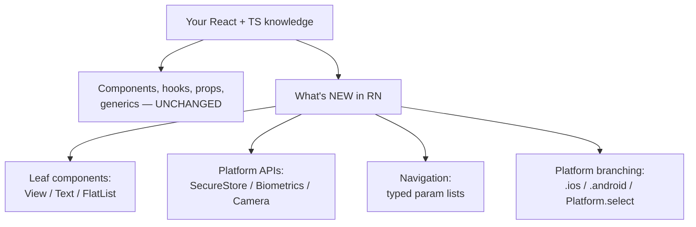
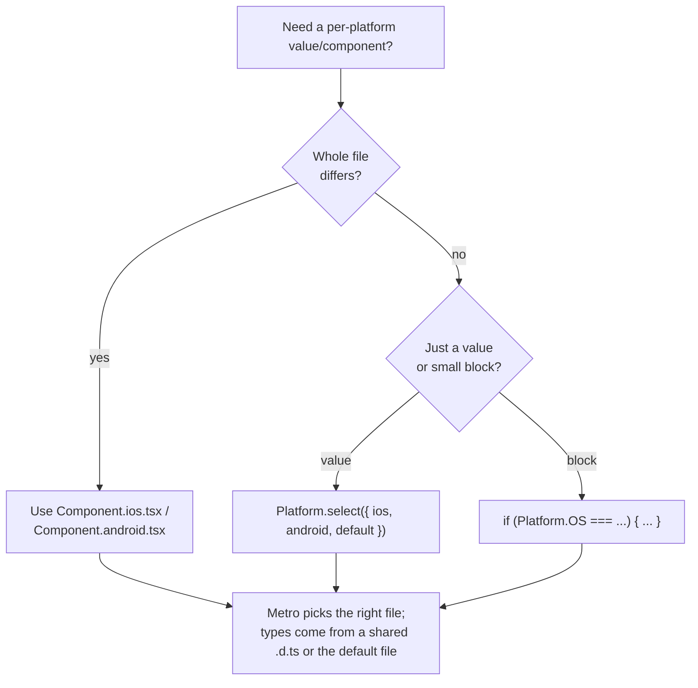
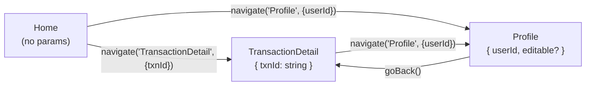

# TypeScript with React Native

**Goal:** Take everything you already know about typing React, and apply it to building real React Native apps in TypeScript — with typed navigation, typed native APIs, and the platform-specific patterns that ship in production fintech, healthcare, and social apps.

## What you'll learn

- How to scaffold a typed Expo project and why the template gives you `tsx` for free
- Typing the core RN components: `View`, `Text`, `Pressable`, `ScrollView`, and `FlatList<T>` with a correctly typed `renderItem`
- `StyleSheet.create` typing and how to pass styles around safely
- Typing the `Platform` module and `Platform.select`
- End-to-end typed navigation with React Navigation: param lists, `useNavigation`/`useRoute` generics, stack/tab navigators, and deep linking
- Typing Expo SDK / native modules, environment config, `SafeAreaView`, and `Dimensions`
- Platform-specific files (`.ios.tsx` / `.android.tsx`) and how their types resolve
- Performance: typed `keyExtractor` and `getItemLayout`
- Production patterns: secure token storage, biometric gating for PHI, and offline-first typed caches

## Prerequisites

You should be comfortable with React in TypeScript first. If `useState<T>`, typed props, `React.FC` vs explicit return types, and the `children` prop don't feel automatic yet, go back to [./07-react.md](./07-react.md). RN is React — this guide assumes that foundation and only teaches what's *different*.

---

## Mental model: RN shares React's type model

This is the single most important thing to internalize, because it saves you from re-learning anything:

> **A React Native component is a React component.** The hooks are the same hooks. Props are typed the same way. Generics work identically. What changes is the *leaf* components (`<View>` instead of `<div>`) and the *platform APIs* (camera, secure storage, biometrics) — and those ship with their own type definitions.

So your existing React/TS knowledge is ~90% of the job. The new surface area is narrow and mostly about (1) which components exist and how their props are typed, and (2) reaching into platform-native code in a type-safe way.



Everything below is just filling in B → D/E/F/G.

---

## Setup: Expo + TypeScript template

Expo is the lazy correct default for new apps — it handles the native toolchain so you stay in JS/TS. Create a typed project in one line:

```bash
npx create-expo-app@latest my-app --template
# pick "Blank (TypeScript)"
```

You get a `tsconfig.json` that extends `expo/tsconfig.base`, `.tsx` files, and types installed for `react`, `react-native`, and the Expo SDK. The key compiler setting Expo ships:

```jsonc
// tsconfig.json
{
  "extends": "expo/tsconfig.base",
  "compilerOptions": {
    "strict": true,
    "paths": { "@/*": ["./*"] } // path alias, optional but common
  }
}
```

Keep `strict: true`. RN's type defs are good; strictness is what makes them earn their keep.

---

## Typing core components

The leaf components come from `react-native` and are already typed. You mostly *consume* those types; you write types when you build your own wrapper components.

### View, Text, Pressable

```tsx
import { View, Text, Pressable, StyleSheet } from "react-native";

type ButtonProps = {
  label: string;
  onPress: () => void;
  disabled?: boolean;
};

function Button({ label, onPress, disabled }: ButtonProps) {
  return (
    <Pressable
      onPress={onPress}
      disabled={disabled}
      // `pressed` is correctly typed as boolean by RN's PressableStateCallbackType
      style={({ pressed }) => [styles.btn, pressed && styles.btnPressed]}
    >
      <Text style={styles.label}>{label}</Text>
    </Pressable>
  );
}
```

Two things worth noting:

- `Text` is mandatory for any string. Unlike the web, you cannot put a raw string inside a `View` — and TS will *not* catch that (it's a runtime error). Wrap text in `<Text>`.
- `Pressable`'s `style` prop accepts a function `({ pressed }) => style`. That callback's argument is typed for you.

### Extending a built-in component's props

When you wrap a native component, extend its props instead of re-declaring them. This keeps you compatible with every prop the platform supports:

```tsx
import { Pressable, type PressableProps, Text, StyleSheet } from "react-native";

type PrimaryButtonProps = PressableProps & { label: string };

function PrimaryButton({ label, style, ...rest }: PrimaryButtonProps) {
  return (
    <Pressable style={[styles.btn, style]} {...rest}>
      <Text style={styles.label}>{label}</Text>
    </Pressable>
  );
}
```

### FlatList<T> — the one you'll get wrong first

`FlatList` is generic. If you let it infer `T`, your `renderItem` argument is typed and `keyExtractor` knows the item shape. Annotate the generic explicitly when inference can't reach it:

```tsx
import { FlatList, View, Text, type ListRenderItem } from "react-native";

type Transaction = {
  id: string;
  merchant: string;
  amountCents: number;
};

const renderTxn: ListRenderItem<Transaction> = ({ item }) => (
  <View>
    <Text>{item.merchant}</Text>
    <Text>{(item.amountCents / 100).toFixed(2)}</Text>
  </View>
);

function TransactionList({ data }: { data: Transaction[] }) {
  return (
    <FlatList<Transaction>
      data={data}
      renderItem={renderTxn}
      keyExtractor={(item) => item.id} // item is Transaction, fully typed
    />
  );
}
```

Defining `renderItem` as a typed `ListRenderItem<Transaction>` constant (rather than inline) gives you the cleanest errors and lets you reuse it.

### ScrollView

`ScrollView` renders everything at once (no virtualization). Type it like any container — it takes `children`. Use it for short, bounded content; reach for `FlatList` when the list can grow.

```tsx
import { ScrollView } from "react-native";

function Settings({ children }: { children: React.ReactNode }) {
  return <ScrollView contentContainerStyle={{ padding: 16 }}>{children}</ScrollView>;
}
```

---

## StyleSheet.create and typed style props

`StyleSheet.create` is typed so that invalid style keys/values are caught at compile time — `color: 123` or `flexDirección: "row"` won't compile.

```tsx
import { StyleSheet } from "react-native";

const styles = StyleSheet.create({
  btn: { paddingVertical: 12, paddingHorizontal: 16, borderRadius: 8 },
  btnPressed: { opacity: 0.6 },
  label: { fontSize: 16, fontWeight: "600" }, // "600" is checked against valid weights
});
```

When a component accepts a style from a parent, type it with `StyleProp<ViewStyle>` (or `TextStyle` / `ImageStyle`). `StyleProp` allows a single style, an array, or `false`/`null` — the same shapes RN accepts at runtime:

```tsx
import { View, type StyleProp, type ViewStyle } from "react-native";

type CardProps = {
  style?: StyleProp<ViewStyle>;
  children: React.ReactNode;
};

function Card({ style, children }: CardProps) {
  return <View style={[styles.card, style]}>{children}</View>;
}
```

---

## Typing the Platform module and Platform.select

`Platform.OS` is a string literal union (`"ios" | "android" | "windows" | "macos" | "web"`), so branching on it narrows correctly.

```tsx
import { Platform } from "react-native";

if (Platform.OS === "ios") {
  // narrowed; safe to use iOS-only assumptions here
}
```

`Platform.select` returns the value for the current OS. It's generic, so the return type is the union of your branch value types. Provide a `default` to guarantee a non-`undefined` result:

```tsx
import { Platform } from "react-native";

const headerHeight = Platform.select({
  ios: 44,
  android: 56,
  default: 50, // makes the result `number`, not `number | undefined`
});
```



---

## Typed navigation with React Navigation

This is where RN typing earns its keep. React Navigation is fully typed but **you must declare your route param lists** — that's what makes `navigate(...)` and `route.params` type-safe.

Install the native stack and dependencies:

```bash
npx expo install @react-navigation/native @react-navigation/native-stack react-native-screens react-native-safe-area-context
```

### 1. Declare the param list

A param list is a type mapping screen name → its params (`undefined` for no params).

```tsx
// navigation/types.ts
export type RootStackParamList = {
  Home: undefined;
  TransactionDetail: { txnId: string };
  Profile: { userId: string; editable?: boolean };
};
```

### 2. Create a typed navigator

Pass the param list as the generic to `createNativeStackNavigator`. Now `name` props and `component` screens are checked against it.

```tsx
// navigation/RootStack.tsx
import { createNativeStackNavigator } from "@react-navigation/native-stack";
import type { RootStackParamList } from "./types";
import HomeScreen from "../screens/HomeScreen";
import TransactionDetailScreen from "../screens/TransactionDetailScreen";

const Stack = createNativeStackNavigator<RootStackParamList>();

export function RootStack() {
  return (
    <Stack.Navigator>
      <Stack.Screen name="Home" component={HomeScreen} />
      <Stack.Screen name="TransactionDetail" component={TransactionDetailScreen} />
    </Stack.Navigator>
  );
}
```

### 3. Type screen props with NativeStackScreenProps

Each screen gets `navigation` and `route` typed to its own entry. This is the cleanest pattern — no generics scattered through the component:

```tsx
// screens/TransactionDetailScreen.tsx
import type { NativeStackScreenProps } from "@react-navigation/native-stack";
import type { RootStackParamList } from "../navigation/types";
import { View, Text } from "react-native";

type Props = NativeStackScreenProps<RootStackParamList, "TransactionDetail">;

export default function TransactionDetailScreen({ route, navigation }: Props) {
  const { txnId } = route.params; // typed as string
  return (
    <View>
      <Text>Transaction {txnId}</Text>
      {/* navigate is checked: wrong name or missing params won't compile */}
      <Text onPress={() => navigation.navigate("Profile", { userId: "u1" })}>
        View profile
      </Text>
    </View>
  );
}
```

### 4. Hooks: useNavigation / useRoute generics

For deeply nested components that don't receive screen props, use the hooks with explicit generics:

```tsx
import { useNavigation, useRoute, type RouteProp } from "@react-navigation/native";
import type { NativeStackNavigationProp } from "@react-navigation/native-stack";
import type { RootStackParamList } from "../navigation/types";

function PayAgainButton() {
  const navigation =
    useNavigation<NativeStackNavigationProp<RootStackParamList>>();
  const route = useRoute<RouteProp<RootStackParamList, "TransactionDetail">>();
  return null; // route.params.txnId is typed
}
```

To avoid repeating those generics everywhere, declare them **globally once** and `useNavigation()`/`navigate()` become typed app-wide:

```tsx
// navigation/types.ts (append)
declare global {
  namespace ReactNavigation {
    interface RootParamList extends RootStackParamList {}
  }
}
```

### 5. The navigation graph



### 6. Tab navigators compose

Tabs nest stacks. Give each its own param list and reference nested params with `NavigatorScreenParams`:

```tsx
import type { NavigatorScreenParams } from "@react-navigation/native";

export type TabParamList = {
  Wallet: NavigatorScreenParams<RootStackParamList>;
  Settings: undefined;
};
```

### 7. Typed deep linking

The `linking` config maps URLs to screens. Type it as `LinkingOptions<RootStackParamList>` so the `screens` map is checked against your routes:

```tsx
import type { LinkingOptions } from "@react-navigation/native";
import type { RootStackParamList } from "./types";

const linking: LinkingOptions<RootStackParamList> = {
  prefixes: ["myapp://", "https://myapp.com"],
  config: {
    screens: {
      Home: "",
      TransactionDetail: "txn/:txnId", // :txnId maps to params.txnId
      Profile: "user/:userId",
    },
  },
};
```

---

## Typing native modules / Expo SDK APIs

Expo SDK modules ship their own types — you just import and use them. The async ones return typed promises:

```tsx
import * as Location from "expo-location";

async function getCoords() {
  const { status } = await Location.requestForegroundPermissionsAsync();
  if (status !== "granted") return null;
  const loc = await Location.getCurrentPositionAsync({});
  return loc.coords; // { latitude, longitude, ... } fully typed
}
```

For a **bare native module** without bundled types (rare with Expo), write a minimal ambient declaration — type only what you call, not the whole module:

```tsx
// types/react-native-legacy-thing.d.ts
declare module "react-native-legacy-thing" {
  export function doThing(id: string): Promise<{ ok: boolean }>;
}
```

> Don't reach for a full hand-written `.d.ts` until you've confirmed the package truly ships none. Check `@types/<pkg>` and the package's own `types` field first.

---

## Typed environment / config

Expo exposes public config through `process.env.EXPO_PUBLIC_*` (inlined at build time) and `Constants.expoConfig.extra` for everything else. `process.env` values are `string | undefined`, so validate at the edge rather than sprinkling non-null assertions:

```tsx
// config.ts
function required(name: string, value: string | undefined): string {
  if (!value) throw new Error(`Missing env: ${name}`);
  return value;
}

export const config = {
  apiUrl: required("EXPO_PUBLIC_API_URL", process.env.EXPO_PUBLIC_API_URL),
} as const;
```

`as const` makes `config.apiUrl` a precise literal-narrowed `string`, and the `required` helper turns `string | undefined` into `string` once, at startup, where a missing value fails loudly.

---

## SafeAreaView and Dimensions

Wrap screens so content avoids notches and home indicators. Use `react-native-safe-area-context` (the provider-based one) rather than the deprecated core `SafeAreaView`:

```tsx
import { SafeAreaView, useSafeAreaInsets } from "react-native-safe-area-context";

function Screen({ children }: { children: React.ReactNode }) {
  const insets = useSafeAreaInsets(); // { top, bottom, left, right }: number
  return (
    <SafeAreaView style={{ flex: 1, paddingTop: insets.top }}>
      {children}
    </SafeAreaView>
  );
}
```

`Dimensions.get("window")` is typed as `ScaledSize`. Prefer the `useWindowDimensions()` hook — it re-renders on rotation and is typed identically:

```tsx
import { useWindowDimensions } from "react-native";

function Banner() {
  const { width } = useWindowDimensions(); // number, updates on rotate
  return null;
}
```

---

## Platform-specific files (.ios.tsx / .android.tsx)

When a component's whole implementation differs per platform, split it into files. Metro resolves `import { Map } from "./Map"` to `Map.ios.tsx` on iOS and `Map.android.tsx` on Android automatically.

The typing trick: create a shared `Map.tsx` (or `Map.d.ts`) declaring the **common interface** so importers see one consistent type regardless of which file Metro picks.

```tsx
// Map.tsx — the type contract + default (web/fallback)
export type MapProps = { lat: number; lng: number };
export function Map(_: MapProps): JSX.Element { /* fallback */ return null as any; }
```

```tsx
// Map.ios.tsx
import type { MapProps } from "./Map";
export function Map({ lat, lng }: MapProps) { /* Apple Maps */ return null as any; }
```

```tsx
// Map.android.tsx
import type { MapProps } from "./Map";
export function Map({ lat, lng }: MapProps) { /* Google Maps */ return null as any; }
```

Both platform files import `MapProps` from the shared module, so the props stay in sync and consumers get one stable type.

---

## Performance: typed keyExtractor and getItemLayout

For long lists, two props matter for scroll performance, and both are typed off your item type:

- `keyExtractor` — stable identity, avoids re-mounting rows.
- `getItemLayout` — skips measurement when every row is a known fixed height, enabling instant `scrollToIndex` and smoother scrolling.

```tsx
import { FlatList, type ListRenderItem } from "react-native";

const ROW_HEIGHT = 64;

const renderRow: ListRenderItem<Transaction> = ({ item }) => null;

function FastList({ data }: { data: Transaction[] }) {
  return (
    <FlatList<Transaction>
      data={data}
      renderItem={renderRow}
      keyExtractor={(item) => item.id}
      getItemLayout={(_, index) => ({
        length: ROW_HEIGHT,
        offset: ROW_HEIGHT * index,
        index,
      })}
    />
  );
}
```

> Only use `getItemLayout` when rows are truly fixed-height. If heights vary, a wrong layout breaks scrolling — leave it off and let RN measure.

---

## Production gotchas

> **Strings must live in `<Text>`.** A bare string in a `<View>` is a runtime crash that TypeScript does not catch. When you see "Text strings must be rendered within a `<Text>` component", you forgot a wrapper.

> **`Platform.select` without a `default` returns `T | undefined`.** On any OS you didn't list (including web), you'll get `undefined`. Add `default:` whenever the call site expects a value.

> **Inline `renderItem` / `style` functions allocate every render.** For hot lists, hoist `renderItem` and `keyExtractor` to module scope or wrap in `useCallback`. The type stays the same; the GC pressure doesn't.

> **`process.env.EXPO_PUBLIC_*` is inlined at build, not runtime.** Changing it requires a rebuild. Never put secrets in it — anything `EXPO_PUBLIC_` ships in the bundle and is readable by anyone.

> **Global `RootParamList` augmentation is all-or-nothing.** Once you declare it, *every* `useNavigation()` is typed to that list. If you have multiple independent navigators, scope generics per-call instead of globally.

---

## Patterns in production

### Fintech — secure token storage

Never keep auth tokens in `AsyncStorage` (plaintext). Use `expo-secure-store`, which is backed by the iOS Keychain and Android Keystore. Wrap it in a typed module so the rest of the app can't reach raw storage:

```tsx
import * as SecureStore from "expo-secure-store";

const TOKEN_KEY = "auth.token";

export const tokenStore = {
  async set(token: string): Promise<void> {
    await SecureStore.setItemAsync(TOKEN_KEY, token, {
      keychainAccessible: SecureStore.WHEN_UNLOCKED_THIS_DEVICE_ONLY,
    });
  },
  async get(): Promise<string | null> {
    return SecureStore.getItemAsync(TOKEN_KEY);
  },
  async clear(): Promise<void> {
    await SecureStore.deleteItemAsync(TOKEN_KEY);
  },
};
```

The `string | null` return type forces every caller to handle the logged-out case — exactly the discipline you want around money.

### Healthcare — PHI handling and biometric gating

Gate access to Protected Health Information behind device biometrics with `expo-local-authentication`. Model the result as a discriminated union so callers must handle failure before touching PHI:

```tsx
import * as LocalAuthentication from "expo-local-authentication";

type AuthResult =
  | { ok: true }
  | { ok: false; reason: "unavailable" | "failed" };

async function authenticateForPHI(): Promise<AuthResult> {
  const hasHardware = await LocalAuthentication.hasHardwareAsync();
  const enrolled = await LocalAuthentication.isEnrolledAsync();
  if (!hasHardware || !enrolled) return { ok: false, reason: "unavailable" };

  const res = await LocalAuthentication.authenticateAsync({
    promptMessage: "Unlock to view records",
  });
  return res.success ? { ok: true } : { ok: false, reason: "failed" };
}

// caller: TypeScript forces the branch before PHI is read
async function openRecord() {
  const auth = await authenticateForPHI();
  if (!auth.ok) return; // narrowed; PHI never loads on failure
  // ... load PHI
}
```

Keep PHI in `expo-secure-store`, never in logs or analytics, and clear it on background/logout.

### Social — offline-first typed cache

A typed cache layer lets the UI render last-known data instantly and reconcile when the network returns. A tiny generic wrapper over `AsyncStorage` keeps the cache type-safe per key:

```tsx
import AsyncStorage from "@react-native-async-storage/async-storage";

type Cached<T> = { data: T; fetchedAt: number };

async function readCache<T>(key: string): Promise<Cached<T> | null> {
  const raw = await AsyncStorage.getItem(key);
  return raw ? (JSON.parse(raw) as Cached<T>) : null;
}

async function writeCache<T>(key: string, data: T): Promise<void> {
  const entry: Cached<T> = { data, fetchedAt: Date.now() };
  await AsyncStorage.setItem(key, JSON.stringify(entry));
}

// usage: T flows through, so feed is typed end to end
async function loadFeed(): Promise<Post[]> {
  const cached = await readCache<Post[]>("feed");
  if (cached) return cached.data; // render instantly, refresh in background
  return [];
}

type Post = { id: string; author: string; body: string };
```

> `JSON.parse` returns `any` — the `as Cached<T>` is an *unverified* assertion. At a real trust boundary (network responses, deep-link params) validate with a schema (e.g. Zod) instead of asserting. For your own cache, the assertion is acceptable since you wrote both ends.

---

## Exercises

1. **Typed list screen.** Build a `FlatList<Contact>` screen where `Contact` is `{ id; name; phone }`. Type `renderItem` as a hoisted `ListRenderItem<Contact>` and add a `keyExtractor`. Make TS reject `item.email`.

2. **Param list navigation.** Define a `RootStackParamList` with `Feed: undefined` and `PostDetail: { postId: string }`. Wire a native stack, type both screens with `NativeStackScreenProps`, and navigate from Feed to PostDetail. Confirm `navigate("PostDetail", {})` fails to compile.

3. **Platform-branched header.** Write a `headerHeight` using `Platform.select` with `ios`, `android`, and `default`. Then create `Header.ios.tsx` / `Header.android.tsx` sharing a `HeaderProps` type from a common module, and prove both importers see the same props.

4. **Typed config gate.** Add `EXPO_PUBLIC_API_URL` to `.env`, write a `required()` validator, and export a `config` object with `as const`. Make the app throw on startup if the var is missing.

5. **Secure token module.** Implement `tokenStore` over `expo-secure-store` returning `Promise<string | null>` from `get()`. Add a `useAuthToken()` hook that loads it on mount and types the state as `string | null`.

6. **Biometric PHI gate (stretch).** Implement `authenticateForPHI(): Promise<AuthResult>` as a discriminated union and write a screen that only renders a (mock) record after `auth.ok` narrows to `true`.

---

## Next

- Previous: [./07-react.md](./07-react.md) — the React/TS foundation this guide builds on
- Next: [./09-nextjs.md](./09-nextjs.md) — bringing typed React to the server and web
- Backend for your app's API: [./10-backend.md](./10-backend.md)
- Testing your components and navigation: [./12-testing-quality.md](./12-testing-quality.md)
- Series overview: [./00-roadmap.md](./00-roadmap.md) · Plan: [../TypeScript_Learning_Plan.md](../TypeScript_Learning_Plan.md)
