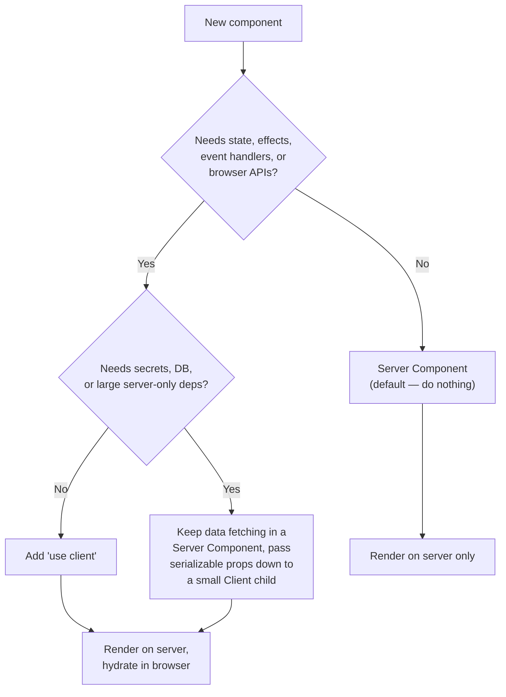
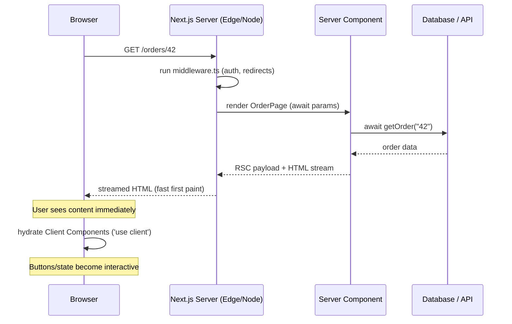

# TypeScript with Next.js (App Router)

**Goal:** Confidently build production Next.js applications in TypeScript using the App Router, with type safety that stretches from the browser all the way to the database.

You already know React with TypeScript and you've seen a backend or two. Next.js is where those two worlds collide in a single codebase. The hard part isn't the syntax — it's understanding *where your code runs* and how types flow across that boundary. This guide is about making that boundary visible and type-safe.

## What you'll learn

- Setting up a typed Next.js project and what the tooling gives you for free
- The App Router file conventions (`page.tsx`, `layout.tsx`, `route.ts`) and the exact types each one expects
- Typing `params`, `searchParams`, `generateMetadata`, and `generateStaticParams`
- Server Components vs Client Components: what each can do and how to type the props that cross between them
- Server Actions with Zod-validated, typed inputs
- Route Handlers with `NextRequest` / `NextResponse`
- Typed data fetching, caching, environment variables, and middleware
- How this all ties into end-to-end type safety with your backend

## Prerequisites

- [07 — React with TypeScript](./07-react.md) — components, props, hooks. You must be comfortable here first.
- [10 — Backend with TypeScript](./10-backend.md) — Route Handlers and Server Actions are the front door to your backend. We link there for tRPC and the deeper data layer.

---

## Mental model: the server/client boundary

In a classic React SPA, *all* your code runs in the browser. In Next.js App Router, the default flipped: **every component is a Server Component until you say otherwise.** A Server Component runs once, on the server, during the request. It never ships to the browser. A Client Component runs on the server for the initial HTML *and* in the browser for interactivity.

This one fact explains almost everything else:

- Server Components can `await` a database call directly, read secrets, and touch the filesystem — because they never reach the browser.
- Client Components can use `useState`, `onClick`, and browser APIs — because they hydrate in the browser.
- Anything passed *from* a Server Component *into* a Client Component as props must be **serializable** — it gets sent over the wire as JSON-ish data. You can't pass a function, a class instance, or a Date-with-methods and expect it to survive (Next does serialize plain `Date`, `Map`, `Set`, etc. via its own format, but not functions or class instances).

Hold that boundary in your head. The compiler can't fully enforce "this is serializable," so it's the one place where TypeScript helps but doesn't save you.



The lazy rule: **start every component as a Server Component. Only reach for `'use client'` when you hit something that genuinely needs the browser.** Push the `'use client'` boundary as far down the tree (toward the leaves) as you can — a single interactive button shouldn't drag its whole page into the client bundle.

---

## Project setup

```bash
npx create-next-app@latest my-app --typescript --app --eslint
```

The `--typescript --app` flags give you `tsconfig.json`, a `next-env.d.ts` (don't edit it — Next regenerates it), and the App Router under `app/`. Next has a first-class TypeScript plugin; in your editor it type-checks the special exports (`generateMetadata`, `generateStaticParams`, page props) that plain `tsc` is laxer about.

One setting worth knowing in `tsconfig.json`:

```jsonc
{
  "compilerOptions": {
    "strict": true,              // non-negotiable — turn it on, keep it on
    "moduleResolution": "bundler",
    "plugins": [{ "name": "next" }],
    "paths": { "@/*": ["./*"] }  // import "@/lib/db" instead of "../../../lib/db"
  }
}
```

To type-check the whole project in CI (separate from the dev server, which only type-checks files it touches):

```bash
npx tsc --noEmit
```

---

## File conventions and their types

The App Router is convention-driven: a file named `page.tsx` in a folder *is* the route. Each special file has an expected shape.

### `page.tsx` — typing `params` and `searchParams`

A page receives `params` (dynamic route segments) and `searchParams` (the `?key=value` query string). **In Next.js 15, both are Promises** — you `await` them. (In 14 they were plain objects; the examples below use the 15 async form, which is the direction everything is moving.)

For a route at `app/orders/[orderId]/page.tsx`:

```tsx
// app/orders/[orderId]/page.tsx
type PageProps = {
  params: Promise<{ orderId: string }>;
  searchParams: Promise<{ tab?: string }>;
};

export default async function OrderPage({ params, searchParams }: PageProps) {
  const { orderId } = await params;
  const { tab } = await searchParams;

  const order = await getOrder(orderId); // runs on the server, can hit the DB directly

  return (
    <main>
      <h1>Order {order.id}</h1>
      <p>Active tab: {tab ?? "summary"}</p>
    </main>
  );
}
```

Note `orderId` is always a `string` — route params are never typed as numbers, even for `[id]` that "looks numeric." Parse and validate at the edge.

> [!TIP]
> Next 15 ships a typed-routes feature and generates `.next/types`. You don't have to hand-write the `PageProps` type — you can often let the Next TypeScript plugin infer it. But writing it explicitly, as above, is clearer when you're learning and survives refactors well.

### `layout.tsx` — wrapping routes

A layout always receives `children`. It can also receive `params` for dynamic segments at its level.

```tsx
// app/orders/[orderId]/layout.tsx
import type { ReactNode } from "react";

type LayoutProps = {
  children: ReactNode;
  params: Promise<{ orderId: string }>;
};

export default async function OrderLayout({ children, params }: LayoutProps) {
  const { orderId } = await params;
  return (
    <section>
      <nav>Order #{orderId}</nav>
      {children}
    </section>
  );
}
```

### `generateMetadata` and the `Metadata` type

For static metadata, export a typed `metadata` object. For per-request metadata (e.g. a title built from the fetched record), export an async `generateMetadata`. Both use the `Metadata` type from `next`.

```tsx
// app/orders/[orderId]/page.tsx
import type { Metadata } from "next";

export const metadata: Metadata = {
  // static — fine for fixed pages
  title: "Orders",
};

// OR, dynamic — pick one, not both for the same field:
export async function generateMetadata({
  params,
}: {
  params: Promise<{ orderId: string }>;
}): Promise<Metadata> {
  const { orderId } = await params;
  const order = await getOrder(orderId);
  return {
    title: `Order ${order.id}`,
    description: `Status: ${order.status}`,
  };
}
```

### `generateStaticParams` — pre-rendering dynamic routes at build

Return the list of param objects you want pre-built. The return type must match the route's params shape (string values).

```tsx
// app/blog/[slug]/page.tsx
export async function generateStaticParams(): Promise<{ slug: string }[]> {
  const posts = await getAllPostSlugs();
  return posts.map((slug) => ({ slug }));
}
```

---

## The request lifecycle

Here's what actually happens when a browser asks for an App Router page. The server renders Server Components to a stream, sends HTML plus a serialized React payload, and the browser then hydrates only the Client Components.



The takeaway: server work (DB calls, secrets) is finished before any JS reaches the browser. The browser only "wakes up" the interactive islands.

---

## Server Components vs Client Components: typing the boundary

A Server Component is the default. A Client Component is any file with `'use client'` at the very top.

```tsx
// app/orders/[orderId]/AddNoteButton.tsx
"use client";

import { useState } from "react";

type Props = {
  orderId: string;
  // ✅ serializable: a string, a number, a plain object
  initialNote: string;
  // ❌ a function prop is fine ONLY if passed from another Client Component,
  //    or if it's a Server Action (see below). A plain server fn won't serialize.
};

export function AddNoteButton({ orderId, initialNote }: Props) {
  const [note, setNote] = useState(initialNote);
  return (
    <input value={note} onChange={(e) => setNote(e.target.value)} data-id={orderId} />
  );
}
```

The Server Component renders it and passes only serializable props:

```tsx
// inside OrderPage (a Server Component)
const order = await getOrder(orderId);
return <AddNoteButton orderId={order.id} initialNote={order.note ?? ""} />;
```

> [!WARNING]
> TypeScript will happily let you pass a `() => void` callback or a class instance from a Server Component to a Client Component. It compiles. It then **fails at runtime** with a serialization error (or silently misbehaves). The type system does not model the serialization boundary. Train yourself to glance at every prop crossing into a `'use client'` component and ask: "is this plain data?"

A clean way to make the boundary intentional is to define the props type next to the Client Component and keep it to primitives, plain objects, and arrays.

---

## Server Actions with typed inputs and Zod

A Server Action is a function with `'use server'` that runs on the server but can be called *from* a Client Component (or used directly as a `<form action={...}>`). It's the App Router's answer to "submit this form to the backend" without writing an API route.

The critical discipline: **the input arrives untrusted.** Even though you wrote the form, anyone can POST arbitrary data. Validate with Zod, then act.

```ts
// app/orders/actions.ts
"use server";

import { z } from "zod";
import { revalidatePath } from "next/cache";

const CreateOrderSchema = z.object({
  customerId: z.string().uuid(),
  amountCents: z.number().int().positive(),
  memo: z.string().max(500).optional(),
});

// Inferred input type — single source of truth, no hand-written duplicate.
export type CreateOrderInput = z.infer<typeof CreateOrderSchema>;

export type ActionResult =
  | { ok: true; orderId: string }
  | { ok: false; error: string };

export async function createOrder(raw: unknown): Promise<ActionResult> {
  const parsed = CreateOrderSchema.safeParse(raw);
  if (!parsed.success) {
    return { ok: false, error: parsed.error.issues[0]?.message ?? "Invalid input" };
  }

  const session = await requireSession(); // throws/redirects if unauthenticated
  const order = await db.orders.create({
    ...parsed.data,
    createdBy: session.userId,
  });

  revalidatePath("/orders");
  return { ok: true, orderId: order.id };
}
```

Calling it from a Client Component:

```tsx
"use client";

import { useTransition, useState } from "react";
import { createOrder, type ActionResult } from "./actions";

export function NewOrderForm({ customerId }: { customerId: string }) {
  const [pending, startTransition] = useTransition();
  const [result, setResult] = useState<ActionResult | null>(null);

  return (
    <form
      action={(formData) => {
        startTransition(async () => {
          const res = await createOrder({
            customerId,
            amountCents: Number(formData.get("amount")),
            memo: String(formData.get("memo") ?? ""),
          });
          setResult(res);
        });
      }}
    >
      <input name="amount" type="number" />
      <input name="memo" />
      <button disabled={pending}>{pending ? "Saving…" : "Create"}</button>
      {result && !result.ok && <p role="alert">{result.error}</p>}
    </form>
  );
}
```

The `action` returns `unknown` to the validator on purpose — that `safeParse` is the trust boundary. The `ActionResult` discriminated union gives the caller exhaustive, typed handling of success vs failure.

---

## Route Handlers (`route.ts`)

When you need an actual HTTP endpoint (webhooks, third-party callbacks, non-form clients), use a Route Handler. Export a function named after the HTTP verb. Use `NextRequest`/`NextResponse` for the typed Next-flavored request/response (they extend the web standard `Request`/`Response`).

```ts
// app/api/orders/[orderId]/route.ts
import { NextRequest, NextResponse } from "next/server";
import { z } from "zod";

const PatchSchema = z.object({ status: z.enum(["open", "paid", "void"]) });

export async function GET(
  _req: NextRequest,
  { params }: { params: Promise<{ orderId: string }> }, // Next 15: async params here too
) {
  const { orderId } = await params;
  const order = await getOrder(orderId);
  if (!order) {
    return NextResponse.json({ error: "Not found" }, { status: 404 });
  }
  return NextResponse.json(order);
}

export async function PATCH(
  req: NextRequest,
  { params }: { params: Promise<{ orderId: string }> },
) {
  const { orderId } = await params;
  const body = PatchSchema.safeParse(await req.json());
  if (!body.success) {
    return NextResponse.json({ error: "Invalid body" }, { status: 400 });
  }
  const updated = await db.orders.update(orderId, body.data);
  return NextResponse.json(updated);
}
```

Read query params with `req.nextUrl.searchParams` (a typed `URLSearchParams`). Validate dynamic segments the same way you'd validate any input — `orderId` is a `string`, nothing more.

---

## Typed data fetching and caching

In a Server Component you just `await fetch(...)` or call your DB. The win is typing the response. `fetch` returns `any` from `.json()`, so validate or assert.

```ts
// lib/api.ts
import { z } from "zod";

const Quote = z.object({ symbol: z.string(), priceCents: z.number().int() });
export type Quote = z.infer<typeof Quote>;

export async function getQuote(symbol: string): Promise<Quote> {
  const res = await fetch(`https://api.example.com/quote/${symbol}`, {
    // Caching is opt-in per request via the `next` option:
    next: { revalidate: 60 },          // ISR: cache for 60s
    // cache: "no-store",              // always fresh (e.g. per-user data)
  });
  if (!res.ok) throw new Error(`Quote failed: ${res.status}`);
  return Quote.parse(await res.json()); // throws if the shape is wrong
}
```

> [!NOTE]
> In Next 15 the default `fetch` cache changed to **not cached** (`no-store`) unless you opt in with `next: { revalidate }` or `cache: "force-cache"`. In Next 14 GET fetches were cached by default. Always be explicit — don't rely on the version default.

Validating with `z.parse` at the fetch boundary means everything downstream is genuinely the type you claim, not a hopeful cast.

---

## Typed environment variables

`process.env.FOO` is `string | undefined` and silently typos into `undefined` at runtime. Validate your env once, at startup, and import the typed object everywhere instead of touching `process.env` directly. The `@t3-oss/env-nextjs` package formalizes this, but the idea is a dozen lines of Zod:

```ts
// env.ts
import { z } from "zod";

const schema = z.object({
  DATABASE_URL: z.string().url(),
  STRIPE_SECRET_KEY: z.string().min(1),
  // Client-exposed vars MUST be prefixed NEXT_PUBLIC_ and are the only ones
  // that reach the browser. Keep secrets out of this group.
  NEXT_PUBLIC_APP_URL: z.string().url(),
});

const parsed = schema.safeParse(process.env);
if (!parsed.success) {
  console.error("❌ Invalid environment variables:", parsed.error.flatten().fieldErrors);
  throw new Error("Invalid environment variables");
}

export const env = parsed.data; // fully typed, autocompleted, validated
```

```ts
import { env } from "@/env";
const db = connect(env.DATABASE_URL); // string, guaranteed, autocompleted
```

> [!WARNING]
> Only `NEXT_PUBLIC_`-prefixed vars are inlined into the client bundle. A secret without that prefix used inside a `'use client'` component will be `undefined` in the browser — and if you *do* prefix a secret to "fix" that, you've just shipped it to every user. This is one of the most common (and most dangerous) Next.js mistakes. Secrets stay server-side; only Server Components, Server Actions, and Route Handlers may read them.

---

## Typed middleware

`middleware.ts` runs at the edge before the request hits your route — perfect for auth gates and redirects. It's typed with `NextRequest` → `NextResponse`.

```ts
// middleware.ts
import { NextRequest, NextResponse } from "next/server";

export function middleware(req: NextRequest) {
  const session = req.cookies.get("session")?.value;
  if (!session && req.nextUrl.pathname.startsWith("/dashboard")) {
    const url = req.nextUrl.clone();
    url.pathname = "/login";
    return NextResponse.redirect(url);
  }
  return NextResponse.next();
}

export const config = {
  matcher: ["/dashboard/:path*"], // only run on these paths
};
```

Middleware runs in the Edge runtime — no Node APIs, no heavy DB drivers. Keep it to cookie/header checks and redirects; do real auth verification in the page or action.

---

## `next.config` typing

Type the config with the `NextConfig` type and the `satisfies` operator so you get autocomplete and catch typos without widening the type.

```ts
// next.config.ts
import type { NextConfig } from "next";

const config: NextConfig = {
  reactStrictMode: true,
  images: { remotePatterns: [{ protocol: "https", hostname: "cdn.example.com" }] },
} satisfies NextConfig;

export default config;
```

---

## End-to-end type safety with the backend

Server Actions and Route Handlers *are* your backend's front door, and because they're in the same TypeScript project, the input/output types are shared by construction — no codegen, no drift. For a richer typed RPC layer (procedures, input/output schemas, React Query integration), reach for **tRPC**, covered in [10 — Backend with TypeScript](./10-backend.md). The pattern is the same one you saw here: a Zod schema is the single source of truth, and `z.infer` produces the type both sides use.

---

## Production gotchas

> [!WARNING]
> **Secrets leaking to the client.** Any value used in a `'use client'` component is in the browser bundle. Never read `process.env.SECRET` (un-prefixed) expecting it to work client-side, and never `NEXT_PUBLIC_`-prefix something sensitive. Audit your client components for env access.

> [!WARNING]
> **Non-serializable props across the boundary.** Passing functions, class instances, or symbols from a Server Component into a Client Component compiles but fails at runtime. Only plain data crosses. Use Server Actions for "call the server" behavior instead of passing server functions down.

> [!CAUTION]
> **Unvalidated Server Action / Route Handler input.** These are public endpoints. TypeScript types on the parameter are a *lie about runtime* — they describe what you hope arrives, not what does. Always `safeParse` untrusted input before using it.

> [!NOTE]
> **Caching surprises after upgrading.** The default `fetch` caching behavior differs between Next 14 and 15. Be explicit with `cache` / `next: { revalidate }` on every fetch so an upgrade doesn't silently change your data freshness.

> [!TIP]
> **`'use client'` creeping up the tree.** Marking a layout or page as a client component drags everything below it into the client bundle and disables server data fetching there. Keep the directive on the smallest interactive leaf.

---

## Patterns in production

**Fintech — transaction forms via Server Actions.** A "send payment" form posts to a Server Action that re-validates the amount and currency with Zod, re-checks authorization server-side, and writes through an idempotency key — never trusting the client's claimed amount. The action returns a typed `{ ok: true; receiptId } | { ok: false; error }` discriminated union so the UI handles failure exhaustively. The amount is parsed from `unknown`, in cents as an integer, never a float.

**Healthcare — PHI never crosses to the client.** Patient records are fetched and rendered inside Server Components; only the minimum non-PHI fields (e.g. an appointment time, a display name) are passed as serializable props into Client Components. The "view full chart" interaction is a Server Action that returns a server-rendered fragment, so protected health information stays in the server boundary and never lands in the browser bundle, JS memory, or client-side cache. The typed env module keeps the EHR API key out of any `NEXT_PUBLIC_` path.

**Social — SSR auth/session typing and feature flags.** `middleware.ts` reads the session cookie and gates routes at the edge. Inside Server Components a typed `getSession(): Promise<Session | null>` is the single auth accessor; a `Session` type with a discriminated `role` field drives what renders. Feature flags are fetched server-side and passed as boolean props to Client Components, so flag values are decided on the server and the client only renders the chosen variant — no flag-evaluation logic shipped to the browser.

---

## Exercises

1. **Typed dynamic route.** Build `app/users/[userId]/page.tsx` that `await`s `params`, fetches a user, and exports a `generateMetadata` setting the title to the user's name. Add `generateStaticParams` to pre-build the first 10 users.

2. **Boundary discipline.** Create a Server Component that fetches a list, and a `'use client'` child that filters it with `useState`. Pass only serializable props. Then deliberately try to pass a function prop and read the runtime error — internalize what the type system *didn't* catch.

3. **Validated Server Action.** Write a `createComment` Server Action with a Zod schema (`postId: uuid`, `body: 1–1000 chars`). Return a discriminated `ActionResult`. Wire it to a form using `useTransition` and render validation errors with `role="alert"`.

4. **Route Handler.** Implement `app/api/health/route.ts` with a typed `GET` returning `NextResponse.json({ status: "ok", ts })`, and a `POST` that validates a JSON body with Zod and 400s on bad input.

5. **Typed env.** Add an `env.ts` Zod validator with one secret and one `NEXT_PUBLIC_` var. Import it in a Server Component and a Client Component; confirm the secret is `undefined`/unavailable on the client side and explain why.

6. **Stretch — middleware auth gate.** Add `middleware.ts` that redirects unauthenticated requests to `/dashboard/*` toward `/login`, scoped with a `matcher` config. Verify a logged-out request redirects and a logged-in one passes through.

---

## Next

- Previous: [08 — React Native with TypeScript](./08-react-native.md)
- Next: [10 — Backend with TypeScript](./10-backend.md) — tRPC, typed APIs, and the data layer behind these pages
- Related: [07 — React with TypeScript](./07-react.md) · [11 — Production Patterns](./11-production-patterns.md)
- Series index: [00 — Roadmap](./00-roadmap.md) · Plan: [../TypeScript_Learning_Plan.md](../TypeScript_Learning_Plan.md)
