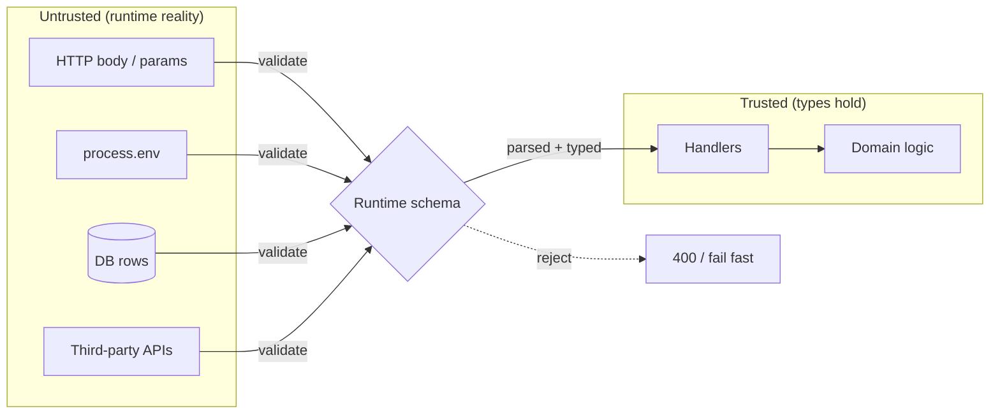
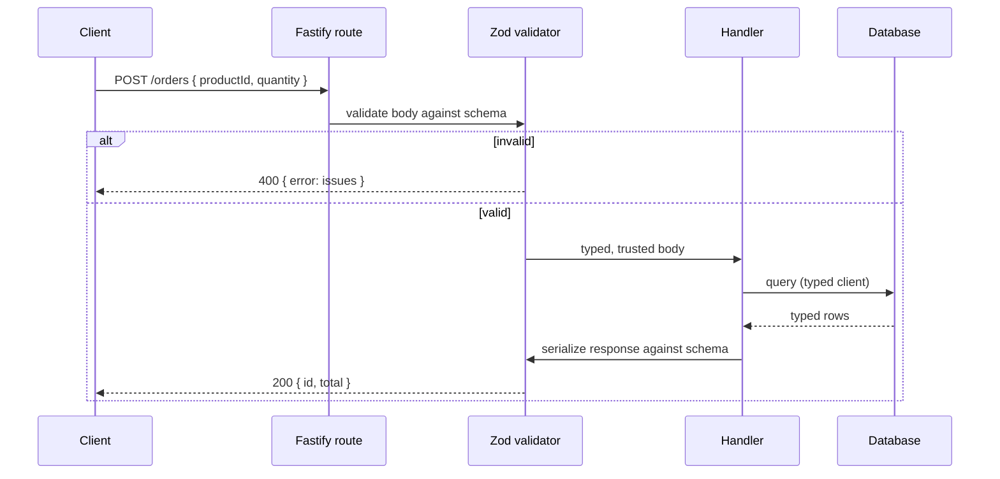
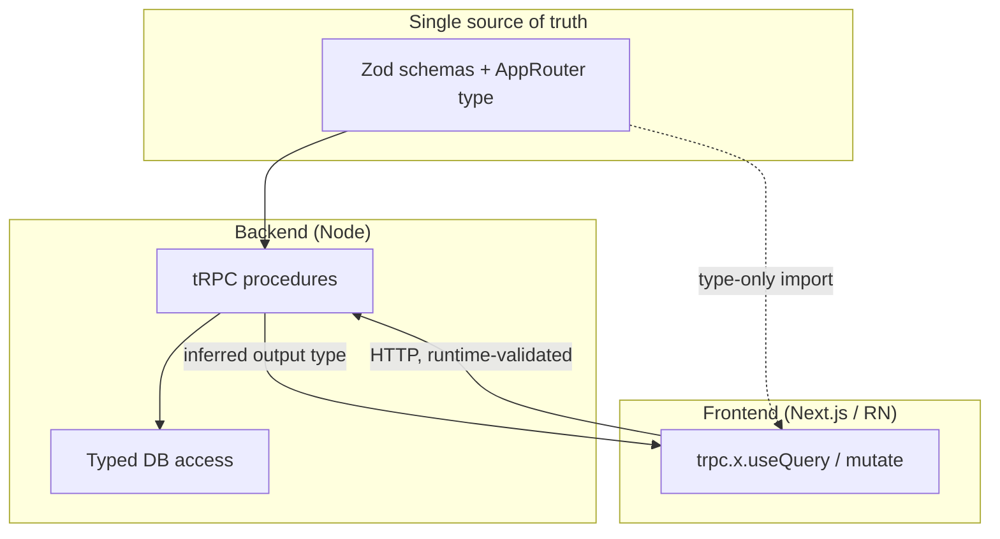

# Backend TypeScript: Production Services for Typed Frontends

**Goal:** Build production backend services in TypeScript that pair safely with React, React Native, and Next.js frontends — where the *same types* describe the data on both ends and external input is never trusted blindly.

## What you'll learn

- How to run TypeScript on Node and type `process.env` without lying to yourself
- The single most important backend lesson: **types are erased at runtime**, so every external input must be validated at the boundary
- Zod in depth — schemas as the single source of truth, `z.infer`, `parse` vs `safeParse`, transforms, refinements
- Building a typed HTTP API with Fastify (type providers / typed routes)
- tRPC for end-to-end type safety between a Next.js/React client and your backend
- Typed database access with Prisma vs Drizzle, and when to pick which
- Typed error handling at the API layer, and DTOs vs domain types
- How fintech, healthcare, and social products apply these patterns

## Prerequisites

You should be comfortable with generics and modules first:

- [Functions & Generics](./03-functions-generics.md) — `z.infer`, type providers, and tRPC inference all lean on generics
- [Modules & Tooling](./06-modules-tooling.md) — `tsconfig` strict mode, ESM vs CJS, and build setup

---

## Mental model: the trust boundary

Here is the one idea that, if you internalize nothing else, will keep you out of trouble.

> **TypeScript types are compile-time only. They are completely erased before your code runs.**

When you write `function charge(amount: number)`, the `number` annotation disappears in the emitted JavaScript. At runtime, `amount` can be a string, `undefined`, `NaN`, an object, or a SQL injection payload — because it came over the network, and the network does not respect your types.

So draw a line around your program. Inside the line, types are *guaranteed* by the compiler. Outside the line is everything you don't control:

- HTTP request bodies, query params, headers, path params
- `process.env`
- Database rows (the DB schema can drift from your TS types)
- Responses from third-party APIs
- Message queues, webhooks, files

**At every point where data crosses the line inward, validate it at runtime.** Once validated, it carries a real type you can trust for the rest of the program. This is the whole job of backend type safety: shrink the untrusted zone to a thin shell at the edges.



---

## Node + TypeScript runtime

For new services, run TypeScript directly with `tsx` in dev and compile with `tsc` (or `esbuild`/`swc`) for production. Use ESM (`"type": "module"` in `package.json`) and `"module": "NodeNext"` in `tsconfig.json` — it's the path the ecosystem is converging on.

```jsonc
// tsconfig.json (essentials — see 06-modules-tooling for the full setup)
{
  "compilerOptions": {
    "strict": true,
    "target": "ES2022",
    "module": "NodeNext",
    "moduleResolution": "NodeNext",
    "noUncheckedIndexedAccess": true, // arr[i] is T | undefined — catches real bugs
    "outDir": "dist"
  }
}
```

### Typing `process.env` safely

`process.env.PORT` is typed `string | undefined` by default — which is honest, because env vars are external input. Do **not** paper over this with a global `declare` that claims every var exists as a `string`; that's lying to the compiler about untrusted data. Validate it once at startup and export a typed object:

```ts
import { z } from "zod";

const EnvSchema = z.object({
  NODE_ENV: z.enum(["development", "production", "test"]).default("development"),
  PORT: z.coerce.number().int().positive().default(3000),
  DATABASE_URL: z.string().url(),
  STRIPE_SECRET_KEY: z.string().startsWith("sk_"),
});

// Fail fast at boot if config is wrong — better than a 3am NaN.
export const env = EnvSchema.parse(process.env);
//    ^? { NODE_ENV: "development" | "production" | "test"; PORT: number; ... }
```

`z.coerce.number()` turns the env string `"3000"` into the number `3000`. If `DATABASE_URL` is missing, the process crashes at startup with a readable message — which is exactly what you want. A misconfigured service should never accept traffic.

---

## Zod: schemas as the single source of truth

The naive approach defines a TypeScript `interface` *and* writes separate validation code, then keeps them in sync by hand. They drift. Instead, define the schema once and **derive the type from it**.

```ts
import { z } from "zod";

const CreateUser = z.object({
  email: z.string().email(),
  age: z.number().int().min(0).max(150),
  role: z.enum(["admin", "member"]).default("member"),
});

// Derive the static type from the runtime schema — one source of truth.
type CreateUser = z.infer<typeof CreateUser>;
//   ^? { email: string; age: number; role: "admin" | "member" }
```

Change the schema and the type updates automatically. There is nothing to keep in sync.

### parse vs safeParse

`parse` throws a `ZodError` on invalid input. `safeParse` returns a discriminated result you can branch on without try/catch — usually what you want in a request handler.

```ts
const result = CreateUser.safeParse(req.body);
if (!result.success) {
  // result.error.issues is a structured list — great for 400 responses
  return reply.code(400).send({ error: result.error.flatten() });
}
const user = result.data; // fully typed CreateUser, guaranteed at runtime
```

### Transforms and refinements

`transform` reshapes valid data; `refine` adds cross-field or domain rules that the type system can't express.

```ts
const Money = z
  .string()
  .regex(/^\d+\.\d{2}$/, "must be a 2-decimal amount")
  .transform((s) => Math.round(parseFloat(s) * 100)); // store cents as int

const DateRange = z
  .object({ start: z.coerce.date(), end: z.coerce.date() })
  .refine((r) => r.start < r.end, { message: "start must be before end" });
```

Parse money as integer cents at the boundary — never let floats into financial math.

---

## A typed HTTP API with Fastify

Fastify's type providers wire Zod schemas directly into routes so `request.body` is typed *and* validated from the same schema. (Express works too, but you wrap each handler manually; Fastify does it natively, so I'll show Fastify well rather than both half-heartedly.)

```ts
import Fastify from "fastify";
import {
  serializerCompiler,
  validatorCompiler,
  type ZodTypeProvider,
} from "fastify-type-provider-zod";
import { z } from "zod";

const app = Fastify().withTypeProvider<ZodTypeProvider>();
app.setValidatorCompiler(validatorCompiler);
app.setSerializerCompiler(serializerCompiler);

const CreateOrder = z.object({
  productId: z.string().uuid(),
  quantity: z.number().int().positive(),
});
const OrderResponse = z.object({ id: z.string().uuid(), total: z.number() });

app.post(
  "/orders",
  { schema: { body: CreateOrder, response: { 200: OrderResponse } } },
  async (request) => {
    // request.body is typed AND already validated by the schema above.
    const { productId, quantity } = request.body;
    const total = await priceOrder(productId, quantity);
    return { id: crypto.randomUUID(), total }; // checked against OrderResponse
  },
);
```

The schema does double duty: it validates the incoming body (rejecting bad input with a 400 automatically) and types the response so you can't accidentally return the wrong shape.

### Request lifecycle



---

## tRPC: end-to-end type safety with Next.js/React

With a REST API, the frontend re-declares the response types by hand and hopes they match. **tRPC** removes that gap: you define procedures on the server, and the client infers their input and output types directly from the server code — no codegen, no OpenAPI, no drift. Inputs are still validated at runtime with Zod, so the trust boundary is intact.

```ts
// server/router.ts
import { initTRPC } from "@trpc/server";
import { z } from "zod";

const t = initTRPC.create();

export const appRouter = t.router({
  createOrder: t.procedure
    .input(z.object({ productId: z.string().uuid(), quantity: z.number().int().positive() }))
    .mutation(async ({ input }) => {
      // input is validated at runtime AND typed
      const total = await priceOrder(input.productId, input.quantity);
      return { id: crypto.randomUUID(), total };
    }),
});

// The client imports ONLY this type — never server runtime code.
export type AppRouter = typeof appRouter;
```

```ts
// client (React / Next.js)
import { createTRPCProxyClient, httpBatchLink } from "@trpc/client";
import type { AppRouter } from "../server/router";

const trpc = createTRPCProxyClient<AppRouter>({ links: [httpBatchLink({ url: "/api/trpc" })] });

const order = await trpc.createOrder.mutate({ productId: id, quantity: 2 });
//    ^? { id: string; total: number } — inferred from the server, no manual types
```

Rename a field on the server and the client fails to compile. That's the payoff.



The key detail: the client imports the `AppRouter` **type only** (`import type`), so no server code is bundled into the browser — only the shapes.

---

## Typed database access: Prisma vs Drizzle

Both give you typed queries. They differ in philosophy.

**Prisma** — you write a `schema.prisma`, run codegen, and get a high-level client. Ergonomic, great migrations, but it's an extra schema language and a generation step.

```ts
// prisma/schema.prisma → model Order { id String @id; total Int; ... }
const order = await prisma.order.findUniqueOrThrow({ where: { id } });
//    ^? Order — type generated from the .prisma schema
```

**Drizzle** — your schema *is* TypeScript. Types come straight from the schema definition (no codegen), and queries read like SQL. Lighter, closer to the metal, easier in serverless.

```ts
import { pgTable, uuid, integer } from "drizzle-orm/pg-core";
import { eq } from "drizzle-orm";

export const orders = pgTable("orders", {
  id: uuid("id").primaryKey(),
  total: integer("total").notNull(),
});

const [order] = await db.select().from(orders).where(eq(orders.id, id));
//    ^? { id: string; total: number } — inferred from the table definition
```

| | Prisma | Drizzle |
|---|---|---|
| Schema source | `.prisma` file | TypeScript |
| Codegen step | Yes | No |
| Query style | Method/object API | SQL-like |
| Best fit | App teams wanting ergonomics + migrations | Serverless, SQL-fluent teams, no build step |

**Either way, a DB row is still external input.** The compiler trusts your schema, but a hand-rolled migration, a raw query, or a column added out-of-band can make the runtime shape diverge from the type. For data crossing a real trust boundary (e.g. a JSON column, or rows from a DB you don't own), re-validate with Zod.

---

## Typed error handling at the API layer

Don't leak raw exceptions to clients. Model expected failures as data, and convert them to HTTP at one place.

```ts
// Domain errors carry a stable code clients can branch on.
class AppError extends Error {
  constructor(
    readonly code: "NOT_FOUND" | "FORBIDDEN" | "CONFLICT" | "VALIDATION",
    message: string,
    readonly status: number,
  ) {
    super(message);
  }
}

// One error handler maps everything to a typed response shape.
app.setErrorHandler((err, _req, reply) => {
  if (err instanceof AppError) {
    return reply.code(err.status).send({ code: err.code, message: err.message });
  }
  if (err instanceof z.ZodError) {
    return reply.code(400).send({ code: "VALIDATION", issues: err.flatten() });
  }
  request.log.error(err); // unexpected — log, don't leak internals
  return reply.code(500).send({ code: "INTERNAL", message: "Internal error" });
});
```

For pure domain logic, a result type (`{ ok: true; value } | { ok: false; error }`) keeps failures in the type signature so callers must handle them. Reach for it when a failure is *expected* (payment declined), not for truly exceptional bugs.

---

## DTOs vs domain types

Resist the urge to send your database rows straight to the client. The shape stored in the DB (the **domain type**) and the shape sent over the wire (the **DTO**) have different jobs and different audiences.

```ts
// Domain type — includes secrets you must never serialize.
type User = { id: string; email: string; passwordHash: string; createdAt: Date };

// DTO — define it as a Zod schema so the boundary is enforced.
const UserDTO = z.object({ id: z.string(), email: z.string(), createdAt: z.string() });
function toUserDTO(u: User): z.infer<typeof UserDTO> {
  return { id: u.id, email: u.email, createdAt: u.createdAt.toISOString() };
}
```

If `passwordHash` ever appears in a DTO, the mapping function won't compile. The DTO is a deliberate, reviewable contract — not an accident of what your ORM happened to return.

---

## Production gotchas

> **Never trust the type, only the schema.** A casual `req.body as CreateUser` compiles and is a lie — it asserts a runtime guarantee the compiler cannot back. Use `safeParse`, never `as`, at the boundary.

> **`process.env` is `string | undefined` for a reason.** Validate it at startup and crash on bad config. A `declare global` that claims every var is a present `string` just moves the crash to 3am, deeper in the stack, with a worse error.

> **Floating-point money will lose you cents.** `0.1 + 0.2 !== 0.3`. Store and compute money as integer cents (or use a decimal library). Parse strings to cents at the boundary with a Zod transform.

> **DB types can drift from reality.** Generated/inferred ORM types reflect the schema *you declared*, not the rows that actually exist after a sloppy migration. For untrusted or JSON columns, re-validate.

> **`import type` for cross-package shapes.** In a tRPC/monorepo setup, importing the router value instead of its type pulls server code (and its secrets/deps) into the client bundle. Type-only imports are erased at build.

---

## Patterns in production

**Fintech — idempotency + money validation.** Money is parsed to integer cents with a refined Zod schema; floats never touch the math. Mutating endpoints require an `Idempotency-Key` header so a retried "charge" doesn't double-charge — the key is validated and looked up before any side effect.

```ts
const Charge = z.object({
  amountCents: z.number().int().positive(), // never a float
  currency: z.enum(["USD", "EUR"]),
  idempotencyKey: z.string().uuid(),
});
// Handler: if a result exists for idempotencyKey, return it; else charge once and store.
```

**Healthcare — PHI validation + audit.** Every field carrying protected health information is validated against an explicit schema (no pass-through objects), and a refinement enforces invariants like "consent must be present before storing." Each access is recorded for audit — the typed handler is the natural single choke point to log *who* read *what*.

```ts
const PatientRecord = z
  .object({ patientId: z.string().uuid(), diagnosis: z.string(), consent: z.boolean() })
  .refine((r) => r.consent, { message: "consent required to store PHI" });
```

**Social — rate-limit headers + pagination types.** Cursor pagination is a typed generic so every list endpoint returns the same shape, and the client infers `nextCursor`. Rate-limit state is exposed as typed response headers the client can read.

```ts
function page<T>(items: T[], nextCursor: string | null) {
  return { items, nextCursor };
}
const ListPosts = z.object({ cursor: z.string().nullish(), limit: z.number().int().max(100).default(20) });
```

---

## Exercises

1. **Type your config.** Write an `EnvSchema` with Zod for a service needing `PORT`, `DATABASE_URL`, and `LOG_LEVEL` (enum). Make it crash with a clear message when `DATABASE_URL` is missing, and export a typed `env`.
2. **One schema, two outputs.** Define a `CreateUser` Zod schema, derive its type with `z.infer`, and write a handler using `safeParse` that returns `400` with `error.flatten()` on bad input and the typed value otherwise.
3. **Money transform.** Write a Zod schema that accepts `"19.99"` as a string and parses it to `1999` cents, rejecting `"19.9"` and `"abc"`. Add a runnable assertion that both the success and failure cases behave.
4. **tRPC round-trip.** Build a tRPC procedure `getOrder(id)` with a Zod input, then call it from a client typed only via `import type { AppRouter }`. Rename a returned field and confirm the client fails to compile.
5. **DTO mapping.** Given a `User` domain type containing `passwordHash`, write a `toUserDTO` that omits it, and prove that adding `passwordHash` to the DTO schema breaks compilation.
6. **Pick an ORM.** Model an `orders` table in both Prisma and Drizzle. Note which one needs a codegen step and which infers types directly, then write one query against each.

---

## Next

- [Production Patterns](./11-production-patterns.md) — observability, config, graceful shutdown, deployment
- [Testing & Quality](./12-testing-quality.md) — testing typed handlers, schema-driven test data
- [Industry Patterns](./13-industry-patterns.md) — fintech, healthcare, and social deep dives
- Back to the [Roadmap](./00-roadmap.md) or the [TypeScript Learning Plan](../TypeScript_Learning_Plan.md)
