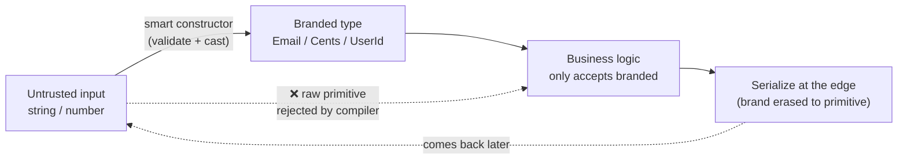
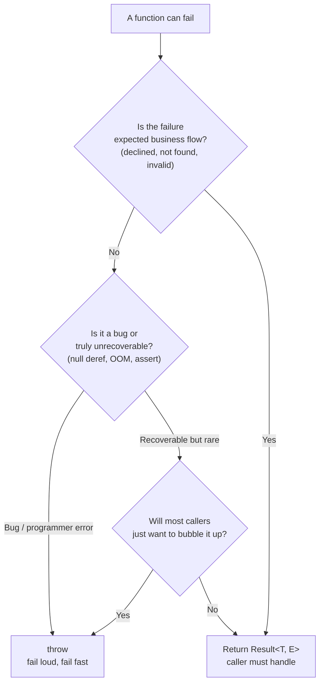

# 11 · Production Patterns & Architecture

**Goal:** Use the type system as a *design tool*, not just a linter. By the end you'll model domains so that wrong code doesn't compile — branded money, discriminated state machines, typed errors, and end-to-end contract safety from DB to React component.

### What you'll learn

- The one idea everything else hangs on: **make illegal states unrepresentable**.
- **Branded / nominal types** so a `UserId` can never be passed where an `OrderId` is wanted, and `Cents` never gets multiplied by a tax rate by accident.
- **Result / Either** types for errors you expect, and when to keep `throw` for errors you don't.
- **Exhaustiveness with `never`** — the compiler nagging you when you add a case and forget a branch.
- **Parse, don't validate** — turn untrusted input into trusted types once, at the edge.
- Type-safe **config**, **dependency injection**, **event emitters**, and **API contracts** (Zod / tRPC / OpenAPI) without dragging in a framework.
- Taming `any`, controlling `unknown`, and keeping the **type-checker fast** when your types get clever.

### Prerequisites

You should be comfortable with [advanced types](./04-advanced-types.md) (discriminated unions, conditional/mapped types, `infer`, template literals) and have read [the backend guide](./10-backend.md) (Zod, request parsing). This guide assumes TypeScript 5.x with `strict: true`.

---

## Mental model: make illegal states unrepresentable

Most bugs are not logic errors. They're *state* errors — the program is in a combination of values that should never have happened together. The classic example:

```ts
// ❌ This shape allows nonsense the compiler is fine with.
interface RequestState {
  isLoading: boolean;
  data?: User;
  error?: Error;
}
// isLoading: true AND data set AND error set — what does the UI render?
// All four booleans-times-optionals = 8 states, only 4 are real.
```

The fix is to stop describing the *fields* and start describing the *states*. A discriminated union lets only the legal combinations exist:

```ts
type RequestState =
  | { status: "idle" }
  | { status: "loading" }
  | { status: "success"; data: User }
  | { status: "error"; error: Error };
```

Now `data` literally cannot exist unless `status` is `"success"`. The illegal states aren't guarded against at runtime — they can't be *typed*. That's the whole philosophy: **push correctness from runtime checks into the shape of your data, so the bug is a red squiggle instead of a 3am page.**

Everything below is a technique for doing this in a specific situation: money, IDs, errors, config, events, APIs.

---

## Branded (nominal) types

TypeScript is *structurally* typed: two types with the same shape are interchangeable. That's usually great, and occasionally a disaster — `UserId`, `OrderId`, and `string` are all the same type, so you can pass any of them anywhere.

**Branding** fakes nominal typing by intersecting a primitive with a phantom marker that only exists at compile time:

```ts
// A reusable brand helper.
declare const brand: unique symbol;
type Brand<T, B extends string> = T & { readonly [brand]: B };

type UserId = Brand<string, "UserId">;
type OrderId = Brand<string, "OrderId">;
type Cents = Brand<number, "Cents">;
type Email = Brand<string, "Email">;
```

The brand has no runtime cost — `brand` is never assigned, so a `UserId` *is* a `string` at runtime. But the compiler now refuses to mix them:

```ts
function cancelOrder(id: OrderId) {/* ... */}

const userId = "u_123" as UserId;
cancelOrder(userId); // ❌ Type 'UserId' is not assignable to 'OrderId'
```

You create branded values through a single trusted "smart constructor" so the `as` cast lives in exactly one place:

```ts
function toEmail(raw: string): Email {
  const value = raw.trim().toLowerCase();
  if (!value.includes("@")) throw new Error(`Invalid email: ${raw}`);
  return value as Email; // the only cast — validated, so it's earned
}
```

### Fintech: money is the killer use case

Floating-point money is a recurring production fire. `0.1 + 0.2 !== 0.3`. The rule on every serious payments team: **store and compute money in integer minor units (cents), never floats.** Branding makes the rule un-bypassable.

```ts
type Cents = Brand<number, "Cents">;

function cents(whole: number, fractional = 0): Cents {
  if (!Number.isInteger(whole) || !Number.isInteger(fractional)) {
    throw new Error("cents() takes integers");
  }
  return (whole * 100 + fractional) as Cents;
}

function addMoney(a: Cents, b: Cents): Cents {
  return (a + b) as Cents;
}

// Multiplying money by a rate produces money; multiplying money by money is nonsense.
function applyRate(amount: Cents, rate: number): Cents {
  return Math.round(amount * rate) as Cents;
}

const subtotal = cents(19, 99);          // $19.99
const tax = applyRate(subtotal, 0.0825); // typed Cents
const total = addMoney(subtotal, tax);   // ✅

// const broken = subtotal * tax;        // produces a raw number, not Cents —
//                                       // assigning it to a Cents field won't compile.
```

The flow of a branded value through the system:



> [!WARNING]
> Brands are **compile-time only**. After `JSON.stringify`, a `Cents` is just a number again. When data re-enters your program (API body, DB row, `localStorage`) you *must* re-parse it through the smart constructor. Branding protects you *inside* your code; it does nothing across the wire.

---

## Result / Either: typed errors vs throwing

`throw` is invisible in the type system. A function's signature says it returns `User`; whether it can also blow up is documented in a comment, if you're lucky. For errors that are part of normal business flow — "card declined", "user not found", "out of stock" — that's the wrong tool. Make the failure a *value*:

```ts
type Result<T, E> =
  | { ok: true; value: T }
  | { ok: false; error: E };

const ok = <T>(value: T): Result<T, never> => ({ ok: true, value });
const err = <E>(error: E): Result<never, E> => ({ ok: false, error });
```

Now the failure modes are in the signature and the caller *cannot* forget to handle them:

```ts
type ChargeError =
  | { kind: "card_declined"; reason: string }
  | { kind: "insufficient_funds" }
  | { kind: "network" };

function charge(card: CardId, amount: Cents): Result<ReceiptId, ChargeError> {
  // ... returns ok(receipt) or err({ kind: "card_declined", reason })
}

const r = charge(card, total);
if (!r.ok) {
  switch (r.error.kind) {        // exhaustive — see next section
    case "card_declined":   return showDecline(r.error.reason);
    case "insufficient_funds": return showTopUp();
    case "network":         return retryLater();
  }
}
useReceipt(r.value); // narrowed to ReceiptId here
```

If you've used **`neverthrow`**, this is the same idea with chaining helpers (`.map`, `.andThen`, `.mapErr`). Reach for the library when you're threading many fallible steps; the hand-rolled type above is fine for most code.

### When to throw vs when to return a Result

This is a judgement call, not a religion. The decision:



Rule of thumb: **expected, per-call, branch-on-it failures → `Result`. Programmer errors and truly exceptional conditions → `throw`.** Don't wrap genuine bugs in `Result` — you want those to crash and show up in your error tracker, not get silently `.mapErr`'d away.

> [!NOTE]
> Don't `Result`-ify everything. A deeply chained `Result` of `Result` of `Result` is its own kind of unreadable. Use it at boundaries where the failure is a real decision; let internal invariant violations throw.

---

## Exhaustiveness with `never`

The payoff of discriminated unions is the compiler enforcing that you handle every case — including ones you add *later*. The trick is `never`: the type with no values. In the `default` branch, every real case should already be narrowed away, leaving `never`. Assign the variable to a `never` parameter and adding a new union member breaks the build:

```ts
function assertNever(x: never): never {
  throw new Error(`Unhandled case: ${JSON.stringify(x)}`);
}

function describe(state: RequestState): string {
  switch (state.status) {
    case "idle":    return "Waiting";
    case "loading": return "Loading…";
    case "success": return `Got ${state.data.name}`;
    case "error":   return state.error.message;
    default:        return assertNever(state); // ✅ compiles only if exhaustive
  }
}
```

Add `{ status: "cancelled" }` to `RequestState` and `describe` fails to compile: `Argument of type '{ status: "cancelled" }' is not assignable to parameter of type 'never'`. That's the compiler handing you a TODO list. This single pattern is the highest-leverage thing in this guide — wire it into every union you switch on.

---

## Parse, don't validate

"Validation" checks data and then *throws the proof away* — you tested that `body.email` is a string, but its type is still `string` (or `any`), so every later use re-checks or trusts blindly. **Parsing** checks data and *returns a more precise type* that carries the proof forward. Lean on [Zod from the backend guide](./10-backend.md):

```ts
import { z } from "zod";

const SignupInput = z.object({
  email: z.string().email().transform((e) => e.toLowerCase() as Email),
  age: z.number().int().min(13),
});
type SignupInput = z.infer<typeof SignupInput>; // { email: Email; age: number }

function handleSignup(raw: unknown) {
  const parsed = SignupInput.safeParse(raw);
  if (!parsed.success) return err(parsed.error);
  // parsed.data.email is Email, age is a validated int — proof carried forward.
  return ok(parsed.data);
}
```

The discipline: **untrusted data enters as `unknown`, gets parsed *once* at the trust boundary, and flows through the rest of the system as a precise, branded type.** No function deep in your domain should ever take `unknown` or re-validate.

### Healthcare: PHI typing and redaction

Parse-don't-validate plus branding is how you keep Protected Health Information from leaking into logs. Brand the sensitive fields and make your logger physically unable to print them:

```ts
type PHI<T> = Brand<T, "PHI">;          // a value that must never be logged raw
type MRN = PHI<string>;                  // medical record number
type Diagnosis = PHI<string>;

function redact<T>(_value: PHI<T>): "[REDACTED]" {
  return "[REDACTED]";
}

interface Patient {
  id: UserId;
  mrn: MRN;
  diagnosis: Diagnosis;
}

function logPatient(p: Patient) {
  console.log({ id: p.id, mrn: redact(p.mrn), diagnosis: redact(p.diagnosis) });
}
```

Because PHI fields are branded, a reviewer (and a lint rule) can spot any place a raw `MRN` reaches a sink. The type is documentation that the compiler checks.

---

## Type-safe config and dependency injection (no framework)

You don't need NestJS or InversifyJS to get DI. A plain object of dependencies, typed once, gives you constructor injection, easy test doubles, and zero magic:

```ts
interface Services {
  db: Database;
  clock: () => Date;
  charge: (card: CardId, amount: Cents) => Result<ReceiptId, ChargeError>;
}

// Each unit declares exactly what it needs via structural subtyping.
function placeOrder(deps: Pick<Services, "db" | "charge">, cart: Cart) {
  const total = cart.items.reduce((s, i) => addMoney(s, i.price), cents(0));
  return deps.charge(cart.card, total);
}

// Real wiring at the composition root; fakes in tests — same type, no mock framework.
placeOrder({ db: realDb, charge: stripeCharge }, cart);
placeOrder({ db: fakeDb, charge: () => ok(receiptId) }, cart); // test
```

For config, parse the environment *once* into a typed, frozen object and never touch `process.env` again:

```ts
const Config = z.object({
  NODE_ENV: z.enum(["development", "test", "production"]),
  PORT: z.coerce.number().default(3000),
  DATABASE_URL: z.string().url(),
});
export const config = Object.freeze(Config.parse(process.env)); // throws at boot if misconfigured
```

> [!TIP]
> Failing at *startup* on bad config beats failing on a customer's request three hours later. Parse env at the top of your entrypoint so a missing `DATABASE_URL` is a crash on boot, not a 500 in production.

---

## Type-safe event emitters / pub-sub

Node's `EventEmitter` is stringly-typed — typo an event name and you get silence. A typed map turns event names and payloads into a contract:

```ts
type Events = {
  "order.placed": { orderId: OrderId; total: Cents };
  "user.login": { userId: UserId };
};

class Bus<E extends Record<string, unknown>> {
  private handlers: { [K in keyof E]?: Array<(p: E[K]) => void> } = {};

  on<K extends keyof E>(type: K, fn: (p: E[K]) => void) {
    (this.handlers[type] ??= []).push(fn);
  }
  emit<K extends keyof E>(type: K, payload: E[K]) {
    this.handlers[type]?.forEach((fn) => fn(payload));
  }
}

const bus = new Bus<Events>();
bus.on("order.placed", (p) => p.total);     // p typed as { orderId; total }
bus.emit("user.login", { userId });          // ✅
// bus.emit("order.plced", {});              // ❌ typo caught at compile time
```

---

## Type-safe API contracts (end-to-end)

The biggest source of runtime surprises is the seam between client and server. Three ways to make that seam type-checked, in rough order of coupling:

- **tRPC** — both client and server are TypeScript in one repo. The client *infers* its types from the server router. Zero codegen, zero drift; the call site knows the return type because it *is* the server's return type.
- **Zod-shared schemas** — define request/response schemas in a shared package; both sides import them and `parse`. Works across language boundaries on the wire, gives you runtime validation for free.
- **OpenAPI → TS** — when the backend isn't TypeScript (or is owned by another team), generate client types from the OpenAPI spec (`openapi-typescript`). The spec is the contract; regenerate on change.

```ts
// Shared package, imported by both client and server.
export const CreateOrder = z.object({ items: z.array(z.string()), card: z.string() });
export const OrderResult = z.object({ orderId: z.string(), total: z.number() });
export type CreateOrder = z.infer<typeof CreateOrder>;
export type OrderResult = z.infer<typeof OrderResult>;
```

The point in all three: **one source of truth for the contract, and a compile error the moment the two sides disagree.** See [the backend guide](./10-backend.md) for wiring Zod into route handlers.

---

## Taming `any`, controlling `unknown`

`any` is a hole in the type system that disables checking for everything it touches and silently spreads. `unknown` is the safe top type: you can hold anything in it, but you can't *do* anything until you narrow it.

```ts
function handle(input: unknown) {
  // input.foo;                  // ❌ can't touch it yet — good
  if (typeof input === "string") input.toUpperCase(); // ✅ narrowed
}
```

For third-party libraries that leak `any`, quarantine it at the boundary — wrap the call, parse the output, and expose a clean typed surface inward:

```ts
import sketchy from "untyped-lib"; // returns any

function getRate(): Result<number, Error> {
  const raw: unknown = sketchy.fetchRate();        // demote any → unknown
  const parsed = z.number().safeParse(raw);
  return parsed.success ? ok(parsed.data) : err(new Error("bad rate"));
}
```

> [!CAUTION]
> Turn on `"noImplicitAny": true` (it's in `strict`) and add the ESLint rule `@typescript-eslint/no-explicit-any`. Every `any` should be a deliberate, commented escape hatch — `// eslint-disable-next-line ... -- third-party, parsed below`. An `any` that sneaks in unannounced is how an entire module quietly loses type safety.

---

## Domain-driven design, lite

You don't need aggregates and bounded contexts on a CRUD app. But the cheap, high-value DDD habits in TS are: **branded IDs and value objects, discriminated-union state machines for entity lifecycles, and a thin domain layer that only speaks in those types.** Keep persistence and transport (DB rows, JSON) at the edges and translate to/from domain types there — so a Prisma model change can't ripple straight into your business rules.

---

## Performance: when types get too clever

The type-checker is a program too, and you can write types that make it crawl. Deeply recursive conditional types, huge unions, and string-template-literal explosions can push `tsc` and your editor into multi-second lag.

> [!WARNING]
> Symptoms of a type that's too clever: editor autocomplete lags, `tsc --noEmit` takes much longer after one PR, or you hit `Type instantiation is excessively deep and possibly infinite`. The fix is almost always *simpler types*, not more clever ones — a plain interface beats a 200-line conditional type nobody can debug.

Practical levers, cheapest first:

- Run **`tsc --noEmit --extendedDiagnostics`** and watch *Check time* and *Instantiations* — that's your budget.
- Prefer **`interface` over large intersection types** for object shapes; the checker caches them better.
- Cap **recursive/template-literal types** — a union of every possible route string can be millions of members.
- Use **project references / incremental builds** (`composite`, `incremental`) so unchanged packages aren't re-checked.
- Annotate exported function return types explicitly so the checker isn't re-inferring complex types at every call site.

At social-network scale the type ergonomics matter as much as runtime: a monorepo where one clever type adds two seconds to every developer's editor is a real, multiplied cost. **Boring, fast types are a feature.**

---

## Production gotchas

> [!WARNING]
> **Brands erase at the boundary.** Re-parse anything coming from JSON, the DB, or storage. A `Cents` is a `number` on the wire.

> [!CAUTION]
> **Floats for money will bite you.** `19.99` stored as a float drifts. Use integer `Cents` and a branded type so the rule is enforced, not remembered.

> [!NOTE]
> **`Result` everywhere is as bad as `throw` everywhere.** Reserve `Result` for failures the caller should branch on; let bugs throw and surface in your error tracker.

> [!TIP]
> **One smart constructor per branded type.** Centralize the `as` cast in a validated constructor so unsafe casts live in exactly one auditable place.

> [!CAUTION]
> **`any` is contagious.** Ban it with lint, demote third-party `any` to `unknown` at the boundary, and parse it before it spreads.

---

## Patterns in production

- **Fintech:** money as branded `Cents` integers, never floats; `Result<_, ChargeError>` for declines; exhaustive `switch` over payment states so a new decline reason is a build break, not a silent fallthrough.
- **Healthcare:** PHI fields branded and run through a `redact()` sink that's the only thing allowed to log them; parse-don't-validate at every intake so untrusted records become typed `Patient`s once.
- **Social / scale:** keep types boring and fast — explicit return types on exported APIs, project references in the monorepo, and a hard ceiling on clever recursive types so the editor stays snappy for everyone.
- **Every team:** typed config parsed at boot, typed event bus, and a single shared contract (tRPC/Zod/OpenAPI) so client and server can't drift.

---

## Exercises

1. **Illegal states.** Take a form component with `isSubmitting`, `isSuccess`, `errorMessage` booleans/strings and refactor it into a single discriminated union. Count how many states the old version allowed vs. the new one.

2. **Branded money.** Implement `Cents`, `addMoney`, `subtractMoney`, and `applyRate`. Write a self-check that asserts `cents(19, 99)` plus 8.25% tax equals the right total, and confirm `subtotal * tax` won't assign to a `Cents` field.

3. **Result + exhaustiveness.** Write `charge(): Result<ReceiptId, ChargeError>` with at least three error kinds. Handle it with an exhaustive `switch` + `assertNever`. Add a fourth error kind and observe the compile error pointing at the unhandled branch.

4. **Parse, don't validate.** Define a Zod schema for an inbound webhook, parse it into a branded type, and write a handler that takes the *branded* type. Prove the handler can't be called with raw `unknown`.

5. **Tame third-party `any`.** Pick a real untyped (or loosely typed) npm module, wrap one function so it demotes `any → unknown`, parses with Zod, and returns a `Result`. Enable `@typescript-eslint/no-explicit-any` and make the file clean.

6. **(Stretch) Type-checker budget.** Run `tsc --noEmit --extendedDiagnostics` on a project, note *Check time* and *Instantiations*, then add a deliberately over-clever recursive type and measure the regression. Simplify it back and confirm the numbers recover.

---

## Next

- ← Previous: [10 · Backend](./10-backend.md)
- → Next: [12 · Testing & Quality](./12-testing-quality.md) — proving the runtime matches the types.
- Related: [04 · Advanced Types](./04-advanced-types.md) · [13 · Industry Patterns](./13-industry-patterns.md)
- Up: [TypeScript Learning Plan](../TypeScript_Learning_Plan.md)
