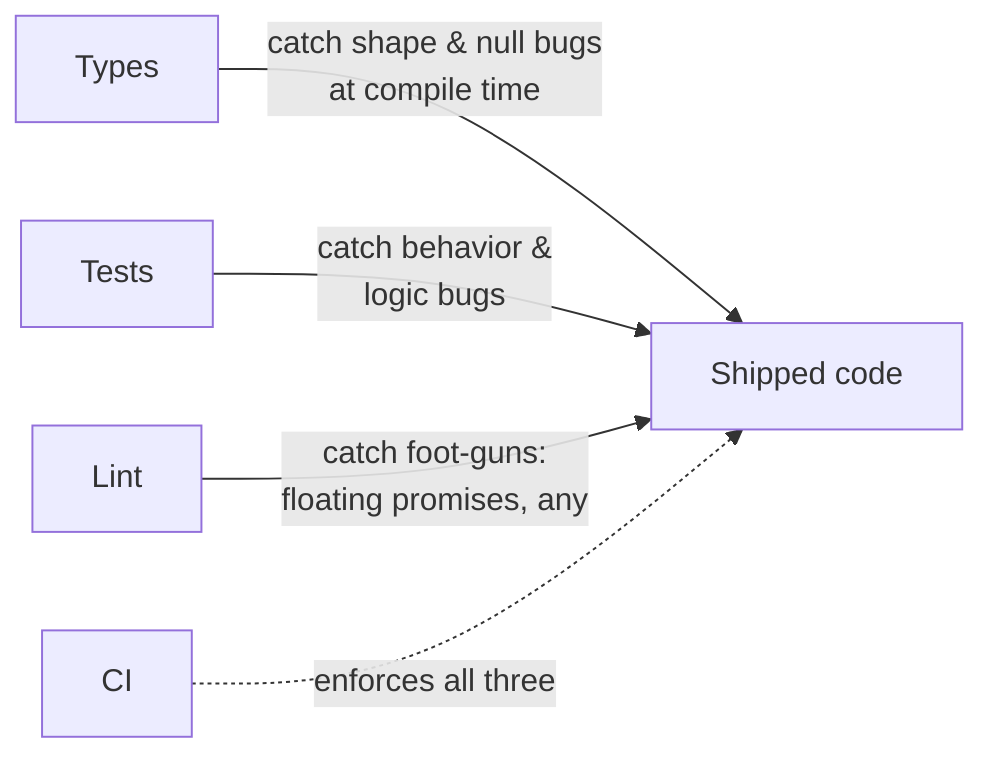
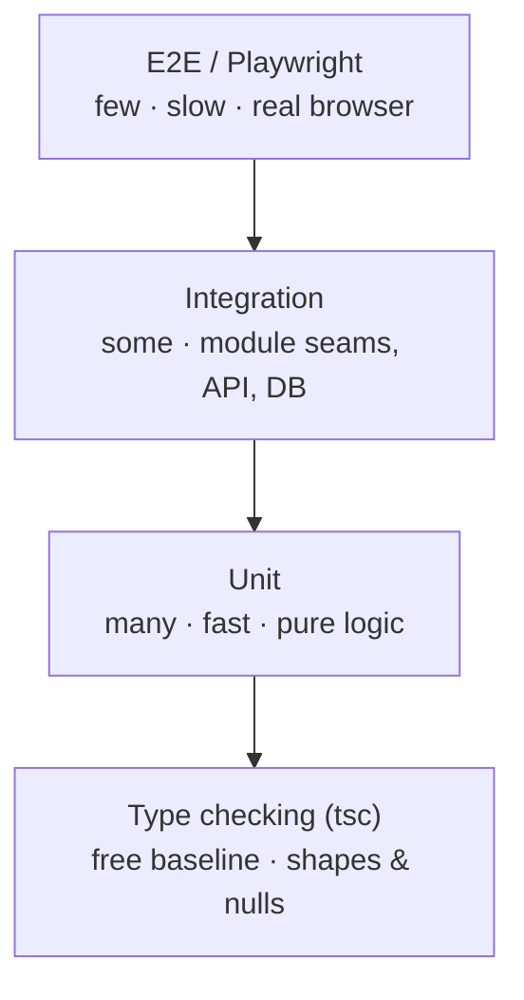
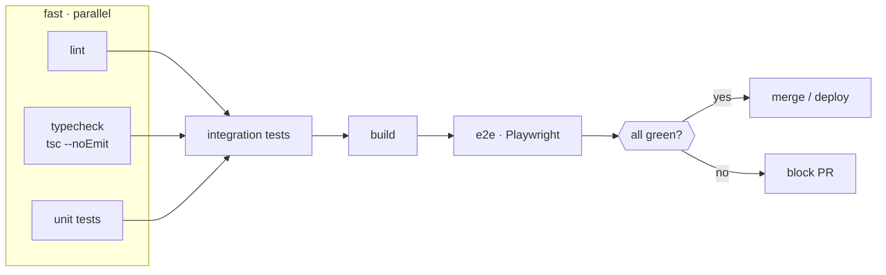

# 12 - Testing & Code Quality

**Goal:** Build a testing and quality stack you can trust to ship reliable React / React Native / Next.js + backend TypeScript without manual QA babysitting every release. By the end you can write typed unit, integration, and component tests, assert your *types* behave, wire type-aware linting, and gate it all in CI.

**What you'll learn:**

- Unit and integration testing with **Vitest** (TS-native) and **Jest** (via `ts-jest` / SWC).
- Testing React with **React Testing Library** and React Native with **React Native Testing Library** — typed `render` and queries.
- Mocking with full types: `vi.mocked`, typed mock factories.
- **Type-level testing** — asserting your types compile (and *fail to compile*) the way you intend.
- **ESLint + typescript-eslint** type-aware rules, **Prettier**, and the rules that actually catch bugs.
- `tsc --noEmit` as a CI gate, pre-commit hooks with **husky + lint-staged**.
- The **test pyramid** for TS apps, coverage, a brief look at **Playwright** E2E, and a real CI pipeline shape.

**Prerequisites:** You've set up a project, `tsconfig`, and a bundler/test runner from [./06-modules-tooling.md](./06-modules-tooling.md). You should be comfortable with strict mode, generics, and discriminated unions from earlier in the series.

---

## Mental model: three nets, one gate

Quality in a TS codebase is **layered nets**, not one big test suite. Each net catches a different class of failure, and the cheapest net you didn't use is the bug you ship.



- **Types** eliminate a whole category of bugs for free: wrong shapes, `undefined` access, missing enum cases. A test that asserts `user.name` is a string is mostly wasted effort — the compiler already knows.
- **Tests** verify *behavior the types can't express*: "given an overdrawn account, the transfer is rejected." Types say the function takes a number; only a test says it returns the *right* number.
- **Lint** catches the runtime foot-guns that compile fine: an unawaited promise, an `any` that disables the type checker, a `useEffect` with stale deps.
- **CI** is the gate that makes the other three non-optional. Locally you can skip a check; CI cannot.

The lazy principle: **don't test what the type system already proves.** Spend test budget on logic, edge cases, and integration seams.

---

## Vitest: the TS-native default

Vitest reads your `tsconfig` paths, runs ESM, and needs almost no config. For a new project, reach for it before Jest.

```bash
npm i -D vitest @vitest/coverage-v8
```

```ts
// vitest.config.ts
import { defineConfig } from "vitest/config";

export default defineConfig({
  test: {
    globals: true, // describe/it/expect without imports
    environment: "node", // "jsdom" for DOM tests
    coverage: {
      provider: "v8",
      reporter: ["text", "html", "lcov"],
      thresholds: { lines: 80, functions: 80, branches: 70 },
    },
  },
});
```

A typed unit test needs no ceremony — the types flow from the imported code:

```ts
// money.ts
export function transfer(balance: number, amount: number): number {
  if (amount <= 0) throw new RangeError("amount must be positive");
  if (amount > balance) throw new RangeError("insufficient funds");
  return balance - amount;
}
```

```ts
// money.test.ts
import { describe, it, expect } from "vitest";
import { transfer } from "./money";

describe("transfer", () => {
  it("debits the balance", () => {
    expect(transfer(100, 30)).toBe(70);
  });

  it("rejects overdraft", () => {
    expect(() => transfer(100, 150)).toThrow(/insufficient/);
  });

  it("rejects non-positive amounts", () => {
    expect(() => transfer(100, 0)).toThrow(RangeError);
  });
});
```

### Jest, when you must

Jest is still everywhere (and is the RN default via the `react-native` preset). For TS, skip the slow `ts-jest` type-checking transform and use SWC — it's an order of magnitude faster and you get your type checking from `tsc --noEmit` anyway.

```bash
npm i -D jest @swc/core @swc/jest @types/jest
```

```js
// jest.config.js
/** @type {import('jest').Config} */
module.exports = {
  testEnvironment: "node",
  transform: { "^.+\\.(t|j)sx?$": ["@swc/jest"] },
};
```

> [!NOTE]
> `ts-jest` type-checks during the test run, which feels safe but is slow and redundant. Let SWC/esbuild *strip* types fast, and let a dedicated `tsc --noEmit` job be the type gate. One source of truth for type errors, not two.

---

## Integration tests: where real bugs live

Unit tests prove a function. Integration tests prove the *seam* between modules — the place where mismatched assumptions actually break. For a backend, hit the HTTP layer with a real (in-memory) app.

```ts
// app.integration.test.ts
import { describe, it, expect, beforeAll, afterAll } from "vitest";
import { createServer, type Server } from "node:http";
import { app } from "./app"; // your express/fastify/hono handler

let server: Server;
let baseUrl: string;

beforeAll(async () => {
  server = createServer(app);
  await new Promise<void>((r) => server.listen(0, r));
  const addr = server.address();
  if (addr === null || typeof addr === "string") throw new Error("no port");
  baseUrl = `http://127.0.0.1:${addr.port}`;
});

afterAll(() => new Promise<void>((r) => server.close(() => r())));

describe("POST /transfer", () => {
  it("returns the new balance", async () => {
    const res = await fetch(`${baseUrl}/transfer`, {
      method: "POST",
      headers: { "content-type": "application/json" },
      body: JSON.stringify({ from: "acct_1", amount: 30 }),
    });
    expect(res.status).toBe(200);
    const body = (await res.json()) as { balance: number };
    expect(body.balance).toBe(70);
  });
});
```

---

## Testing React with React Testing Library

RTL's rule: **test what the user sees and does, not the component's internals.** Query by role/text, fire events, assert on the rendered output. Refactors that keep behavior identical keep tests green.

```bash
npm i -D @testing-library/react @testing-library/user-event @testing-library/jest-dom jsdom
```

```ts
// vitest.setup.ts
import "@testing-library/jest-dom/vitest";
```

```tsx
// Counter.tsx
import { useState } from "react";

export function Counter({ start = 0 }: { start?: number }): JSX.Element {
  const [n, setN] = useState(start);
  return (
    <button type="button" onClick={() => setN((c) => c + 1)}>
      count: {n}
    </button>
  );
}
```

```tsx
// Counter.test.tsx
import { render, screen } from "@testing-library/react";
import userEvent from "@testing-library/user-event";
import { describe, it, expect } from "vitest";
import { Counter } from "./Counter";

describe("<Counter />", () => {
  it("increments on click", async () => {
    const user = userEvent.setup();
    render(<Counter start={5} />);

    const btn = screen.getByRole("button", { name: /count: 5/i });
    await user.click(btn);

    expect(screen.getByRole("button", { name: /count: 6/i })).toBeInTheDocument();
  });
});
```

`render` and the queries are fully typed — `getByRole`'s `name` option, the `screen` object, and the `jest-dom` matchers all come typed once you add the setup import to `vitest.setup.ts` (register it under `test.setupFiles` in the config).

### React Native Testing Library

Same philosophy, native queries. The render output and queries are typed identically; you query by accessibility props instead of DOM roles.

```tsx
// Greeting.test.tsx
import { render, screen, fireEvent } from "@testing-library/react-native";
import { describe, it, expect } from "vitest";
import { Greeting } from "./Greeting";

describe("<Greeting />", () => {
  it("shows the name after submit", () => {
    render(<Greeting />);
    fireEvent.changeText(screen.getByPlaceholderText("name"), "Ada");
    fireEvent.press(screen.getByText("Submit"));
    expect(screen.getByText("Hello, Ada")).toBeTruthy();
  });
});
```

---

## Mocking with full types

The win in TS is **typed mocks**: when the real function's signature changes, the mock fails to compile. Use `vi.mocked` (or `jest.mocked`) to keep the autocomplete and type-checking on your mock's `.mockResolvedValue`, `.mockReturnValue`, etc.

```ts
// userService.test.ts
import { describe, it, expect, vi, beforeEach } from "vitest";
import * as db from "./db";
import { getActiveUser } from "./userService";

vi.mock("./db"); // auto-mocks every export

const mockedDb = vi.mocked(db);

beforeEach(() => vi.resetAllMocks());

describe("getActiveUser", () => {
  it("returns null for an inactive user", async () => {
    // .mockResolvedValue is type-checked against findUser's real return type
    mockedDb.findUser.mockResolvedValue({ id: "u1", active: false });

    const result = await getActiveUser("u1");

    expect(result).toBeNull();
    expect(mockedDb.findUser).toHaveBeenCalledWith("u1");
  });
});
```

For a single typed mock function without mocking a whole module:

```ts
type Notifier = (userId: string, message: string) => Promise<void>;

const notify = vi.fn<Notifier>();
notify.mockResolvedValue(undefined);
// notify("u1", 123); // ❌ compile error — message must be string
```

> [!WARNING]
> `vi.mock` is **hoisted** above imports. Anything referenced inside the factory must be defined inside it or via `vi.hoisted`. A variable declared above `vi.mock` will be `undefined` at mock-time — a classic "works in JS, breaks mysteriously" trap.

---

## Type-level testing: assert your types behave

If you ship types (a library, a generic util, a complex API client), the types are part of the contract — so test them. The goal is to assert both "this compiles" *and* "this does **not** compile."

Vitest ships `expectTypeOf`, which runs in the type checker (no runtime cost):

```ts
// parseQuery.type.test.ts
import { describe, it, expectTypeOf } from "vitest";
import { parseQuery } from "./parseQuery";

describe("parseQuery types", () => {
  it("infers literal keys from the template", () => {
    const result = parseQuery("/user/:id/post/:slug");
    expectTypeOf(result).toEqualTypeOf<{ id: string; slug: string }>();
  });

  it("rejects a non-string input", () => {
    // @ts-expect-error — parseQuery requires a string literal
    parseQuery(42);
  });
});
```

Two tools, two jobs:

- `@ts-expect-error` is the simplest negative assertion — the line **must** error, and CI fails if it ever stops erroring (e.g. someone loosened the type). No dependency needed.
- `expectTypeOf` / [`tsd`](https://github.com/tsdjs/tsd) give precise positive assertions (`toEqualTypeOf`, `toMatchTypeOf`, parameter/return introspection).

```ts
// With expectTypeOf you can assert exact equality, not just assignability:
expectTypeOf<{ a: 1 }>().not.toEqualTypeOf<{ a: number }>();
```

> [!TIP]
> Run type tests with `vitest --typecheck`. They don't execute — they're verified by `tsc` — so they're cheap and they catch the subtle generic regressions normal tests miss entirely.

---

## ESLint with type-aware rules

Plain ESLint can't see types, so it can't catch the bugs that matter most in TS. **Type-aware** linting (`recommended-type-checked`) feeds your `tsconfig` into the linter and unlocks the high-value rules.

```bash
npm i -D eslint typescript-eslint eslint-plugin-react-hooks
```

```ts
// eslint.config.ts  (flat config, ESLint 9+)
import tseslint from "typescript-eslint";
import reactHooks from "eslint-plugin-react-hooks";

export default tseslint.config(
  ...tseslint.configs.recommendedTypeChecked,
  {
    languageOptions: {
      parserOptions: { projectService: true, tsconfigRootDir: import.meta.dirname },
    },
    plugins: { "react-hooks": reactHooks },
    rules: {
      "@typescript-eslint/no-explicit-any": "error",
      "@typescript-eslint/no-floating-promises": "error",
      "@typescript-eslint/no-misused-promises": "error",
      "react-hooks/exhaustive-deps": "warn",
    },
  },
);
```

The rules that earn their keep:

| Rule | Catches | Why it matters |
| --- | --- | --- |
| `no-floating-promises` | `doAsync()` with no `await`/`.catch` | Silent unhandled rejections, lost errors |
| `no-misused-promises` | async fn passed where `void` expected | `onClick={async () => …}` swallowing errors |
| `no-explicit-any` | `any` escapes | One `any` disables checking downstream |
| `exhaustive-deps` | stale closures in `useEffect` | The #1 React bug class |
| `no-unnecessary-condition` | a check the type proves can't fail | Dead code / wrong type assumptions |

> [!NOTE]
> Type-aware linting is slower than syntactic linting because it builds the type graph. Worth it. Scope it to `src` and let `--cache` cut repeat runs.

### Prettier: stop arguing about style

Prettier formats; ESLint finds bugs. Keep them separate — don't run formatting *as* lint rules. Let Prettier own formatting and ESLint own correctness.

```json
// .prettierrc.json
{ "semi": true, "singleQuote": false, "trailingComma": "all", "printWidth": 100 }
```

---

## `tsc --noEmit` as a CI gate

Your bundler (esbuild/SWC/Vite) *strips* types for speed — it does **not** type-check. So a file with type errors can build and ship fine. The only thing that actually checks types is `tsc`, and in CI you run it in check-only mode:

```jsonc
// package.json
{
  "scripts": {
    "typecheck": "tsc --noEmit",
    "lint": "eslint .",
    "test": "vitest run --coverage",
    "build": "vite build"
  }
}
```

This is non-negotiable: **if `tsc --noEmit` is not in CI, your types are decorative.**

---

## Pre-commit hooks: husky + lint-staged

Catch the obvious stuff before it leaves the laptop. Run lint/format only on *staged* files (fast), and keep the full `typecheck`/`test` for CI (thorough).

```bash
npm i -D husky lint-staged
npx husky init
```

```sh
# .husky/pre-commit
npx lint-staged
```

```json
// package.json
{
  "lint-staged": {
    "*.{ts,tsx}": ["eslint --fix", "prettier --write"],
    "*.{json,md,css}": ["prettier --write"]
  }
}
```

> [!WARNING]
> Don't put the full test suite or `tsc --noEmit` in the pre-commit hook. A slow hook trains developers to `--no-verify`, which defeats the whole point. Keep hooks under a couple seconds; let CI be the thorough gate.

---

## The test pyramid for TS apps

Many fast unit tests, fewer integration tests, a thin layer of slow E2E. Inverting this (an "ice cream cone" of mostly E2E) gives slow, flaky suites that nobody trusts. In TS, the *base* of the pyramid is partly free — the type checker does work that would otherwise be unit tests.



**Coverage** measures lines executed by tests — it's a smoke detector, not a quality score. 100% coverage of trivial getters proves nothing; 80% coverage that hits every branch of your money logic proves a lot. Set a threshold to prevent *regression* (block PRs that drop coverage), not to chase a number.

---

## E2E briefly: Playwright, typed

E2E drives a real browser through real user flows. It's the slowest, flakiest net, so keep it thin — cover the few critical paths (login, checkout, the one flow that loses money if broken).

```ts
// e2e/login.spec.ts
import { test, expect } from "@playwright/test";

test("user can log in", async ({ page }) => {
  await page.goto("/login");
  await page.getByLabel("Email").fill("ada@example.com");
  await page.getByLabel("Password").fill("hunter2");
  await page.getByRole("button", { name: "Sign in" }).click();
  await expect(page.getByRole("heading", { name: "Dashboard" })).toBeVisible();
});
```

Playwright's API is fully typed; the `page` fixture, locators, and assertions all autocomplete. Same query philosophy as RTL — by role and label, not CSS selectors.

---

## CI pipeline structure

Run the cheap, fast checks first and **in parallel** so a lint error or type error fails the build in seconds instead of after a five-minute E2E run. Lint, typecheck, and unit tests have no dependencies on each other — fan them out.



```yaml
# .github/workflows/ci.yml
name: CI
on: [push, pull_request]

jobs:
  lint:
    runs-on: ubuntu-latest
    steps:
      - uses: actions/checkout@v4
      - uses: actions/setup-node@v4
        with: { node-version: 20, cache: npm }
      - run: npm ci
      - run: npm run lint

  typecheck:
    runs-on: ubuntu-latest
    steps:
      - uses: actions/checkout@v4
      - uses: actions/setup-node@v4
        with: { node-version: 20, cache: npm }
      - run: npm ci
      - run: npm run typecheck

  test:
    runs-on: ubuntu-latest
    steps:
      - uses: actions/checkout@v4
      - uses: actions/setup-node@v4
        with: { node-version: 20, cache: npm }
      - run: npm ci
      - run: npm run test

  build:
    needs: [lint, typecheck, test]
    runs-on: ubuntu-latest
    steps:
      - uses: actions/checkout@v4
      - uses: actions/setup-node@v4
        with: { node-version: 20, cache: npm }
      - run: npm ci
      - run: npm run build
```

Separate jobs (not one `&&` chain) give you parallelism and a clear red/green per check — you see *which* gate failed at a glance, and a flaky test can be retried without re-running lint.

---

## Production gotchas

> [!WARNING]
> **A passing test suite with `any` everywhere is a false sense of security.** `any` silently disables the type checker for everything it touches — including your test assertions. `expect(result.balnce).toBe(70)` (typo) passes if `result` is `any`. Enforce `no-explicit-any` and prefer `unknown` at boundaries.

> [!WARNING]
> **Don't test implementation details.** A test that asserts a component's internal state or that a private method was called breaks on every refactor and tests nothing a user cares about. Test observable behavior (rendered output, return values, side effects at the boundary).

> [!CAUTION]
> **`vi.mock` hoisting + shared mutable mock state across tests = nondeterministic failures.** Always `resetAllMocks()` (or `clearMocks: true` in config) in `beforeEach`. A mock that leaks `mockResolvedValue` from one test into the next produces failures that only appear in a specific test order.

> [!NOTE]
> **Coverage thresholds catch regressions, not quality.** Gate on "coverage must not drop," and review *what* is covered in PRs. A green 85% number hides the 15% that's your payment path.

> [!TIP]
> **Flaky tests are worse than no tests** — they train the team to ignore red. Quarantine a flaky test (`it.skip` with a tracking ticket) rather than letting it erode trust in the whole suite.

---

## Patterns in production

**Fintech — correctness and regression gates.** Money logic gets exhaustive unit tests on every branch (overdraft, rounding, currency conversion, fee edges) plus property-based tests where feasible. The CI gate is hard: `tsc --noEmit`, full coverage threshold on the money modules specifically (not the whole repo average), and no merge without green. Type-level tests pin the public API shape so a breaking change can't sneak through. Every test run is an artifact — the suite *is* the regression evidence that yesterday's bug stays fixed.

**Healthcare — compliance and audit of test evidence.** Test runs are retained as audit artifacts: CI uploads coverage reports and test results, tagged to the commit and release. Requirements trace to tests (a control maps to the test that verifies it). The pipeline is the same shape but the *retention* and *traceability* are the deliverable — you must be able to show an auditor that release X passed test suite Y at coverage Z.

**Social / high-velocity — fast, parallel CI.** Hundreds of merges a day means the pipeline must be fast and parallel or it becomes the bottleneck. Heavy use of caching (`npm ci` cache, ESLint `--cache`, Vitest's smart re-run), sharded test jobs, and `tsc` incremental builds. E2E is sampled or run post-merge rather than blocking every PR. The gate is "fast enough that nobody routes around it."

---

## Exercises

1. **Typed mock.** Take a module with an async `fetchUser(id: string): Promise<User>` export. Write a test that mocks it with `vi.mocked`, then change `User` to add a required field — confirm your test now *fails to compile* until you fix the mock. (Proves the mock is actually typed.)

2. **Negative type test.** Write a generic function `pick<T, K extends keyof T>(obj: T, key: K): T[K]`. Add `expectTypeOf` assertions for the happy path and a `@ts-expect-error` line for `pick(obj, "nonexistentKey")`. Run with `vitest --typecheck`.

3. **Find the floating promise.** Disable `no-floating-promises`, write code that calls an async function without awaiting it, observe the test passing with the unhandled rejection. Re-enable the rule and watch it get caught at lint time.

4. **Component behavior, not internals.** Write an RTL test for a form component that asserts *only* on rendered output and user interactions — no peeking at state. Then refactor the component's internals (e.g. `useReducer` instead of `useState`) and confirm the test stays green.

5. **CI fan-out.** Take a single-job CI workflow and split it into parallel `lint` / `typecheck` / `test` jobs with a `build` job that `needs` all three. Introduce a type error and confirm `typecheck` goes red while `lint` and `test` stay green.

6. **Coverage regression gate.** Add a coverage threshold to `vitest.config.ts`, then delete a test and confirm CI blocks the change. Set the threshold to "current value" so any drop fails.

---

## Next

- Back to tooling and config: [./06-modules-tooling.md](./06-modules-tooling.md)
- Production hardening patterns: [./11-production-patterns.md](./11-production-patterns.md)
- Industry-specific patterns (fintech / healthcare / social): [./13-industry-patterns.md](./13-industry-patterns.md)
- Series overview: [./00-roadmap.md](./00-roadmap.md) · Root plan: [../TypeScript_Learning_Plan.md](../TypeScript_Learning_Plan.md)
