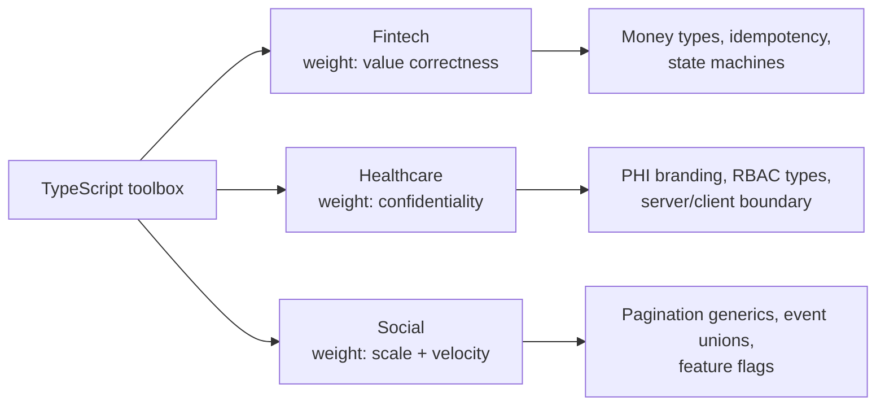
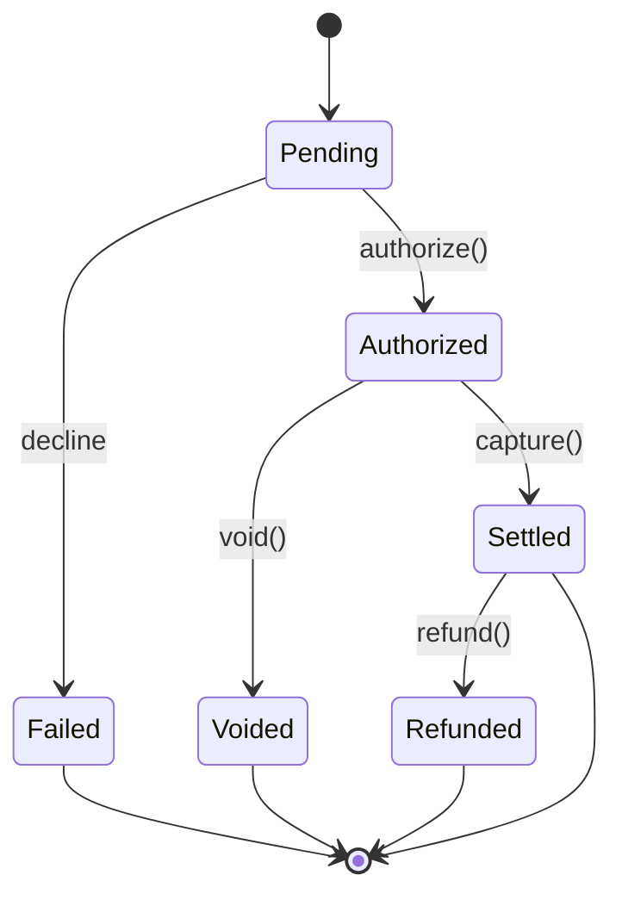
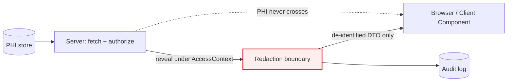
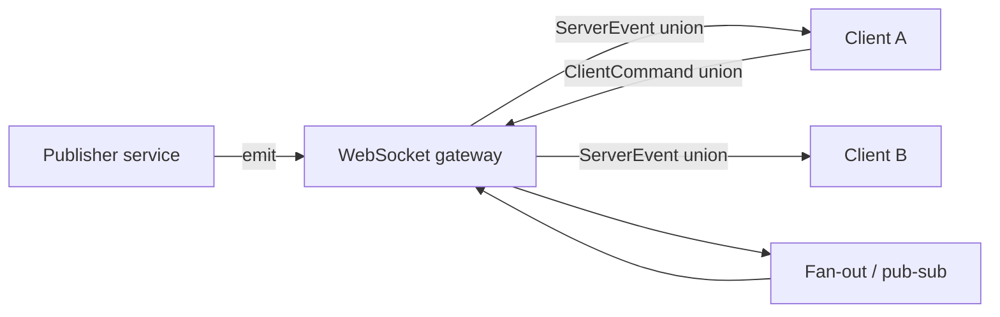

# Industry Patterns: Fintech, Healthcare, Social/Internet

**Goal:** Learn how mature startups actually deploy TypeScript in three different worlds — fintech, healthcare, and social/internet — and *why* each world bends the type system in a different direction. By the end you should be able to look at a problem domain and say "here's the constraint that matters most, here's the TypeScript pattern that enforces it."

**What you'll learn**

- The mental model that explains *why* the same language produces such different codebases across industries.
- **Fintech:** money types that make floating-point bugs unrepresentable, idempotency, double-entry ledgers, and transaction state machines as discriminated unions.
- **Healthcare:** branded `PHI<T>` types that can't be accidentally logged, typed consent and access control, FHIR resource typing, and the server/client redaction boundary.
- **Social/Internet:** typed cursor pagination, feed item unions, real-time WebSocket message unions, feature flags, and denormalized read models built for scale.

**Prerequisites**

This guide assumes you're comfortable with branded types, discriminated unions, Zod validation at boundaries, and end-to-end type safety. Those tools come from earlier in the series:

- [./11-production-patterns.md](./11-production-patterns.md) — branded types, Result types, validation, error modeling.
- [./10-backend.md](./10-backend.md) — Zod at the wire, typed APIs, server-side data flow.

Everything below is just those primitives, pointed at a specific industry's pain.

---

## Mental model: every industry weights type-safety constraints differently

TypeScript gives you one toolbox. What changes between industries is the *cost function* — what a bug actually costs when it ships.

- **Fintech** optimizes for **correctness of value**. A rounding error isn't a glitch; it's money created or destroyed, and an auditor will find it. The dominant constraint is "illegal financial states must be unrepresentable." You spend type budget on money representation, idempotency, and exhaustive transaction states.
- **Healthcare** optimizes for **confidentiality and provenance**. The worst bug isn't a crash — it's PHI in a log file or sent to the wrong client. The dominant constraint is "sensitive data cannot leak by accident." You spend type budget on opaque/branded PHI types, access control as types, and a hard server/client boundary.
- **Social/Internet** optimizes for **scale and iteration speed**. A single wrong record rarely matters; latency and the ability to ship daily do. The dominant constraint is "shapes stay consistent across a huge, fast-moving surface." You spend type budget on generated types (GraphQL codegen), pagination generics, event unions, and feature flags.



The primitives are identical. The *emphasis* is the whole game. Read each section asking "what does this industry refuse to let the compiler stay silent about?"

---

## Fintech: make illegal money states unrepresentable

**What they optimize for:** every cent is accounted for, every operation is replayable, and every state transition is legal and auditable. Float arithmetic is banned, inputs are validated at every boundary, and the set of valid transaction states is closed.

### Never use floats for money

`0.1 + 0.2 !== 0.3` is the canonical reason. Money is represented as an **integer number of minor units** (cents, pence), or with a decimal library (`dinero.js`, `big.js`) when you need division and complex rounding. The integer-cents approach is the laziest correct option for most CRUD-style fintech, so start there.

A `Money` value is a *tagged pair* of an integer amount and a currency. The brand stops you from passing a raw `number` where money is expected, and the currency tag stops you from adding USD to EUR.

```ts
// Branded integer cents — see ./11-production-patterns.md for the Brand helper.
type Brand<T, B> = T & { readonly __brand: B };

type Currency = "USD" | "EUR" | "GBP" | "JPY";

// Minor units: cents for USD/EUR/GBP, yen has 0 decimals.
type Cents = Brand<number, "Cents">;

interface Money {
  readonly amount: Cents; // integer minor units, never a float
  readonly currency: Currency;
}

function cents(n: number): Cents {
  if (!Number.isInteger(n)) {
    throw new Error(`Money must be integer minor units, got ${n}`);
  }
  return n as Cents;
}

function money(amount: number, currency: Currency): Money {
  return { amount: cents(amount), currency };
}

// Same-currency addition only — mixing currencies is a type/runtime error.
function add(a: Money, b: Money): Money {
  if (a.currency !== b.currency) {
    throw new Error(`Cannot add ${a.currency} to ${b.currency}`);
  }
  return { amount: cents(a.amount + b.amount), currency: a.currency };
}
```

### Rounding is a decision, not a default

When you split, apply interest, or convert currency you get fractions of a cent. You must pick a rounding rule explicitly and make it part of the type's API — "round half to even" (banker's rounding) is common because it doesn't bias totals upward over many operations.

```ts
type RoundingMode = "half-up" | "half-even" | "down";

// Allocate a Money amount into N parts with no cents lost (largest-remainder method).
function allocate(total: Money, ratios: readonly number[]): Money[] {
  const sum = ratios.reduce((a, b) => a + b, 0);
  const raw = ratios.map((r) => Math.floor((total.amount * r) / sum));
  let remainder = total.amount - raw.reduce((a, b) => a + b, 0);

  // Hand out leftover cents one at a time so the parts sum back to total exactly.
  return raw.map((part, i) => {
    const extra = i < remainder ? 1 : 0;
    return { amount: cents(part + extra), currency: total.currency };
  });
}
```

> The point isn't the algorithm; it's that the *type* `Money` never lets a fractional cent exist. The remainder is distributed, not dropped.

### Idempotency keys, typed

Payment requests get retried — by clients, by gateways, by your own queue. An idempotency key lets the server recognize a retry and return the original result instead of charging twice. Type it so it can't be confused with any other string.

```ts
type IdempotencyKey = Brand<string, "IdempotencyKey">;

interface ChargeRequest {
  readonly idempotencyKey: IdempotencyKey;
  readonly amount: Money;
  readonly source: string; // tokenized card/account ref
}

interface IdempotencyStore {
  get(key: IdempotencyKey): Promise<ChargeResult | undefined>;
  put(key: IdempotencyKey, result: ChargeResult): Promise<void>;
}

async function charge(
  req: ChargeRequest,
  store: IdempotencyStore,
  gateway: (r: ChargeRequest) => Promise<ChargeResult>,
): Promise<ChargeResult> {
  const existing = await store.get(req.idempotencyKey);
  if (existing) return existing; // retry → original result, no double charge
  const result = await gateway(req);
  await store.put(req.idempotencyKey, result);
  return result;
}
```

### Double-entry ledger types

In real accounting, money never appears or vanishes — it moves *between* accounts. Every transaction is a set of entries whose debits equal credits. Encode that invariant.

```ts
type AccountId = Brand<string, "AccountId">;

interface LedgerEntry {
  readonly account: AccountId;
  readonly amount: Money; // positive = debit, negative = credit, same currency
}

interface Transaction {
  readonly id: Brand<string, "TxnId">;
  readonly entries: readonly [LedgerEntry, LedgerEntry, ...LedgerEntry[]]; // ≥2
  readonly state: TxnState;
}

// A transaction is only postable if it balances to zero.
function isBalanced(entries: readonly LedgerEntry[]): boolean {
  const currency = entries[0]?.currency ?? entries[0]?.amount.currency;
  return (
    entries.every((e) => e.amount.currency === currency) &&
    entries.reduce((sum, e) => sum + e.amount.amount, 0) === 0
  );
}
```

### Audit-log types

Auditors ask "who did what, when, and what changed." Make that the shape of every audited action — the compiler then forces you to supply the actor and the before/after.

```ts
interface AuditEvent<T> {
  readonly actor: AccountId | "system";
  readonly action: string;
  readonly at: string; // ISO-8601
  readonly before: T | null;
  readonly after: T | null;
}
```

### Transaction state machine as a discriminated union

A transaction can't be both "pending" and "settled." Model the *closed* set of states as a discriminated union so every consumer must handle each case — and so impossible states (e.g. a `failed` transaction with a `settledAt`) can't be constructed.



```ts
type TxnState =
  | { status: "pending" }
  | { status: "authorized"; authCode: string }
  | { status: "settled"; settledAt: string; authCode: string }
  | { status: "failed"; reason: string }
  | { status: "voided"; voidedAt: string }
  | { status: "refunded"; refundedAt: string; refundOf: Money };

// Exhaustive handling — the `never` arm fails to compile if a state is added but unhandled.
function describe(state: TxnState): string {
  switch (state.status) {
    case "pending":
      return "Awaiting authorization";
    case "authorized":
      return `Authorized (${state.authCode})`;
    case "settled":
      return `Settled at ${state.settledAt}`;
    case "failed":
      return `Failed: ${state.reason}`;
    case "voided":
      return `Voided at ${state.voidedAt}`;
    case "refunded":
      return `Refunded ${state.refundOf.amount} ${state.refundOf.currency}`;
    default: {
      const _exhaustive: never = state;
      return _exhaustive;
    }
  }
}
```

### Validate at every boundary with Zod

Money and currency arriving over the wire are untrusted. Parse them into branded types at the edge so the rest of the system only ever sees validated `Money`.

```ts
import { z } from "zod";

const CurrencySchema = z.enum(["USD", "EUR", "GBP", "JPY"]);

const MoneySchema = z
  .object({
    amount: z.number().int(), // rejects floats — minor units only
    currency: CurrencySchema,
  })
  .transform((m): Money => ({ amount: cents(m.amount), currency: m.currency }));

const ChargeBodySchema = z.object({
  idempotencyKey: z.string().uuid(),
  amount: MoneySchema,
  source: z.string().min(1),
});

// At the route handler: untrusted JSON → fully typed, branded ChargeRequest.
function parseCharge(raw: unknown): ChargeRequest {
  const body = ChargeBodySchema.parse(raw);
  return {
    idempotencyKey: body.idempotencyKey as IdempotencyKey,
    amount: body.amount,
    source: body.source,
  };
}
```

---

## Healthcare: make PHI impossible to leak by accident

**What they optimize for:** confidentiality, data minimization, and provenance. The cardinal sin is **PHI in the wrong place** — a log line, an error message, a client bundle, a response to an unauthorized user. HIPAA pushes you to handle the *minimum necessary* data, with consent and access checked everywhere.

### Brand PHI so it can't be logged by accident

A plain `string` for a patient's name will end up in `console.log`, a Sentry breadcrumb, or a query string eventually. Wrap PHI in an **opaque branded type** whose raw value can only be unwrapped through an explicit, auditable function. The brand makes "I accidentally serialized this" a *type error*.

```ts
declare const phiBrand: unique symbol;

// Opaque wrapper: the inner value is unreachable except via reveal().
type PHI<T> = { readonly [phiBrand]: T };

function protect<T>(value: T): PHI<T> {
  return { [phiBrand]: value } as PHI<T>;
}

// Unwrapping is explicit and is the single place to attach an audit hook.
function reveal<T>(phi: PHI<T>, ctx: AccessContext): T {
  assertAuthorized(ctx, "read:phi"); // throws if not permitted
  audit(ctx, "phi.reveal");
  return phi[phiBrand];
}

// A logger that physically cannot accept PHI — passing one is a compile error.
function safeLog(msg: string, meta: Record<string, string | number>): void {
  console.log(msg, meta); // PHI<T> is not assignable to string | number ✓
}
```

> `safeLog({ name: patient.name })` won't compile if `patient.name` is `PHI<string>`. That single constraint kills a whole class of breach. Make the only logger in your codebase one that refuses PHI.

### Data minimization with typed projections

HIPAA's "minimum necessary" rule says don't fetch or pass more PHI than the task needs. Express that as narrow types: a scheduling service should receive a `PatientForScheduling`, not the full record.

```ts
interface PatientRecord {
  readonly id: Brand<string, "PatientId">;
  readonly name: PHI<string>;
  readonly ssn: PHI<string>;
  readonly dob: PHI<string>;
  readonly diagnoses: PHI<readonly string[]>;
}

// The scheduler only needs an id and a non-PHI display handle.
type PatientForScheduling = Pick<PatientRecord, "id"> & {
  readonly initials: string; // derived, de-identified
};
```

### Typed consent and authorization

Whether you may use a patient's data depends on consent and on the requester's role/relationship. Make consent a value the type system tracks, not a boolean buried in business logic.

```ts
type Purpose = "treatment" | "payment" | "operations" | "research";

interface Consent {
  readonly patient: Brand<string, "PatientId">;
  readonly purposes: readonly Purpose[];
  readonly expiresAt: string;
}

function hasConsent(consent: Consent, purpose: Purpose, now: string): boolean {
  return consent.purposes.includes(purpose) && consent.expiresAt > now;
}
```

### Access control (RBAC/ABAC) as types

Encode roles and the permissions they grant so a missing check is visible in the types. ABAC (attribute-based) adds context like "is this clinician on the patient's care team."

```ts
type Role = "patient" | "clinician" | "billing" | "admin";
type Permission = "read:phi" | "write:phi" | "read:billing";

const rolePermissions: Record<Role, readonly Permission[]> = {
  patient: ["read:phi"],
  clinician: ["read:phi", "write:phi"],
  billing: ["read:billing"],
  admin: ["read:phi", "write:phi", "read:billing"],
};

interface AccessContext {
  readonly actor: Brand<string, "UserId">;
  readonly role: Role;
  readonly careTeamFor: readonly Brand<string, "PatientId">[]; // ABAC attribute
}

function assertAuthorized(ctx: AccessContext, perm: Permission): void {
  if (!rolePermissions[ctx.role].includes(perm)) {
    throw new Error(`Role ${ctx.role} lacks ${perm}`);
  }
}

function audit(_ctx: AccessContext, _action: string): void {
  /* write to immutable audit store */
}
```

### FHIR resource typing

FHIR is the healthcare interoperability standard; resources like `Patient` and `Observation` have defined shapes. Type them as discriminated unions on `resourceType` so processing code is exhaustive, and mark the human fields as PHI.

```ts
interface FhirPatient {
  readonly resourceType: "Patient";
  readonly id: string;
  readonly name: PHI<{ family: string; given: string[] }>;
  readonly birthDate: PHI<string>;
}

interface FhirObservation {
  readonly resourceType: "Observation";
  readonly id: string;
  readonly subject: { reference: string }; // "Patient/123"
  readonly value: PHI<{ quantity: number; unit: string }>;
}

type FhirResource = FhirPatient | FhirObservation;

function summarize(r: FhirResource): string {
  switch (r.resourceType) {
    case "Patient":
      return `Patient ${r.id}`;
    case "Observation":
      return `Observation ${r.id} for ${r.subject.reference}`;
    default: {
      const _exhaustive: never = r;
      return _exhaustive;
    }
  }
}
```

### The server/client redaction boundary

PHI must never cross to the browser unless the user is authorized and the data is needed there. In a Next.js app this maps cleanly onto the **Server Component / Client Component boundary**: fetch and redact on the server, send only de-identified data to the client. See the server/client boundary discussion in [./09-nextjs.md](./09-nextjs.md).



```ts
// Runs only on the server. Output type carries no PHI<T>, so it is safe to serialize.
interface PatientDTO {
  readonly id: string;
  readonly initials: string;
  readonly ageBand: "0-17" | "18-64" | "65+";
}

function toClientDTO(p: PatientRecord, ctx: AccessContext): PatientDTO {
  const name = reveal(p.name, ctx); // authorized + audited unwrap
  const dob = reveal(p.dob, ctx);
  return {
    id: p.id,
    initials: name
      .split(" ")
      .map((s) => s[0])
      .join(""),
    ageBand: ageBandOf(dob),
  };
}

function ageBandOf(_dob: string): PatientDTO["ageBand"] {
  return "18-64"; // compute from dob
}
```

> If a function returns a type containing `PHI<T>` and you try to pass it to a Client Component, TypeScript complains (PHI isn't serializable to a plain prop). The boundary is enforced by the types, not by a code reviewer's memory.

---

## Social/Internet: types built for scale and velocity

**What they optimize for:** throughput, low latency, and the ability to ship many times a day across a huge API surface. Individual records are cheap; consistency of *shapes* across millions of calls is what hurts when it breaks. The patterns here are about generics that scale, generated types that stay in sync, and unions that keep fast-moving feeds and real-time streams type-safe.

### Cursor-based pagination, generically typed

Offset pagination (`?page=3`) breaks at scale — items shift, you get duplicates and gaps, and `OFFSET 1000000` is slow. Cursor pagination is the standard. Make it a reusable generic so every list endpoint shares one shape.

```ts
interface Page<T> {
  readonly items: readonly T[];
  readonly nextCursor: string | null; // null ⇒ no more pages
}

type Fetcher<T> = (cursor: string | null, limit: number) => Promise<Page<T>>;

// Walk all pages lazily — works for any T because the shape is generic.
async function* paginate<T>(fetch: Fetcher<T>, limit = 50): AsyncGenerator<T> {
  let cursor: string | null = null;
  do {
    const page: Page<T> = await fetch(cursor, limit);
    yield* page.items;
    cursor = page.nextCursor;
  } while (cursor !== null);
}
```

### Feed/timeline items as a discriminated union

A social timeline mixes posts, ads, suggestions, and reshares. Model the item types as a discriminated union so rendering code handles every kind exhaustively — when product adds a new card type, the compiler points at every place that must change.

```ts
type FeedItem =
  | { kind: "post"; id: string; authorId: string; body: string; likes: number }
  | { kind: "repost"; id: string; original: string; by: string }
  | { kind: "ad"; id: string; campaign: string; creative: string }
  | { kind: "suggestion"; id: string; suggestedUser: string; reason: string };

function renderHint(item: FeedItem): string {
  switch (item.kind) {
    case "post":
      return `post by ${item.authorId}`;
    case "repost":
      return `repost of ${item.original}`;
    case "ad":
      return `ad ${item.campaign}`;
    case "suggestion":
      return `follow ${item.suggestedUser}`;
    default: {
      const _exhaustive: never = item;
      return _exhaustive;
    }
  }
}
```

### Typed GraphQL via codegen (not hand-written types)

At social scale you don't hand-write API types — they drift from the schema. Tools like `graphql-codegen` generate TypeScript types and typed hooks from the schema and your queries, giving end-to-end type safety from server to component. The pattern below shows the *shape* codegen produces; in practice the file is generated.

```ts
// Generated from schema + query — do not edit by hand.
type FeedQueryVariables = { cursor: string | null; first: number };
type FeedQuery = {
  feed: {
    edges: { node: FeedItem; cursor: string }[];
    pageInfo: { hasNextPage: boolean; endCursor: string | null };
  };
};

declare function useQuery<TData, TVars>(
  doc: string,
  vars: TVars,
): { data?: TData; loading: boolean };

function useFeed(cursor: string | null) {
  return useQuery<FeedQuery, FeedQueryVariables>("FeedDoc", { cursor, first: 20 });
}
```

> The lazy win here: regenerate types on schema change and the build breaks at every now-wrong call site. You don't audit the API surface by hand — the codegen + compiler does it.

### Real-time event types as a WebSocket message union

Live feeds, presence, and notifications come over a WebSocket as a stream of differently-shaped messages. A discriminated union on `type` plus an exhaustive handler keeps the client honest as the protocol grows.



```ts
type ServerEvent =
  | { type: "new_post"; item: FeedItem }
  | { type: "like"; postId: string; total: number }
  | { type: "presence"; userId: string; online: boolean }
  | { type: "error"; code: number; message: string };

type ClientCommand =
  | { type: "subscribe"; channel: string }
  | { type: "unsubscribe"; channel: string };

function onMessage(ev: ServerEvent, apply: (i: FeedItem) => void): void {
  switch (ev.type) {
    case "new_post":
      return apply(ev.item);
    case "like":
      return; // update like count in store
    case "presence":
      return; // update presence map
    case "error":
      return console.warn(`ws error ${ev.code}: ${ev.message}`);
    default: {
      const _exhaustive: never = ev;
      return _exhaustive;
    }
  }
}
```

### Feature-flag types

Continuous shipping relies on flags. Type the flag registry so reading an undefined flag, or treating a boolean flag as a string, is a compile error.

```ts
interface FlagDefs {
  new_feed_ranking: boolean;
  upload_max_mb: number;
  checkout_variant: "control" | "v2";
}

declare const flagStore: { [K in keyof FlagDefs]: FlagDefs[K] };

function flag<K extends keyof FlagDefs>(key: K): FlagDefs[K] {
  return flagStore[key];
}

const variant = flag("checkout_variant"); // typed as "control" | "v2"
```

### Denormalized read models and rate limits

For read-heavy scale you precompute denormalized views (the timeline a user sees) instead of joining on every request — write-time cost for read-time speed. And public APIs are rate-limited; type the limit state so handlers return it consistently.

```ts
// Denormalized read model: everything the feed card needs, no joins at read time.
interface FeedCardReadModel {
  readonly itemId: string;
  readonly authorName: string; // copied in at write time
  readonly authorAvatar: string;
  readonly body: string;
  readonly likeCount: number; // counter, not a COUNT(*) query
}

interface RateLimit {
  readonly limit: number;
  readonly remaining: number;
  readonly resetAt: number; // epoch seconds
}

type RateLimited<T> =
  | { ok: true; value: T; rate: RateLimit }
  | { ok: false; rate: RateLimit }; // 429 — caller checks rate.resetAt
```

---

## Production gotchas

> **Fintech — `JSON.parse` turns your integer cents into a `number` that *looks* fine until it doesn't.** A value like `9007199254740993` exceeds `Number.MAX_SAFE_INTEGER` and rounds silently. For large balances or high-volume aggregates, use `BigInt` or a decimal library, and always re-validate with Zod's `.int()` at the boundary.

> **Fintech — currency conversion is where rounding bugs hide.** Never store a converted amount without also storing the rate and timestamp used. Make the conversion function return both, and treat the result as a new `Money` that must be re-validated, not a mutated old one.

> **Healthcare — a branded `PHI<T>` only protects you if it's the *only* path to the data.** If any code does `as string` or reads a raw DB column without wrapping it, the protection is bypassed. Wrap at the data-access layer, lint against `as` casts on PHI types, and keep `reveal()` as the single audited exit.

> **Healthcare — error messages leak PHI.** `throw new Error(\`patient ${name} not found\`)` puts a name into stack traces and monitoring. Throw with IDs only, and make sure your error reporter scrubs `PHI<T>`-shaped fields (it can't, if you branded them — that's the point).

> **Social — discriminated-union exhaustiveness is your migration safety net; don't defeat it with `default: return null`.** Use the `never` exhaustiveness arm so adding a new `FeedItem` kind fails the build at every unhandled site. A silent default ships a blank card to millions instead.

> **Social — generated types are only safe if codegen runs in CI.** If developers regenerate locally and forget to commit, the committed types drift from the live schema and the compiler is lying to you. Make codegen a build step and check the output into the repo so drift is a failing diff.

---

## Exercises

1. **Money allocation correctness.** Take the `allocate` function and write three assertions: splitting 100 cents into `[1,1,1]` sums back to 100, the first part gets the extra cent, and no part is fractional. Then break it (drop the remainder loop) and confirm an assertion fails.
2. **Exhaustive states.** Add a new `TxnState` — `{ status: "disputed"; openedAt: string }` — to the fintech union and fix every compile error the change surfaces. Note how many sites the compiler found for you.
3. **PHI can't be logged.** Try to call `safeLog("patient", { name: patient.name })` where `name: PHI<string>`. Read the type error, then add a correct de-identified field (initials) that *does* compile.
4. **Server/client boundary.** Write a function that returns a type containing `PHI<T>` and attempt to pass it as a prop to a (mocked) Client Component typed to accept only `PatientDTO`. Confirm it fails to type-check; fix it via `toClientDTO`.
5. **Generic pagination.** Implement a `collect<T>(fetch: Fetcher<T>, max: number)` that drains the `paginate` generator but stops after `max` items. Keep it fully generic — no concrete item type.
6. **(Stretch) Cross-cutting.** Combine all three: a healthcare *billing* feed that paginates `RateLimited<Page<FeedCardReadModel>>` where each card's `authorName` is a de-identified projection. Decide which industry's constraint wins at each line and write a comment justifying it.

---

## Next

- Back to the production primitives these patterns build on: [./11-production-patterns.md](./11-production-patterns.md)
- Server-side data flow and Zod-at-the-wire: [./10-backend.md](./10-backend.md)
- Server/client boundary in depth: [./09-nextjs.md](./09-nextjs.md)
- Testing these patterns (state machines, validators, redaction): [./12-testing-quality.md](./12-testing-quality.md)
- Series overview and the full path: [./00-roadmap.md](./00-roadmap.md) · [../TypeScript_Learning_Plan.md](../TypeScript_Learning_Plan.md)
