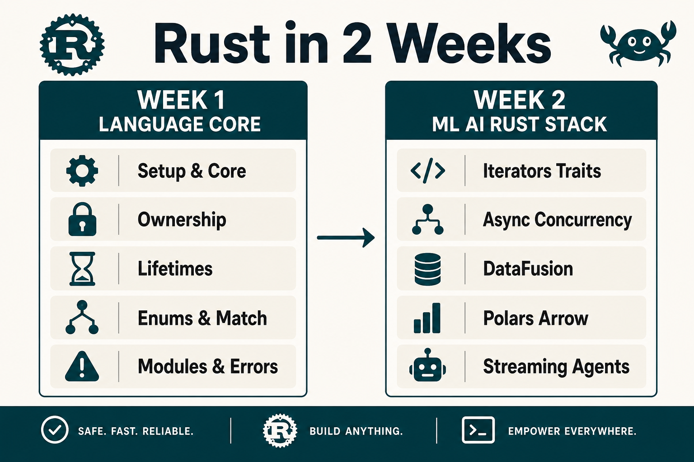
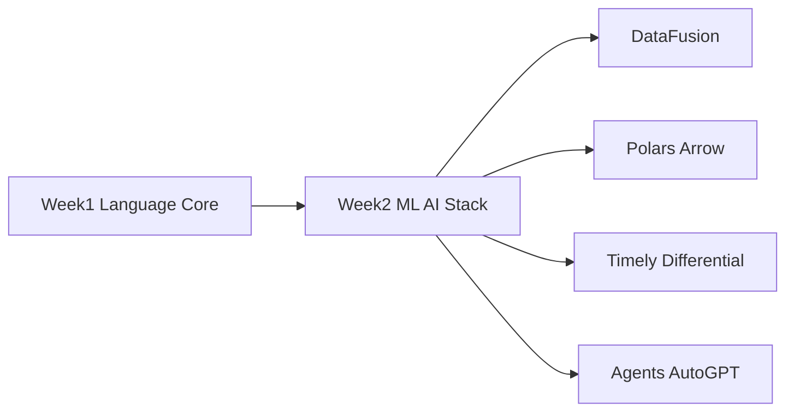

# Rust Roadmap & Mental Model (2 Weeks)

> **Goal:** Reach usable Rust fluency for ML/AI data + agent work in 10 weekdays (Aug 26 – Sep 8, 2026). Weekends off.

## What you'll learn

- Ownership, borrowing, lifetimes — Rust's memory model
- Enums, `Option`/`Result`, modules, iterators, generics, traits
- Enough `async`/concurrency to run agent-style workloads
- Rust analogs to Spark/data stacks: DataFusion, Polars, Arrow/Parquet
- Streaming engines (Timely/Differential) and AutoGPT-style agents in Rust

## Prerequisites

- Comfortable in another language (Python/JS/Go fine)
- Terminal + editor (VS Code / Cursor + rust-analyzer)
- Willing to watch Udemy slices while coding along

## Resources

- [Udemy courses](../Udemy_Courses.md) — Grider, Codestars, McDonogh AutoGPT
- [Rust Learning Plan (ML/Spark analogs)](../Rust_Learning_Plan.md)

---

## The guides

| # | Guide | What it covers | Day |
|---|-------|----------------|-----|
| 00 | [Roadmap](./00-roadmap.md) | Map, mental model, skill tree | — |
| 01 | [Setup & Core](./01-setup-core.md) | Install, Cargo, types, structs | Wed Aug 26 |
| 02 | [Ownership & Borrowing](./02-ownership-borrowing.md) | Move, borrow, refs | Thu Aug 27 |
| 03 | [Lifetimes](./03-lifetimes.md) | Lifetime annotations | Fri Aug 28 |
| 04 | [Enums & Pattern Matching](./04-enums-pattern-matching.md) | Enums, `Option`, match | Mon Aug 31 |
| 05 | [Modules & Errors](./05-modules-errors.md) | Crates, modules, `Result` | Tue Sep 1 |
| 06 | [Iterators, Generics & Traits](./06-iterators-generics-traits.md) | Flexible reusable code | Wed Sep 2 |
| 07 | [Async & Concurrency](./07-async-concurrency.md) | Threads, async, channels | Thu Sep 3 |
| 08 | [DataFusion](./08-datafusion-spark-analog.md) | Spark-SQL analog in Rust | Fri Sep 4 |
| 09 | [Polars & Arrow](./09-polars-arrow.md) | DataFrames + columnar I/O | Mon Sep 7 |
| 10 | [Streaming & Agents](./10-streaming-agents-ml.md) | Timely, Differential, AutoGPT | Tue Sep 8 |

---

## Mental model

Hold three ideas:

1. **Ownership = one owner.** Values move by default. Borrow (`&` / `&mut`) to share without transfer.
2. **Compiler is the reviewer.** Borrow checker catches data races and use-after-free at compile time — not runtime.
3. **Types encode absence and failure.** Prefer `Option` / `Result` over nulls and exceptions.

---

## Course → guide map

| Udemy / plan | Guides |
|--------------|--------|
| Grider — Foundations → Generics/Traits | 01–06 |
| Codestars — broader Rust / concurrency | 06–07 |
| Rust_Learning_Plan — DataFusion, Polars, Timely | 08–10 |
| McDonogh — AutoGPT in Rust | 10 |

---

## Suggested order

Work **01 → 10** in schedule order. Skip weekends. Each day: read guide → watch matching Udemy slice → ship the Day exercise.

**Next:** [01 — Setup & Core](./01-setup-core.md)
