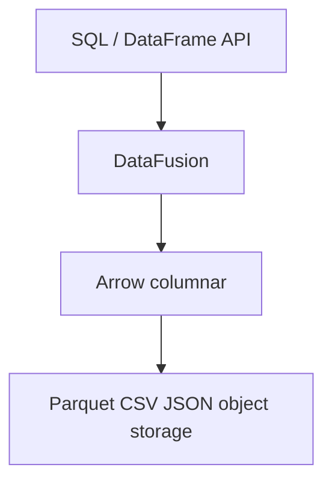

# Day 8 — DataFusion (Spark SQL Analog)

> **Goal:** Know DataFusion as the closest Rust-native Spark-SQL-style engine; run a tiny SQL query over in-memory/Arrow data.

**Date:** Fri Sep 4, 2026

## What you'll learn

- What DataFusion is (Apache Arrow query engine in Rust)
- SQL + DataFrame APIs, Parquet/CSV/JSON
- Distributed story (Ballista heritage) — high level only
- When to embed DataFusion vs stay on Spark

## Prerequisites

Week 1 language core (01–05) + [06](./06-iterators-generics-traits.md) / [07](./07-async-concurrency.md) enough to read examples.

## Watch / read

- [Rust Learning Plan §1 — DataFusion](../Rust_Learning_Plan.md)
- Docs: [DataFusion user guide](https://datafusion.apache.org/user-guide/index.html) (skim)

---

## Mental model

Think: **"Spark SQL's engine, but Rust + Arrow, embeddable in your service."** Younger ecosystem — no full MLlib twin. You own orchestration (K8s/Airflow).

Good for:

- Clustered SQL analytics over Parquet on object storage
- Embedding query engine inside Rust services
- Replacing smaller SparkSQL jobs

Skip / keep Spark when org needs full MLlib + Structured Streaming + managed cluster UX.

---

## Day 8 exercise

1. `cargo new day08_datafusion`
2. Add `datafusion` crate; register a tiny in-memory table (or CSV) with 2–3 columns
3. Run `SELECT … WHERE …` via `SessionContext`; print results
4. Write 3 bullets in README: when DataFusion wins vs Spark for *your* stack

**Done when:** one SQL query returns rows; you can pitch DataFusion in one sentence to a lead.

**Weekend off** (Sep 5–6). Resume Mon → [09 — Polars & Arrow](./09-polars-arrow.md)
