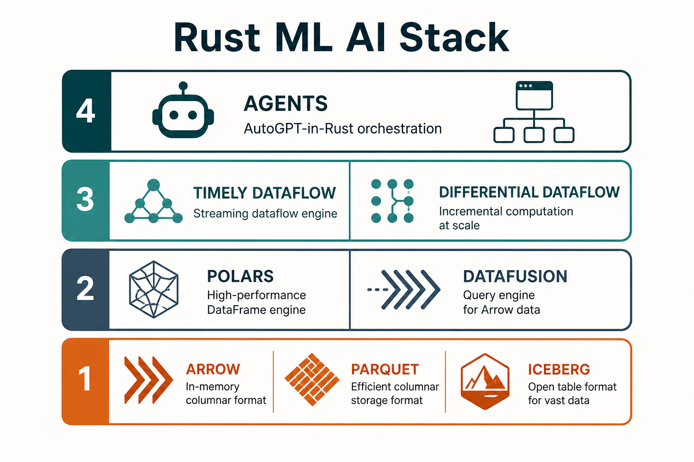
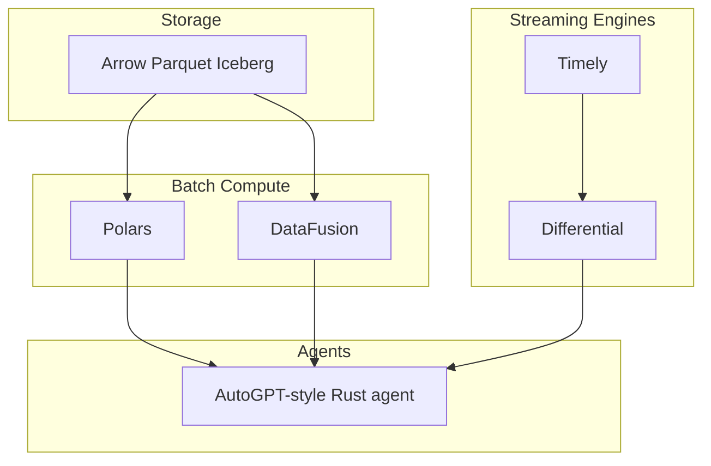

# Day 10 — Streaming, Agents & ML Pitch

> **Goal:** Map Timely/Differential Dataflow for streaming; wire AutoGPT-style agents in Rust; pitch Rust for AI/ML to a lead.

**Date:** Tue Sep 8, 2026

## What you'll learn

- Timely Dataflow & Differential Dataflow — Flink / streaming-Spark *building blocks*
- What they are *not* (not analyst-ready Spark replacement)
- AutoGPT / code-writing agent patterns in Rust (McDonogh course)
- How to pitch: Spark where data org lives; Rust where perf/control matters

## Prerequisites

[08](./08-datafusion-spark-analog.md) + [09](./09-polars-arrow.md); [07 async](./07-async-concurrency.md) for agent runtimes.

## Watch / read

- [Rust Learning Plan §3–5](../Rust_Learning_Plan.md)
- Udemy: [Shaun McDonogh — Built AutoGPT Code Writing AI Tool with Rust](../Udemy_Courses.md)

---

## Mental model

- **Timely** — high-throughput distributed dataflow
- **Differential** — incremental views / streaming joins on Timely
- Use when building **custom** real-time engines, not for ad-hoc notebooks
- **Agents** — async Rust + tool calls + LLM API; McDonogh course is the hands-on path

Pitch (from plan):

- Spark / Snowflake / BigQuery where the rest of the data org lives
- Embed **DataFusion** in Rust services for custom analytics
- **Polars** for columnar batch; migrate hot paths to pure Rust over time
- **Timely/Differential** for bespoke streaming / agentic event systems

---

## Day 10 exercise

1. Watch McDonogh AutoGPT course intro + first build slice; note crate/layout choices
2. Sketch (markdown or ASCII) an agent loop: plan → tool (Rust fn) → observe → repeat — mark where Tokio + `Result` sit
3. Optional stretch: `cargo new day10_agent_stub` with a fake `async fn call_tool(name: &str) -> Result<String, String>` and a 3-step loop
4. Write a 5-bullet "lead pitch" email draft: DataFusion, Polars, Timely, agents, what stays on Spark

**Done when:** pitch bullets exist; agent loop sketch clear; you know Timely ≠ drop-in Spark Streaming.

**Series complete.** Revisit [00-roadmap](./00-roadmap.md) for gaps; deepen via Udemy leftovers.
